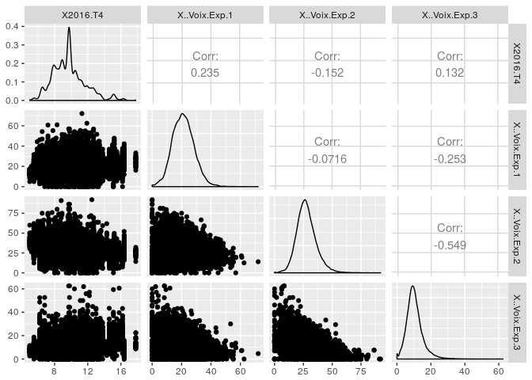
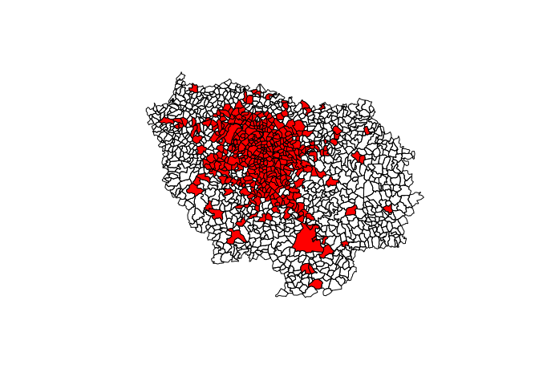
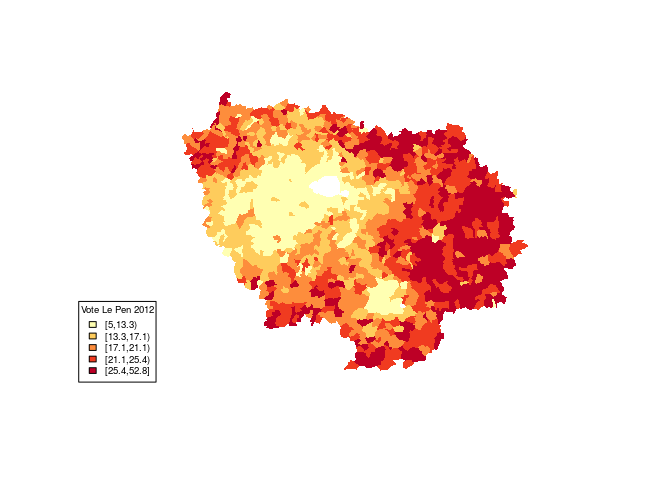

Elections France 2017
================

``` r
library(dplyr)
```

    ## 
    ## Attaching package: 'dplyr'

    ## The following objects are masked from 'package:stats':
    ## 
    ##     filter, lag

    ## The following objects are masked from 'package:base':
    ## 
    ##     intersect, setdiff, setequal, union

``` r
library(tidyr)
library(stringr)
library(GGally)
```

    ## 
    ## Attaching package: 'GGally'

    ## The following object is masked from 'package:dplyr':
    ## 
    ##     nasa

``` r
library("sp")
library("rgdal")
```

    ## rgdal: version: 1.2-6, (SVN revision 651)
    ##  Geospatial Data Abstraction Library extensions to R successfully loaded
    ##  Loaded GDAL runtime: GDAL 1.11.3, released 2015/09/16
    ##  Path to GDAL shared files: /usr/share/gdal/1.11
    ##  Loaded PROJ.4 runtime: Rel. 4.9.2, 08 September 2015, [PJ_VERSION: 492]
    ##  Path to PROJ.4 shared files: (autodetected)
    ##  Linking to sp version: 1.2-4

``` r
library("RColorBrewer")
library("classInt")


library("ggmap")
```

    ## Loading required package: ggplot2

``` r
library("maptools")
```

    ## Checking rgeos availability: FALSE
    ##      Note: when rgeos is not available, polygon geometry     computations in maptools depend on gpclib,
    ##      which has a restricted licence. It is disabled by default;
    ##      to enable gpclib, type gpclibPermit()

``` r
df_chomage<-read.csv('data/chomages_France.csv',sep=';',stringsAsFactors = F,skip = 1)

df_chomage$ZE2010<- df_chomage$ZE2010 %>% as.numeric()
```

    ## Warning in function_list[[k]](value): NAs introduced by coercion

``` r
df_zones_communes<- read.csv('data/code_geo_communes.csv',sep=';',stringsAsFactors = 1)
df_pres<-read.csv('data/Pres 2012.csv',stringsAsFactors = F,sep=';')
```

Add a new chunk by clicking the *Insert Chunk* button on the toolbar or by pressing *Ctrl+Alt+I*.

When you save the notebook, an HTML file containing the code and output will be saved alongside it (click the *Preview* button or press *Ctrl+Shift+K* to preview the HTML file).

``` r
sample_communes<-sample_n(df_zones_communes,50) %>% select(LIBGEO) %>% .$LIBGEO
sample_pres<-sample_n(df_pres,100) %>% select(Libellé.de.la.commune)%>% .$Libellé.de.la.commune
```

``` r
df_pres %>% filter (Libellé.de.la.commune %in% sample_pres)
```

    ##     Code.du.département  Libellé.du.département Code.de.la.commune
    ## 1                     2                   AISNE                528
    ## 2                     3                  ALLIER                185
    ## 3                     3                  ALLIER                195
    ## 4                     4 ALPES DE HAUTE PROVENCE                  1
    ## 5                     6         ALPES MARITIMES                  1
    ## 6                     7                 ARDECHE                  6
    ## 7                     7                 ARDECHE                318
    ## 8                     9                  ARIEGE                177
    ## 9                     9                  ARIEGE                206
    ## 10                    9                  ARIEGE                269
    ## 11                   10                    AUBE                153
    ## 12                   10                    AUBE                220
    ## 13                   14                CALVADOS                530
    ## 14                   15                  CANTAL                 57
    ## 15                   16                CHARENTE                294
    ## 16                   16                CHARENTE                368
    ## 17                   17       CHARENTE MARITIME                 59
    ## 18                   17       CHARENTE MARITIME                118
    ## 19                   17       CHARENTE MARITIME                213
    ## 20                   18                    CHER                 56
    ## 21                   18                    CHER                 60
    ## 22                   21               COTE D'OR                  6
    ## 23                   21               COTE D'OR                309
    ## 24                   21               COTE D'OR                437
    ## 25                   24                DORDOGNE                133
    ## 26                   24                DORDOGNE                585
    ## 27                   25                   DOUBS                195
    ## 28                   28            EURE ET LOIR                 12
    ## 29                   30                    GARD                156
    ## 30                   30                    GARD                187
    ## 31                   32                    GERS                346
    ## 32                   33                 GIRONDE                359
    ## 33                   33                 GIRONDE                472
    ## 34                   34                 HERAULT                212
    ## 35                   34                 HERAULT                262
    ## 36                   35         ILLE ET VILAINE                177
    ## 37                   36                   INDRE                 53
    ## 38                   37          INDRE ET LOIRE                186
    ## 39                   40                  LANDES                 62
    ## 40                   41            LOIR ET CHER                233
    ## 41                   41            LOIR ET CHER                238
    ## 42                   42                   LOIRE                183
    ## 43                   45                  LOIRET                 76
    ## 44                   45                  LOIRET                161
    ## 45                   45                  LOIRET                326
    ## 46                   45                  LOIRET                327
    ## 47                   46                     LOT                 39
    ## 48                   47          LOT ET GARONNE                227
    ## 49                   48                  LOZERE                 46
    ## 50                   50                  MANCHE                384
    ## 51                   50                  MANCHE                517
    ## 52                   50                  MANCHE                546
    ## 53                   51                   MARNE                 63
    ## 54                   51                   MARNE                 86
    ## 55                   51                   MARNE                390
    ## 56                   51                   MARNE                577
    ## 57                   51                   MARNE                626
    ## 58                   52             HAUTE MARNE                 88
    ## 59                   52             HAUTE MARNE                121
    ## 60                   52             HAUTE MARNE                301
    ## 61                   52             HAUTE MARNE                433
    ## 62                   53                 MAYENNE                116
    ## 63                   54      MEURTHE ET MOSELLE                157
    ## 64                   55                   MEUSE                 17
    ## 65                   55                   MEUSE                140
    ## 66                   56                MORBIHAN                200
    ## 67                   57                 MOSELLE                225
    ## 68                   57                 MOSELLE                232
    ## 69                   57                 MOSELLE                380
    ## 70                   58                  NIEVRE                 57
    ## 71                   58                  NIEVRE                184
    ## 72                   58                  NIEVRE                284
    ## 73                   59                    NORD                497
    ## 74                   60                    OISE                298
    ## 75                   60                    OISE                413
    ## 76                   60                    OISE                432
    ## 77                   61                    ORNE                103
    ## 78                   61                    ORNE                299
    ## 79                   61                    ORNE                427
    ## 80                   62           PAS DE CALAIS                293
    ## 81                   62           PAS DE CALAIS                391
    ## 82                   62           PAS DE CALAIS                562
    ## 83                   63             PUY DE DOME                 91
    ## 84                   63             PUY DE DOME                256
    ## 85                   64    PYRENEES ATLANTIQUES                 44
    ## 86                   64    PYRENEES ATLANTIQUES                350
    ## 87                   65         HAUTES PYRENEES                 67
    ## 88                   65         HAUTES PYRENEES                424
    ## 89                   67                BAS RHIN                142
    ## 90                   69                   RHONE                212
    ## 91                   69                   RHONE                271
    ## 92                   70             HAUTE SAONE                222
    ## 93                   70             HAUTE SAONE                553
    ## 94                   71          SAONE ET LOIRE                 12
    ## 95                   71          SAONE ET LOIRE                111
    ## 96                   72                  SARTHE                 97
    ## 97                   72                  SARTHE                178
    ## 98                   73                  SAVOIE                 40
    ## 99                   73                  SAVOIE                 53
    ## 100                  74            HAUTE SAVOIE                 24
    ## 101                  74            HAUTE SAVOIE                 65
    ## 102                  76          SEINE MARITIME                194
    ## 103                  76          SEINE MARITIME                258
    ## 104                  76          SEINE MARITIME                305
    ## 105                  77          SEINE ET MARNE                209
    ## 106                  77          SEINE ET MARNE                321
    ## 107                  77          SEINE ET MARNE                421
    ## 108                  79             DEUX SEVRES                161
    ## 109                  80                   SOMME                139
    ## 110                  81                    TARN                231
    ## 111                  82         TARN ET GARONNE                 82
    ## 112                  86                  VIENNE                 83
    ## 113                  88                  VOSGES                298
    ## 114                  89                   YONNE                 88
    ## 115                  89                   YONNE                 93
    ## 116                  90   TERRITOIRE DE BELFORT                105
    ## 117                  95              VAL D'OISE                 58
    ## 118                  95              VAL D'OISE                438
    ##             Libellé.de.la.commune Inscrits Abstentions X..Abs.Ins Votants
    ## 1                   Mortefontaine      183          15       8.20     168
    ## 2                       Montluçon    26429        6994      26.46   19435
    ## 3                 Néris-les-Bains     2054         307      14.95    1747
    ## 4                          Aiglun      862         112      12.99     750
    ## 5                          Aiglun      116          18      15.52      98
    ## 6                 Albon d'Ardèche      142          24      16.90     118
    ## 7                        Tauriers      165          28      16.97     137
    ## 8                         Madière      191          26      13.61     165
    ## 9                     Montferrier      586         111      18.94     475
    ## 10         Saint-Martin-de-Caralp      290          39      13.45     251
    ## 11                 Fontaine-Mâcon      438          83      18.95     355
    ## 12   Maizières-la-Grande-Paroisse     1178         225      19.10     953
    ## 13                       Ranville     1471         254      17.27    1217
    ## 14               Cros-de-Montvert      210          36      17.14     174
    ## 15                    Saint-Amant      548          92      16.79     456
    ## 16                           Sers      628          93      14.81     535
    ## 17                      Bourgneuf      838         112      13.37     726
    ## 18                       Corignac      273          35      12.82     238
    ## 19                          Lozay      130          25      19.23     105
    ## 20                         Chassy      212          32      15.09     180
    ## 21                       Chaumont       35           3       8.57      32
    ## 22                Aisey-sur-Seine      138          26      18.84     112
    ## 23                      Griselles       67          13      19.40      54
    ## 24                     Montmançon      134          21      15.67     113
    ## 25                    La Coquille     1047         170      16.24     877
    ## 26       Villefranche-du-Périgord      509          80      15.72     429
    ## 27           Dannemarie-sur-Crète      804          93      11.57     711
    ## 28                          Arrou     1353         246      18.18    1107
    ## 29                   Marguerittes     6995        1317      18.83    5678
    ## 30                     Navacelles      249          40      16.06     209
    ## 31                     Roquebrune      160          19      11.88     141
    ## 32                     Roquebrune      177          26      14.69     151
    ## 33    Saint-Sauveur-de-Puynormand      287          44      15.33     243
    ## 34                        Poujols      127          15      11.81     112
    ## 35                  Saint-Guiraud      164          24      14.63     140
    ## 36                     La Mézière     3039         348      11.45    2691
    ## 37                          Ciron      426          65      15.26     361
    ## 38                   Pont-de-Ruan      617          77      12.48     540
    ## 39             Campet-et-Lamolère      244          34      13.93     210
    ## 40                         Sambin      719         109      15.16     610
    ## 41              Savigny-sur-Braye     1696         336      19.81    1360
    ## 42                   La Ricamarie     5059        1363      26.94    3696
    ## 43     La Chapelle-Saint-Sépulcre      214          35      16.36     179
    ## 44                      Griselles      618          90      14.56     528
    ## 45                     Tournoisis      274          33      12.04     241
    ## 46                        Traînou     2342         418      17.85    1924
    ## 47                       Brengues      161          24      14.91     137
    ## 48                        Ruffiac      137          17      12.41     120
    ## 49                       Chaulhac       84          24      28.57      60
    ## 50             Octeville-l'Avenel      158          26      16.46     132
    ## 51     Saint-Martin-de-Varreville      158          37      23.42     121
    ## 52       Saint-Samson-de-Bonfossé      628          77      12.26     551
    ## 53             Binson-et-Orquigny      138          22      15.94     116
    ## 54                         Breuil      207          27      13.04     180
    ## 55                         Moussy      615         111      18.05     504
    ## 56                        Tramery      126          20      15.87     106
    ## 57  La Villeneuve-lès-Charleville       91          14      15.38      77
    ## 58                       Ceffonds      506          85      16.80     421
    ## 59                       Chaumont    16202        4191      25.87   12011
    ## 60                   Maisoncelles       67           4       5.97      63
    ## 61               Romain-sur-Meuse      121          19      15.70     102
    ## 62                       Le Horps      585          74      12.65     511
    ## 63                     Dieulouard     3603         854      23.70    2749
    ## 64            Autrécourt-sur-Aire       99          17      17.17      82
    ## 65                          Cunel       10           0       0.00      10
    ## 66                        Ruffiac     1128         163      14.45     965
    ## 67                        Fonteny      111           8       7.21     103
    ## 68                   Francaltroff      550         104      18.91     446
    ## 69       Laneuveville-lès-Lorquin       81          11      13.58      70
    ## 70         Chantenay-Saint-Imbert      863         122      14.14     741
    ## 71                         Moussy      104          15      14.42      89
    ## 72                          Talon       55           8      14.55      47
    ## 73                      Renescure     1769         295      16.68    1474
    ## 74                       Hanvoile      467          83      17.77     384
    ## 75       Montagny-Sainte-Félicité      338          41      12.13     297
    ## 76                  Mortefontaine      597         111      18.59     486
    ## 77                       Chaumont      147          25      17.01     122
    ## 78                Moussonvilliers      197          29      14.72     168
    ## 79       Saint-Martin-l'Aiguillon      159          15       9.43     144
    ## 80                          Embry      180          18      10.00     162
    ## 81                     Guarbecque     1153         156      13.53     997
    ## 82                     Matringhem      149          15      10.07     134
    ## 83          Charbonnier-les-Mines      657          90      13.70     567
    ## 84                     Novacelles      140          28      20.00     112
    ## 85                          Arget       78          17      21.79      61
    ## 86                      Louhossoa      603         121      20.07     482
    ## 87                          Barry      116          12      10.34     104
    ## 88                           Sers      114          21      18.42      93
    ## 89                     Fort-Louis      174          31      17.82     143
    ## 90          Saint-Jean-des-Vignes      326          48      14.72     278
    ## 91                       Chassieu     7436        1247      16.77    6189
    ## 92      Etrelles-et-la-Montbleuse       65          11      16.92      54
    ## 93                     Villargent       94          12      12.77      82
    ## 94                         Artaix      280          35      12.50     245
    ## 95                         Chassy      260          24       9.23     236
    ## 96                    Coulombiers      340          50      14.71     290
    ## 97                   Maisoncelles      141          25      17.73     116
    ## 98                        Bessans      387          70      18.09     317
    ## 99                      Bourgneuf      456          64      14.04     392
    ## 100                          Ayse     1620         252      15.56    1368
    ## 101                      Chaumont      341          52      15.25     289
    ## 102            Criquebeuf-en-Caux      306          41      13.40     265
    ## 103              Fauville-en-Caux     1524         209      13.71    1315
    ## 104          Gonfreville-l'Orcher     6316        1234      19.54    5082
    ## 105                     Gouvernes      900         148      16.44     752
    ## 106            Mousseaux-lès-Bray      545         113      20.73     432
    ## 107      Saint-Mars-Vieux-Maisons      227          46      20.26     181
    ## 108                         Luzay      478          88      18.41     390
    ## 109                        Breuil       71           8      11.27      63
    ## 110                     Rouairoux      316          57      18.04     259
    ## 111              Lacapelle-Livron      159          25      15.72     134
    ## 112                   Coulombiers      810         104      12.84     706
    ## 113                     Ménarmont       49           6      12.24      43
    ## 114                        Chassy      351          55      15.67     296
    ## 115                      Chaumont      426          64      15.02     362
    ## 116                Villars-le-Sec      118          22      18.64      96
    ## 117               Bernes-sur-Oise     1421         261      18.37    1160
    ## 118                        Moussy       89          20      22.47      69
    ##     X..Vot.Ins Blancs.et.nuls X..BlNuls.Ins X..BlNuls.Vot Exprimés
    ## 1        91.80              8          4.37          4.76      160
    ## 2        73.54            450          1.70          2.32    18985
    ## 3        85.05             34          1.66          1.95     1713
    ## 4        87.01             13          1.51          1.73      737
    ## 5        84.48              0          0.00          0.00       98
    ## 6        83.10              3          2.11          2.54      115
    ## 7        83.03              1          0.61          0.73      136
    ## 8        86.39              3          1.57          1.82      162
    ## 9        81.06              8          1.37          1.68      467
    ## 10       86.55              0          0.00          0.00      251
    ## 11       81.05              3          0.68          0.85      352
    ## 12       80.90             20          1.70          2.10      933
    ## 13       82.73             18          1.22          1.48     1199
    ## 14       82.86              3          1.43          1.72      171
    ## 15       83.21              8          1.46          1.75      448
    ## 16       85.19             14          2.23          2.62      521
    ## 17       86.63             19          2.27          2.62      707
    ## 18       87.18              4          1.47          1.68      234
    ## 19       80.77              0          0.00          0.00      105
    ## 20       84.91              5          2.36          2.78      175
    ## 21       91.43              2          5.71          6.25       30
    ## 22       81.16              3          2.17          2.68      109
    ## 23       80.60              1          1.49          1.85       53
    ## 24       84.33              1          0.75          0.88      112
    ## 25       83.76             26          2.48          2.96      851
    ## 26       84.28             19          3.73          4.43      410
    ## 27       88.43              7          0.87          0.98      704
    ## 28       81.82             19          1.40          1.72     1088
    ## 29       81.17             98          1.40          1.73     5580
    ## 30       83.94              2          0.80          0.96      207
    ## 31       88.13              3          1.88          2.13      138
    ## 32       85.31              2          1.13          1.32      149
    ## 33       84.67              2          0.70          0.82      241
    ## 34       88.19              5          3.94          4.46      107
    ## 35       85.37              6          3.66          4.29      134
    ## 36       88.55             54          1.78          2.01     2637
    ## 37       84.74             11          2.58          3.05      350
    ## 38       87.52              5          0.81          0.93      535
    ## 39       86.07             10          4.10          4.76      200
    ## 40       84.84              8          1.11          1.31      602
    ## 41       80.19             38          2.24          2.79     1322
    ## 42       73.06             59          1.17          1.60     3637
    ## 43       83.64              2          0.93          1.12      177
    ## 44       85.44              6          0.97          1.14      522
    ## 45       87.96              7          2.55          2.90      234
    ## 46       82.15             34          1.45          1.77     1890
    ## 47       85.09              2          1.24          1.46      135
    ## 48       87.59              3          2.19          2.50      117
    ## 49       71.43              0          0.00          0.00       60
    ## 50       83.54              1          0.63          0.76      131
    ## 51       76.58              5          3.16          4.13      116
    ## 52       87.74             11          1.75          2.00      540
    ## 53       84.06              4          2.90          3.45      112
    ## 54       86.96              0          0.00          0.00      180
    ## 55       81.95             10          1.63          1.98      494
    ## 56       84.13              5          3.97          4.72      101
    ## 57       84.62              0          0.00          0.00       77
    ## 58       83.20             10          1.98          2.38      411
    ## 59       74.13            230          1.42          1.91    11781
    ## 60       94.03              0          0.00          0.00       63
    ## 61       84.30              1          0.83          0.98      101
    ## 62       87.35              4          0.68          0.78      507
    ## 63       76.30             31          0.86          1.13     2718
    ## 64       82.83              5          5.05          6.10       77
    ## 65      100.00              0          0.00          0.00       10
    ## 66       85.55             23          2.04          2.38      942
    ## 67       92.79              5          4.50          4.85       98
    ## 68       81.09              4          0.73          0.90      442
    ## 69       86.42              1          1.23          1.43       69
    ## 70       85.86             13          1.51          1.75      728
    ## 71       85.58              2          1.92          2.25       87
    ## 72       85.45              0          0.00          0.00       47
    ## 73       83.32             39          2.20          2.65     1435
    ## 74       82.23             18          3.85          4.69      366
    ## 75       87.87              2          0.59          0.67      295
    ## 76       81.41              7          1.17          1.44      479
    ## 77       82.99              3          2.04          2.46      119
    ## 78       85.28              1          0.51          0.60      167
    ## 79       90.57              1          0.63          0.69      143
    ## 80       90.00              2          1.11          1.23      160
    ## 81       86.47             22          1.91          2.21      975
    ## 82       89.93              4          2.68          2.99      130
    ## 83       86.30             19          2.89          3.35      548
    ## 84       80.00              1          0.71          0.89      111
    ## 85       78.21              1          1.28          1.64       60
    ## 86       79.93             20          3.32          4.15      462
    ## 87       89.66              4          3.45          3.85      100
    ## 88       81.58              2          1.75          2.15       91
    ## 89       82.18              3          1.72          2.10      140
    ## 90       85.28              7          2.15          2.52      271
    ## 91       83.23            111          1.49          1.79     6078
    ## 92       83.08              2          3.08          3.70       52
    ## 93       87.23              1          1.06          1.22       81
    ## 94       87.50              8          2.86          3.27      237
    ## 95       90.77              6          2.31          2.54      230
    ## 96       85.29              7          2.06          2.41      283
    ## 97       82.27              2          1.42          1.72      114
    ## 98       81.91              6          1.55          1.89      311
    ## 99       85.96              6          1.32          1.53      386
    ## 100      84.44             28          1.73          2.05     1340
    ## 101      84.75              5          1.47          1.73      284
    ## 102      86.60             11          3.59          4.15      254
    ## 103      86.29             31          2.03          2.36     1284
    ## 104      80.46             82          1.30          1.61     5000
    ## 105      83.56             10          1.11          1.33      742
    ## 106      79.27              9          1.65          2.08      423
    ## 107      79.74              3          1.32          1.66      178
    ## 108      81.59             11          2.30          2.82      379
    ## 109      88.73              0          0.00          0.00       63
    ## 110      81.96              6          1.90          2.32      253
    ## 111      84.28              2          1.26          1.49      132
    ## 112      87.16             15          1.85          2.12      691
    ## 113      87.76              1          2.04          2.33       42
    ## 114      84.33              5          1.42          1.69      291
    ## 115      84.98              6          1.41          1.66      356
    ## 116      81.36              2          1.69          2.08       94
    ## 117      81.63             24          1.69          2.07     1136
    ## 118      77.53              2          2.25          2.90       67
    ##     X..Exp.Ins X..Exp.Vot  Sexe  Nom Prénom Voix X..Voix.Ins X..Voix.Exp
    ## 1        87.43      95.24 FALSE JOLY    Eva    3        1.64        1.88
    ## 2        71.83      97.68 FALSE JOLY    Eva  261        0.99        1.37
    ## 3        83.40      98.05 FALSE JOLY    Eva   29        1.41        1.69
    ## 4        85.50      98.27 FALSE JOLY    Eva   20        2.32        2.71
    ## 5        84.48     100.00 FALSE JOLY    Eva    3        2.59        3.06
    ## 6        80.99      97.46 FALSE JOLY    Eva    2        1.41        1.74
    ## 7        82.42      99.27 FALSE JOLY    Eva    8        4.85        5.88
    ## 8        84.82      98.18 FALSE JOLY    Eva    7        3.66        4.32
    ## 9        79.69      98.32 FALSE JOLY    Eva    7        1.19        1.50
    ## 10       86.55     100.00 FALSE JOLY    Eva    9        3.10        3.59
    ## 11       80.37      99.15 FALSE JOLY    Eva    7        1.60        1.99
    ## 12       79.20      97.90 FALSE JOLY    Eva    4        0.34        0.43
    ## 13       81.51      98.52 FALSE JOLY    Eva   16        1.09        1.33
    ## 14       81.43      98.28 FALSE JOLY    Eva    2        0.95        1.17
    ## 15       81.75      98.25 FALSE JOLY    Eva    6        1.09        1.34
    ## 16       82.96      97.38 FALSE JOLY    Eva   12        1.91        2.30
    ## 17       84.37      97.38 FALSE JOLY    Eva   17        2.03        2.40
    ## 18       85.71      98.32 FALSE JOLY    Eva    4        1.47        1.71
    ## 19       80.77     100.00 FALSE JOLY    Eva    1        0.77        0.95
    ## 20       82.55      97.22 FALSE JOLY    Eva    2        0.94        1.14
    ## 21       85.71      93.75 FALSE JOLY    Eva    0        0.00        0.00
    ## 22       78.99      97.32 FALSE JOLY    Eva    7        5.07        6.42
    ## 23       79.10      98.15 FALSE JOLY    Eva    2        2.99        3.77
    ## 24       83.58      99.12 FALSE JOLY    Eva    1        0.75        0.89
    ## 25       81.28      97.04 FALSE JOLY    Eva   14        1.34        1.65
    ## 26       80.55      95.57 FALSE JOLY    Eva    3        0.59        0.73
    ## 27       87.56      99.02 FALSE JOLY    Eva   18        2.24        2.56
    ## 28       80.41      98.28 FALSE JOLY    Eva   12        0.89        1.10
    ## 29       79.77      98.27 FALSE JOLY    Eva   81        1.16        1.45
    ## 30       83.13      99.04 FALSE JOLY    Eva    1        0.40        0.48
    ## 31       86.25      97.87 FALSE JOLY    Eva    1        0.63        0.72
    ## 32       84.18      98.68 FALSE JOLY    Eva    1        0.56        0.67
    ## 33       83.97      99.18 FALSE JOLY    Eva    1        0.35        0.41
    ## 34       84.25      95.54 FALSE JOLY    Eva    3        2.36        2.80
    ## 35       81.71      95.71 FALSE JOLY    Eva    9        5.49        6.72
    ## 36       86.77      97.99 FALSE JOLY    Eva   73        2.40        2.77
    ## 37       82.16      96.95 FALSE JOLY    Eva    4        0.94        1.14
    ## 38       86.71      99.07 FALSE JOLY    Eva   11        1.78        2.06
    ## 39       81.97      95.24 FALSE JOLY    Eva    2        0.82        1.00
    ## 40       83.73      98.69 FALSE JOLY    Eva    5        0.70        0.83
    ## 41       77.95      97.21 FALSE JOLY    Eva   20        1.18        1.51
    ## 42       71.89      98.40 FALSE JOLY    Eva   40        0.79        1.10
    ## 43       82.71      98.88 FALSE JOLY    Eva    0        0.00        0.00
    ## 44       84.47      98.86 FALSE JOLY    Eva   10        1.62        1.92
    ## 45       85.40      97.10 FALSE JOLY    Eva    5        1.82        2.14
    ## 46       80.70      98.23 FALSE JOLY    Eva   31        1.32        1.64
    ## 47       83.85      98.54 FALSE JOLY    Eva    6        3.73        4.44
    ## 48       85.40      97.50 FALSE JOLY    Eva    4        2.92        3.42
    ## 49       71.43     100.00 FALSE JOLY    Eva    1        1.19        1.67
    ## 50       82.91      99.24 FALSE JOLY    Eva    2        1.27        1.53
    ## 51       73.42      95.87 FALSE JOLY    Eva    2        1.27        1.72
    ## 52       85.99      98.00 FALSE JOLY    Eva    6        0.96        1.11
    ## 53       81.16      96.55 FALSE JOLY    Eva    0        0.00        0.00
    ## 54       86.96     100.00 FALSE JOLY    Eva    3        1.45        1.67
    ## 55       80.33      98.02 FALSE JOLY    Eva   11        1.79        2.23
    ## 56       80.16      95.28 FALSE JOLY    Eva    5        3.97        4.95
    ## 57       84.62     100.00 FALSE JOLY    Eva    0        0.00        0.00
    ## 58       81.23      97.62 FALSE JOLY    Eva    3        0.59        0.73
    ## 59       72.71      98.09 FALSE JOLY    Eva  248        1.53        2.11
    ## 60       94.03     100.00 FALSE JOLY    Eva    1        1.49        1.59
    ## 61       83.47      99.02 FALSE JOLY    Eva    1        0.83        0.99
    ## 62       86.67      99.22 FALSE JOLY    Eva   12        2.05        2.37
    ## 63       75.44      98.87 FALSE JOLY    Eva   23        0.64        0.85
    ## 64       77.78      93.90 FALSE JOLY    Eva    1        1.01        1.30
    ## 65      100.00     100.00 FALSE JOLY    Eva    0        0.00        0.00
    ## 66       83.51      97.62 FALSE JOLY    Eva   10        0.89        1.06
    ## 67       88.29      95.15 FALSE JOLY    Eva    0        0.00        0.00
    ## 68       80.36      99.10 FALSE JOLY    Eva    5        0.91        1.13
    ## 69       85.19      98.57 FALSE JOLY    Eva    1        1.23        1.45
    ## 70       84.36      98.25 FALSE JOLY    Eva    9        1.04        1.24
    ## 71       83.65      97.75 FALSE JOLY    Eva    0        0.00        0.00
    ## 72       85.45     100.00 FALSE JOLY    Eva    0        0.00        0.00
    ## 73       81.12      97.35 FALSE JOLY    Eva   29        1.64        2.02
    ## 74       78.37      95.31 FALSE JOLY    Eva    3        0.64        0.82
    ## 75       87.28      99.33 FALSE JOLY    Eva    5        1.48        1.69
    ## 76       80.23      98.56 FALSE JOLY    Eva   17        2.85        3.55
    ## 77       80.95      97.54 FALSE JOLY    Eva    1        0.68        0.84
    ## 78       84.77      99.40 FALSE JOLY    Eva    0        0.00        0.00
    ## 79       89.94      99.31 FALSE JOLY    Eva    4        2.52        2.80
    ## 80       88.89      98.77 FALSE JOLY    Eva    6        3.33        3.75
    ## 81       84.56      97.79 FALSE JOLY    Eva   11        0.95        1.13
    ## 82       87.25      97.01 FALSE JOLY    Eva    0        0.00        0.00
    ## 83       83.41      96.65 FALSE JOLY    Eva    6        0.91        1.09
    ## 84       79.29      99.11 FALSE JOLY    Eva    3        2.14        2.70
    ## 85       76.92      98.36 FALSE JOLY    Eva    3        3.85        5.00
    ## 86       76.62      95.85 FALSE JOLY    Eva   21        3.48        4.55
    ## 87       86.21      96.15 FALSE JOLY    Eva    1        0.86        1.00
    ## 88       79.82      97.85 FALSE JOLY    Eva    0        0.00        0.00
    ## 89       80.46      97.90 FALSE JOLY    Eva    0        0.00        0.00
    ## 90       83.13      97.48 FALSE JOLY    Eva    9        2.76        3.32
    ## 91       81.74      98.21 FALSE JOLY    Eva  146        1.96        2.40
    ## 92       80.00      96.30 FALSE JOLY    Eva    0        0.00        0.00
    ## 93       86.17      98.78 FALSE JOLY    Eva    2        2.13        2.47
    ## 94       84.64      96.73 FALSE JOLY    Eva    4        1.43        1.69
    ## 95       88.46      97.46 FALSE JOLY    Eva    4        1.54        1.74
    ## 96       83.24      97.59 FALSE JOLY    Eva   11        3.24        3.89
    ## 97       80.85      98.28 FALSE JOLY    Eva    1        0.71        0.88
    ## 98       80.36      98.11 FALSE JOLY    Eva   10        2.58        3.22
    ## 99       84.65      98.47 FALSE JOLY    Eva    9        1.97        2.33
    ## 100      82.72      97.95 FALSE JOLY    Eva   49        3.02        3.66
    ## 101      83.28      98.27 FALSE JOLY    Eva   12        3.52        4.23
    ## 102      83.01      95.85 FALSE JOLY    Eva    6        1.96        2.36
    ## 103      84.25      97.64 FALSE JOLY    Eva   11        0.72        0.86
    ## 104      79.16      98.39 FALSE JOLY    Eva   47        0.74        0.94
    ## 105      82.44      98.67 FALSE JOLY    Eva    6        0.67        0.81
    ## 106      77.61      97.92 FALSE JOLY    Eva    4        0.73        0.95
    ## 107      78.41      98.34 FALSE JOLY    Eva    2        0.88        1.12
    ## 108      79.29      97.18 FALSE JOLY    Eva    4        0.84        1.06
    ## 109      88.73     100.00 FALSE JOLY    Eva    0        0.00        0.00
    ## 110      80.06      97.68 FALSE JOLY    Eva    4        1.27        1.58
    ## 111      83.02      98.51 FALSE JOLY    Eva    3        1.89        2.27
    ## 112      85.31      97.88 FALSE JOLY    Eva    3        0.37        0.43
    ## 113      85.71      97.67 FALSE JOLY    Eva    0        0.00        0.00
    ## 114      82.91      98.31 FALSE JOLY    Eva    9        2.56        3.09
    ## 115      83.57      98.34 FALSE JOLY    Eva   11        2.58        3.09
    ## 116      79.66      97.92 FALSE JOLY    Eva    1        0.85        1.06
    ## 117      79.94      97.93 FALSE JOLY    Eva   17        1.20        1.50
    ## 118      75.28      97.10 FALSE JOLY    Eva    1        1.12        1.49
    ##     Sexe.1  Nom.1 Prénom.1 Voix.1 X..Voix.Ins.1 X..Voix.Exp.1 Sexe.2
    ## 1    FALSE LE PEN   Marine     52         28.42         32.50      M
    ## 2    FALSE LE PEN   Marine   2733         10.34         14.40      M
    ## 3    FALSE LE PEN   Marine    233         11.34         13.60      M
    ## 4    FALSE LE PEN   Marine    150         17.40         20.35      M
    ## 5    FALSE LE PEN   Marine     29         25.00         29.59      M
    ## 6    FALSE LE PEN   Marine     30         21.13         26.09      M
    ## 7    FALSE LE PEN   Marine     27         16.36         19.85      M
    ## 8    FALSE LE PEN   Marine     41         21.47         25.31      M
    ## 9    FALSE LE PEN   Marine    112         19.11         23.98      M
    ## 10   FALSE LE PEN   Marine     20          6.90          7.97      M
    ## 11   FALSE LE PEN   Marine    125         28.54         35.51      M
    ## 12   FALSE LE PEN   Marine    246         20.88         26.37      M
    ## 13   FALSE LE PEN   Marine    172         11.69         14.35      M
    ## 14   FALSE LE PEN   Marine     20          9.52         11.70      M
    ## 15   FALSE LE PEN   Marine     63         11.50         14.06      M
    ## 16   FALSE LE PEN   Marine    107         17.04         20.54      M
    ## 17   FALSE LE PEN   Marine     95         11.34         13.44      M
    ## 18   FALSE LE PEN   Marine     57         20.88         24.36      M
    ## 19   FALSE LE PEN   Marine     31         23.85         29.52      M
    ## 20   FALSE LE PEN   Marine     50         23.58         28.57      M
    ## 21   FALSE LE PEN   Marine      4         11.43         13.33      M
    ## 22   FALSE LE PEN   Marine     18         13.04         16.51      M
    ## 23   FALSE LE PEN   Marine     10         14.93         18.87      M
    ## 24   FALSE LE PEN   Marine     27         20.15         24.11      M
    ## 25   FALSE LE PEN   Marine    144         13.75         16.92      M
    ## 26   FALSE LE PEN   Marine     62         12.18         15.12      M
    ## 27   FALSE LE PEN   Marine    126         15.67         17.90      M
    ## 28   FALSE LE PEN   Marine    279         20.62         25.64      M
    ## 29   FALSE LE PEN   Marine   1784         25.50         31.97      M
    ## 30   FALSE LE PEN   Marine     78         31.33         37.68      M
    ## 31   FALSE LE PEN   Marine     27         16.88         19.57      M
    ## 32   FALSE LE PEN   Marine     34         19.21         22.82      M
    ## 33   FALSE LE PEN   Marine     61         21.25         25.31      M
    ## 34   FALSE LE PEN   Marine     15         11.81         14.02      M
    ## 35   FALSE LE PEN   Marine     23         14.02         17.16      M
    ## 36   FALSE LE PEN   Marine    290          9.54         11.00      M
    ## 37   FALSE LE PEN   Marine     51         11.97         14.57      M
    ## 38   FALSE LE PEN   Marine    103         16.69         19.25      M
    ## 39   FALSE LE PEN   Marine     43         17.62         21.50      M
    ## 40   FALSE LE PEN   Marine    168         23.37         27.91      M
    ## 41   FALSE LE PEN   Marine    312         18.40         23.60      M
    ## 42   FALSE LE PEN   Marine    857         16.94         23.56      M
    ## 43   FALSE LE PEN   Marine     50         23.36         28.25      M
    ## 44   FALSE LE PEN   Marine    132         21.36         25.29      M
    ## 45   FALSE LE PEN   Marine     47         17.15         20.09      M
    ## 46   FALSE LE PEN   Marine    399         17.04         21.11      M
    ## 47   FALSE LE PEN   Marine     13          8.07          9.63      M
    ## 48   FALSE LE PEN   Marine     29         21.17         24.79      M
    ## 49   FALSE LE PEN   Marine      7          8.33         11.67      M
    ## 50   FALSE LE PEN   Marine     24         15.19         18.32      M
    ## 51   FALSE LE PEN   Marine     32         20.25         27.59      M
    ## 52   FALSE LE PEN   Marine     87         13.85         16.11      M
    ## 53   FALSE LE PEN   Marine     32         23.19         28.57      M
    ## 54   FALSE LE PEN   Marine     43         20.77         23.89      M
    ## 55   FALSE LE PEN   Marine     93         15.12         18.83      M
    ## 56   FALSE LE PEN   Marine     20         15.87         19.80      M
    ## 57   FALSE LE PEN   Marine      8          8.79         10.39      M
    ## 58   FALSE LE PEN   Marine    132         26.09         32.12      M
    ## 59   FALSE LE PEN   Marine   2108         13.01         17.89      M
    ## 60   FALSE LE PEN   Marine     21         31.34         33.33      M
    ## 61   FALSE LE PEN   Marine     32         26.45         31.68      M
    ## 62   FALSE LE PEN   Marine     77         13.16         15.19      M
    ## 63   FALSE LE PEN   Marine    779         21.62         28.66      M
    ## 64   FALSE LE PEN   Marine     15         15.15         19.48      M
    ## 65   FALSE LE PEN   Marine      2         20.00         20.00      M
    ## 66   FALSE LE PEN   Marine    145         12.85         15.39      M
    ## 67   FALSE LE PEN   Marine     38         34.23         38.78      M
    ## 68   FALSE LE PEN   Marine    117         21.27         26.47      M
    ## 69   FALSE LE PEN   Marine     28         34.57         40.58      M
    ## 70   FALSE LE PEN   Marine    155         17.96         21.29      M
    ## 71   FALSE LE PEN   Marine     23         22.12         26.44      M
    ## 72   FALSE LE PEN   Marine      8         14.55         17.02      M
    ## 73   FALSE LE PEN   Marine    343         19.39         23.90      M
    ## 74   FALSE LE PEN   Marine    125         26.77         34.15      M
    ## 75   FALSE LE PEN   Marine     70         20.71         23.73      M
    ## 76   FALSE LE PEN   Marine     90         15.08         18.79      M
    ## 77   FALSE LE PEN   Marine     34         23.13         28.57      M
    ## 78   FALSE LE PEN   Marine     39         19.80         23.35      M
    ## 79   FALSE LE PEN   Marine     35         22.01         24.48      M
    ## 80   FALSE LE PEN   Marine     34         18.89         21.25      M
    ## 81   FALSE LE PEN   Marine    228         19.77         23.38      M
    ## 82   FALSE LE PEN   Marine     47         31.54         36.15      M
    ## 83   FALSE LE PEN   Marine     84         12.79         15.33      M
    ## 84   FALSE LE PEN   Marine     29         20.71         26.13      M
    ## 85   FALSE LE PEN   Marine      7          8.97         11.67      M
    ## 86   FALSE LE PEN   Marine     70         11.61         15.15      M
    ## 87   FALSE LE PEN   Marine     20         17.24         20.00      M
    ## 88   FALSE LE PEN   Marine     14         12.28         15.38      M
    ## 89   FALSE LE PEN   Marine     56         32.18         40.00      M
    ## 90   FALSE LE PEN   Marine     50         15.34         18.45      M
    ## 91   FALSE LE PEN   Marine   1039         13.97         17.09      M
    ## 92   FALSE LE PEN   Marine     16         24.62         30.77      M
    ## 93   FALSE LE PEN   Marine     24         25.53         29.63      M
    ## 94   FALSE LE PEN   Marine     66         23.57         27.85      M
    ## 95   FALSE LE PEN   Marine     47         18.08         20.43      M
    ## 96   FALSE LE PEN   Marine     72         21.18         25.44      M
    ## 97   FALSE LE PEN   Marine     31         21.99         27.19      M
    ## 98   FALSE LE PEN   Marine     65         16.80         20.90      M
    ## 99   FALSE LE PEN   Marine    105         23.03         27.20      M
    ## 100  FALSE LE PEN   Marine    248         15.31         18.51      M
    ## 101  FALSE LE PEN   Marine     52         15.25         18.31      M
    ## 102  FALSE LE PEN   Marine     61         19.93         24.02      M
    ## 103  FALSE LE PEN   Marine    216         14.17         16.82      M
    ## 104  FALSE LE PEN   Marine   1130         17.89         22.60      M
    ## 105  FALSE LE PEN   Marine    113         12.56         15.23      M
    ## 106  FALSE LE PEN   Marine    111         20.37         26.24      M
    ## 107  FALSE LE PEN   Marine     68         29.96         38.20      M
    ## 108  FALSE LE PEN   Marine     58         12.13         15.30      M
    ## 109  FALSE LE PEN   Marine     16         22.54         25.40      M
    ## 110  FALSE LE PEN   Marine     74         23.42         29.25      M
    ## 111  FALSE LE PEN   Marine     14          8.81         10.61      M
    ## 112  FALSE LE PEN   Marine    112         13.83         16.21      M
    ## 113  FALSE LE PEN   Marine     19         38.78         45.24      M
    ## 114  FALSE LE PEN   Marine     75         21.37         25.77      M
    ## 115  FALSE LE PEN   Marine    108         25.35         30.34      M
    ## 116  FALSE LE PEN   Marine     27         22.88         28.72      M
    ## 117  FALSE LE PEN   Marine    280         19.70         24.65      M
    ## 118  FALSE LE PEN   Marine     17         19.10         25.37      M
    ##       Nom.2 Prénom.2 Voix.2 X..Voix.Ins.2 X..Voix.Exp.2 Sexe.3     Nom.3
    ## 1   SARKOZY  Nicolas     42         22.95         26.25      M MÉLENCHON
    ## 2   SARKOZY  Nicolas   4610         17.44         24.28      M MÉLENCHON
    ## 3   SARKOZY  Nicolas    493         24.00         28.78      M MÉLENCHON
    ## 4   SARKOZY  Nicolas    146         16.94         19.81      M MÉLENCHON
    ## 5   SARKOZY  Nicolas     36         31.03         36.73      M MÉLENCHON
    ## 6   SARKOZY  Nicolas     21         14.79         18.26      M MÉLENCHON
    ## 7   SARKOZY  Nicolas     39         23.64         28.68      M MÉLENCHON
    ## 8   SARKOZY  Nicolas     28         14.66         17.28      M MÉLENCHON
    ## 9   SARKOZY  Nicolas     87         14.85         18.63      M MÉLENCHON
    ## 10  SARKOZY  Nicolas     35         12.07         13.94      M MÉLENCHON
    ## 11  SARKOZY  Nicolas    101         23.06         28.69      M MÉLENCHON
    ## 12  SARKOZY  Nicolas    263         22.33         28.19      M MÉLENCHON
    ## 13  SARKOZY  Nicolas    317         21.55         26.44      M MÉLENCHON
    ## 14  SARKOZY  Nicolas     51         24.29         29.82      M MÉLENCHON
    ## 15  SARKOZY  Nicolas     96         17.52         21.43      M MÉLENCHON
    ## 16  SARKOZY  Nicolas    109         17.36         20.92      M MÉLENCHON
    ## 17  SARKOZY  Nicolas    182         21.72         25.74      M MÉLENCHON
    ## 18  SARKOZY  Nicolas     42         15.38         17.95      M MÉLENCHON
    ## 19  SARKOZY  Nicolas     32         24.62         30.48      M MÉLENCHON
    ## 20  SARKOZY  Nicolas     31         14.62         17.71      M MÉLENCHON
    ## 21  SARKOZY  Nicolas      4         11.43         13.33      M MÉLENCHON
    ## 22  SARKOZY  Nicolas     27         19.57         24.77      M MÉLENCHON
    ## 23  SARKOZY  Nicolas      9         13.43         16.98      M MÉLENCHON
    ## 24  SARKOZY  Nicolas     35         26.12         31.25      M MÉLENCHON
    ## 25  SARKOZY  Nicolas    213         20.34         25.03      M MÉLENCHON
    ## 26  SARKOZY  Nicolas     78         15.32         19.02      M MÉLENCHON
    ## 27  SARKOZY  Nicolas    175         21.77         24.86      M MÉLENCHON
    ## 28  SARKOZY  Nicolas    338         24.98         31.07      M MÉLENCHON
    ## 29  SARKOZY  Nicolas   1384         19.79         24.80      M MÉLENCHON
    ## 30  SARKOZY  Nicolas     47         18.88         22.71      M MÉLENCHON
    ## 31  SARKOZY  Nicolas     44         27.50         31.88      M MÉLENCHON
    ## 32  SARKOZY  Nicolas     40         22.60         26.85      M MÉLENCHON
    ## 33  SARKOZY  Nicolas     50         17.42         20.75      M MÉLENCHON
    ## 34  SARKOZY  Nicolas     38         29.92         35.51      M MÉLENCHON
    ## 35  SARKOZY  Nicolas     28         17.07         20.90      M MÉLENCHON
    ## 36  SARKOZY  Nicolas    608         20.01         23.06      M MÉLENCHON
    ## 37  SARKOZY  Nicolas    117         27.46         33.43      M MÉLENCHON
    ## 38  SARKOZY  Nicolas    121         19.61         22.62      M MÉLENCHON
    ## 39  SARKOZY  Nicolas     56         22.95         28.00      M MÉLENCHON
    ## 40  SARKOZY  Nicolas    184         25.59         30.56      M MÉLENCHON
    ## 41  SARKOZY  Nicolas    379         22.35         28.67      M MÉLENCHON
    ## 42  SARKOZY  Nicolas    501          9.90         13.78      M MÉLENCHON
    ## 43  SARKOZY  Nicolas     49         22.90         27.68      M MÉLENCHON
    ## 44  SARKOZY  Nicolas    178         28.80         34.10      M MÉLENCHON
    ## 45  SARKOZY  Nicolas     98         35.77         41.88      M MÉLENCHON
    ## 46  SARKOZY  Nicolas    499         21.31         26.40      M MÉLENCHON
    ## 47  SARKOZY  Nicolas     42         26.09         31.11      M MÉLENCHON
    ## 48  SARKOZY  Nicolas     29         21.17         24.79      M MÉLENCHON
    ## 49  SARKOZY  Nicolas     24         28.57         40.00      M MÉLENCHON
    ## 50  SARKOZY  Nicolas     57         36.08         43.51      M MÉLENCHON
    ## 51  SARKOZY  Nicolas     42         26.58         36.21      M MÉLENCHON
    ## 52  SARKOZY  Nicolas    144         22.93         26.67      M MÉLENCHON
    ## 53  SARKOZY  Nicolas     44         31.88         39.29      M MÉLENCHON
    ## 54  SARKOZY  Nicolas     53         25.60         29.44      M MÉLENCHON
    ## 55  SARKOZY  Nicolas    192         31.22         38.87      M MÉLENCHON
    ## 56  SARKOZY  Nicolas     48         38.10         47.52      M MÉLENCHON
    ## 57  SARKOZY  Nicolas     36         39.56         46.75      M MÉLENCHON
    ## 58  SARKOZY  Nicolas    142         28.06         34.55      M MÉLENCHON
    ## 59  SARKOZY  Nicolas   3166         19.54         26.87      M MÉLENCHON
    ## 60  SARKOZY  Nicolas      9         13.43         14.29      M MÉLENCHON
    ## 61  SARKOZY  Nicolas     39         32.23         38.61      M MÉLENCHON
    ## 62  SARKOZY  Nicolas    224         38.29         44.18      M MÉLENCHON
    ## 63  SARKOZY  Nicolas    499         13.85         18.36      M MÉLENCHON
    ## 64  SARKOZY  Nicolas     25         25.25         32.47      M MÉLENCHON
    ## 65  SARKOZY  Nicolas      5         50.00         50.00      M MÉLENCHON
    ## 66  SARKOZY  Nicolas    376         33.33         39.92      M MÉLENCHON
    ## 67  SARKOZY  Nicolas     29         26.13         29.59      M MÉLENCHON
    ## 68  SARKOZY  Nicolas    145         26.36         32.81      M MÉLENCHON
    ## 69  SARKOZY  Nicolas     21         25.93         30.43      M MÉLENCHON
    ## 70  SARKOZY  Nicolas    159         18.42         21.84      M MÉLENCHON
    ## 71  SARKOZY  Nicolas     32         30.77         36.78      M MÉLENCHON
    ## 72  SARKOZY  Nicolas     12         21.82         25.53      M MÉLENCHON
    ## 73  SARKOZY  Nicolas    418         23.63         29.13      M MÉLENCHON
    ## 74  SARKOZY  Nicolas     81         17.34         22.13      M MÉLENCHON
    ## 75  SARKOZY  Nicolas     89         26.33         30.17      M MÉLENCHON
    ## 76  SARKOZY  Nicolas    186         31.16         38.83      M MÉLENCHON
    ## 77  SARKOZY  Nicolas     39         26.53         32.77      M MÉLENCHON
    ## 78  SARKOZY  Nicolas     86         43.65         51.50      M MÉLENCHON
    ## 79  SARKOZY  Nicolas     32         20.13         22.38      M MÉLENCHON
    ## 80  SARKOZY  Nicolas     44         24.44         27.50      M MÉLENCHON
    ## 81  SARKOZY  Nicolas    211         18.30         21.64      M MÉLENCHON
    ## 82  SARKOZY  Nicolas     25         16.78         19.23      M MÉLENCHON
    ## 83  SARKOZY  Nicolas     85         12.94         15.51      M MÉLENCHON
    ## 84  SARKOZY  Nicolas     26         18.57         23.42      M MÉLENCHON
    ## 85  SARKOZY  Nicolas     13         16.67         21.67      M MÉLENCHON
    ## 86  SARKOZY  Nicolas    120         19.90         25.97      M MÉLENCHON
    ## 87  SARKOZY  Nicolas     18         15.52         18.00      M MÉLENCHON
    ## 88  SARKOZY  Nicolas     29         25.44         31.87      M MÉLENCHON
    ## 89  SARKOZY  Nicolas     48         27.59         34.29      M MÉLENCHON
    ## 90  SARKOZY  Nicolas     81         24.85         29.89      M MÉLENCHON
    ## 91  SARKOZY  Nicolas   2147         28.87         35.32      M MÉLENCHON
    ## 92  SARKOZY  Nicolas      3          4.62          5.77      M MÉLENCHON
    ## 93  SARKOZY  Nicolas     12         12.77         14.81      M MÉLENCHON
    ## 94  SARKOZY  Nicolas     64         22.86         27.00      M MÉLENCHON
    ## 95  SARKOZY  Nicolas     43         16.54         18.70      M MÉLENCHON
    ## 96  SARKOZY  Nicolas     84         24.71         29.68      M MÉLENCHON
    ## 97  SARKOZY  Nicolas     35         24.82         30.70      M MÉLENCHON
    ## 98  SARKOZY  Nicolas     96         24.81         30.87      M MÉLENCHON
    ## 99  SARKOZY  Nicolas     87         19.08         22.54      M MÉLENCHON
    ## 100 SARKOZY  Nicolas    479         29.57         35.75      M MÉLENCHON
    ## 101 SARKOZY  Nicolas     83         24.34         29.23      M MÉLENCHON
    ## 102 SARKOZY  Nicolas     58         18.95         22.83      M MÉLENCHON
    ## 103 SARKOZY  Nicolas    395         25.92         30.76      M MÉLENCHON
    ## 104 SARKOZY  Nicolas    521          8.25         10.42      M MÉLENCHON
    ## 105 SARKOZY  Nicolas    298         33.11         40.16      M MÉLENCHON
    ## 106 SARKOZY  Nicolas    117         21.47         27.66      M MÉLENCHON
    ## 107 SARKOZY  Nicolas     58         25.55         32.58      M MÉLENCHON
    ## 108 SARKOZY  Nicolas     98         20.50         25.86      M MÉLENCHON
    ## 109 SARKOZY  Nicolas     24         33.80         38.10      M MÉLENCHON
    ## 110 SARKOZY  Nicolas     52         16.46         20.55      M MÉLENCHON
    ## 111 SARKOZY  Nicolas     32         20.13         24.24      M MÉLENCHON
    ## 112 SARKOZY  Nicolas    176         21.73         25.47      M MÉLENCHON
    ## 113 SARKOZY  Nicolas     14         28.57         33.33      M MÉLENCHON
    ## 114 SARKOZY  Nicolas     96         27.35         32.99      M MÉLENCHON
    ## 115 SARKOZY  Nicolas     81         19.01         22.75      M MÉLENCHON
    ## 116 SARKOZY  Nicolas     32         27.12         34.04      M MÉLENCHON
    ## 117 SARKOZY  Nicolas    218         15.34         19.19      M MÉLENCHON
    ## 118 SARKOZY  Nicolas     20         22.47         29.85      M MÉLENCHON
    ##     Prénom.3 Voix.3 X..Voix.Ins.3 X..Voix.Exp.3 Sexe.4  Nom.4 Prénom.4
    ## 1   Jean-Luc     15          8.20          9.38      M POUTOU Philippe
    ## 2   Jean-Luc   2943         11.14         15.50      M POUTOU Philippe
    ## 3   Jean-Luc    219         10.66         12.78      M POUTOU Philippe
    ## 4   Jean-Luc    107         12.41         14.52      M POUTOU Philippe
    ## 5   Jean-Luc      6          5.17          6.12      M POUTOU Philippe
    ## 6   Jean-Luc     29         20.42         25.22      M POUTOU Philippe
    ## 7   Jean-Luc     21         12.73         15.44      M POUTOU Philippe
    ## 8   Jean-Luc     30         15.71         18.52      M POUTOU Philippe
    ## 9   Jean-Luc     65         11.09         13.92      M POUTOU Philippe
    ## 10  Jean-Luc     44         15.17         17.53      M POUTOU Philippe
    ## 11  Jean-Luc     26          5.94          7.39      M POUTOU Philippe
    ## 12  Jean-Luc     82          6.96          8.79      M POUTOU Philippe
    ## 13  Jean-Luc    133          9.04         11.09      M POUTOU Philippe
    ## 14  Jean-Luc     12          5.71          7.02      M POUTOU Philippe
    ## 15  Jean-Luc     59         10.77         13.17      M POUTOU Philippe
    ## 16  Jean-Luc     60          9.55         11.52      M POUTOU Philippe
    ## 17  Jean-Luc     65          7.76          9.19      M POUTOU Philippe
    ## 18  Jean-Luc     26          9.52         11.11      M POUTOU Philippe
    ## 19  Jean-Luc      6          4.62          5.71      M POUTOU Philippe
    ## 20  Jean-Luc     39         18.40         22.29      M POUTOU Philippe
    ## 21  Jean-Luc     10         28.57         33.33      M POUTOU Philippe
    ## 22  Jean-Luc     13          9.42         11.93      M POUTOU Philippe
    ## 23  Jean-Luc      5          7.46          9.43      M POUTOU Philippe
    ## 24  Jean-Luc      7          5.22          6.25      M POUTOU Philippe
    ## 25  Jean-Luc    129         12.32         15.16      M POUTOU Philippe
    ## 26  Jean-Luc     55         10.81         13.41      M POUTOU Philippe
    ## 27  Jean-Luc     91         11.32         12.93      M POUTOU Philippe
    ## 28  Jean-Luc     60          4.43          5.51      M POUTOU Philippe
    ## 29  Jean-Luc    530          7.58          9.50      M POUTOU Philippe
    ## 30  Jean-Luc     10          4.02          4.83      M POUTOU Philippe
    ## 31  Jean-Luc     15          9.38         10.87      M POUTOU Philippe
    ## 32  Jean-Luc     11          6.21          7.38      M POUTOU Philippe
    ## 33  Jean-Luc     27          9.41         11.20      M POUTOU Philippe
    ## 34  Jean-Luc     12          9.45         11.21      M POUTOU Philippe
    ## 35  Jean-Luc     29         17.68         21.64      M POUTOU Philippe
    ## 36  Jean-Luc    265          8.72         10.05      M POUTOU Philippe
    ## 37  Jean-Luc     26          6.10          7.43      M POUTOU Philippe
    ## 38  Jean-Luc     61          9.89         11.40      M POUTOU Philippe
    ## 39  Jean-Luc     23          9.43         11.50      M POUTOU Philippe
    ## 40  Jean-Luc     69          9.60         11.46      M POUTOU Philippe
    ## 41  Jean-Luc    125          7.37          9.46      M POUTOU Philippe
    ## 42  Jean-Luc    711         14.05         19.55      M POUTOU Philippe
    ## 43  Jean-Luc     19          8.88         10.73      M POUTOU Philippe
    ## 44  Jean-Luc     43          6.96          8.24      M POUTOU Philippe
    ## 45  Jean-Luc     10          3.65          4.27      M POUTOU Philippe
    ## 46  Jean-Luc    176          7.51          9.31      M POUTOU Philippe
    ## 47  Jean-Luc     17         10.56         12.59      M POUTOU Philippe
    ## 48  Jean-Luc     13          9.49         11.11      M POUTOU Philippe
    ## 49  Jean-Luc      3          3.57          5.00      M POUTOU Philippe
    ## 50  Jean-Luc      9          5.70          6.87      M POUTOU Philippe
    ## 51  Jean-Luc      8          5.06          6.90      M POUTOU Philippe
    ## 52  Jean-Luc     40          6.37          7.41      M POUTOU Philippe
    ## 53  Jean-Luc      5          3.62          4.46      M POUTOU Philippe
    ## 54  Jean-Luc      6          2.90          3.33      M POUTOU Philippe
    ## 55  Jean-Luc     43          6.99          8.70      M POUTOU Philippe
    ## 56  Jean-Luc      4          3.17          3.96      M POUTOU Philippe
    ## 57  Jean-Luc      9          9.89         11.69      M POUTOU Philippe
    ## 58  Jean-Luc     34          6.72          8.27      M POUTOU Philippe
    ## 59  Jean-Luc   1258          7.76         10.68      M POUTOU Philippe
    ## 60  Jean-Luc      7         10.45         11.11      M POUTOU Philippe
    ## 61  Jean-Luc      1          0.83          0.99      M POUTOU Philippe
    ## 62  Jean-Luc     20          3.42          3.94      M POUTOU Philippe
    ## 63  Jean-Luc    288          7.99         10.60      M POUTOU Philippe
    ## 64  Jean-Luc      6          6.06          7.79      M POUTOU Philippe
    ## 65  Jean-Luc      1         10.00         10.00      M POUTOU Philippe
    ## 66  Jean-Luc     68          6.03          7.22      M POUTOU Philippe
    ## 67  Jean-Luc      5          4.50          5.10      M POUTOU Philippe
    ## 68  Jean-Luc     43          7.82          9.73      M POUTOU Philippe
    ## 69  Jean-Luc      3          3.70          4.35      M POUTOU Philippe
    ## 70  Jean-Luc     93         10.78         12.77      M POUTOU Philippe
    ## 71  Jean-Luc      2          1.92          2.30      M POUTOU Philippe
    ## 72  Jean-Luc      2          3.64          4.26      M POUTOU Philippe
    ## 73  Jean-Luc    119          6.73          8.29      M POUTOU Philippe
    ## 74  Jean-Luc     33          7.07          9.02      M POUTOU Philippe
    ## 75  Jean-Luc     23          6.80          7.80      M POUTOU Philippe
    ## 76  Jean-Luc     32          5.36          6.68      M POUTOU Philippe
    ## 77  Jean-Luc      3          2.04          2.52      M POUTOU Philippe
    ## 78  Jean-Luc      8          4.06          4.79      M POUTOU Philippe
    ## 79  Jean-Luc     16         10.06         11.19      M POUTOU Philippe
    ## 80  Jean-Luc     14          7.78          8.75      M POUTOU Philippe
    ## 81  Jean-Luc    128         11.10         13.13      M POUTOU Philippe
    ## 82  Jean-Luc     11          7.38          8.46      M POUTOU Philippe
    ## 83  Jean-Luc     78         11.87         14.23      M POUTOU Philippe
    ## 84  Jean-Luc      5          3.57          4.50      M POUTOU Philippe
    ## 85  Jean-Luc      4          5.13          6.67      M POUTOU Philippe
    ## 86  Jean-Luc     47          7.79         10.17      M POUTOU Philippe
    ## 87  Jean-Luc     23         19.83         23.00      M POUTOU Philippe
    ## 88  Jean-Luc     14         12.28         15.38      M POUTOU Philippe
    ## 89  Jean-Luc      6          3.45          4.29      M POUTOU Philippe
    ## 90  Jean-Luc     32          9.82         11.81      M POUTOU Philippe
    ## 91  Jean-Luc    459          6.17          7.55      M POUTOU Philippe
    ## 92  Jean-Luc      1          1.54          1.92      M POUTOU Philippe
    ## 93  Jean-Luc      7          7.45          8.64      M POUTOU Philippe
    ## 94  Jean-Luc     30         10.71         12.66      M POUTOU Philippe
    ## 95  Jean-Luc     32         12.31         13.91      M POUTOU Philippe
    ## 96  Jean-Luc     31          9.12         10.95      M POUTOU Philippe
    ## 97  Jean-Luc     17         12.06         14.91      M POUTOU Philippe
    ## 98  Jean-Luc     33          8.53         10.61      M POUTOU Philippe
    ## 99  Jean-Luc     58         12.72         15.03      M POUTOU Philippe
    ## 100 Jean-Luc    106          6.54          7.91      M POUTOU Philippe
    ## 101 Jean-Luc     35         10.26         12.32      M POUTOU Philippe
    ## 102 Jean-Luc     24          7.84          9.45      M POUTOU Philippe
    ## 103 Jean-Luc    132          8.66         10.28      M POUTOU Philippe
    ## 104 Jean-Luc   1669         26.42         33.38      M POUTOU Philippe
    ## 105 Jean-Luc     54          6.00          7.28      M POUTOU Philippe
    ## 106 Jean-Luc     34          6.24          8.04      M POUTOU Philippe
    ## 107 Jean-Luc     12          5.29          6.74      M POUTOU Philippe
    ## 108 Jean-Luc     37          7.74          9.76      M POUTOU Philippe
    ## 109 Jean-Luc      2          2.82          3.17      M POUTOU Philippe
    ## 110 Jean-Luc     27          8.54         10.67      M POUTOU Philippe
    ## 111 Jean-Luc     15          9.43         11.36      M POUTOU Philippe
    ## 112 Jean-Luc     92         11.36         13.31      M POUTOU Philippe
    ## 113 Jean-Luc      0          0.00          0.00      M POUTOU Philippe
    ## 114 Jean-Luc     22          6.27          7.56      M POUTOU Philippe
    ## 115 Jean-Luc     45         10.56         12.64      M POUTOU Philippe
    ## 116 Jean-Luc      5          4.24          5.32      M POUTOU Philippe
    ## 117 Jean-Luc    156         10.98         13.73      M POUTOU Philippe
    ## 118 Jean-Luc      4          4.49          5.97      M POUTOU Philippe
    ##     Voix.4 X..Voix.Ins.4 X..Voix.Exp.4 Sexe.5   Nom.5 Prénom.5 Voix.5
    ## 1        2          1.09          1.25  FALSE ARTHAUD Nathalie      5
    ## 2      240          0.91          1.26  FALSE ARTHAUD Nathalie    127
    ## 3       18          0.88          1.05  FALSE ARTHAUD Nathalie      8
    ## 4       14          1.62          1.90  FALSE ARTHAUD Nathalie      6
    ## 5        2          1.72          2.04  FALSE ARTHAUD Nathalie      0
    ## 6        1          0.70          0.87  FALSE ARTHAUD Nathalie      0
    ## 7        3          1.82          2.21  FALSE ARTHAUD Nathalie      1
    ## 8        4          2.09          2.47  FALSE ARTHAUD Nathalie      1
    ## 9        7          1.19          1.50  FALSE ARTHAUD Nathalie      5
    ## 10       1          0.34          0.40  FALSE ARTHAUD Nathalie      1
    ## 11       5          1.14          1.42  FALSE ARTHAUD Nathalie      3
    ## 12      11          0.93          1.18  FALSE ARTHAUD Nathalie      6
    ## 13      10          0.68          0.83  FALSE ARTHAUD Nathalie      9
    ## 14       1          0.48          0.58  FALSE ARTHAUD Nathalie      0
    ## 15       3          0.55          0.67  FALSE ARTHAUD Nathalie      7
    ## 16       5          0.80          0.96  FALSE ARTHAUD Nathalie      2
    ## 17      13          1.55          1.84  FALSE ARTHAUD Nathalie      4
    ## 18       5          1.83          2.14  FALSE ARTHAUD Nathalie      5
    ## 19       0          0.00          0.00  FALSE ARTHAUD Nathalie      0
    ## 20       0          0.00          0.00  FALSE ARTHAUD Nathalie      2
    ## 21       0          0.00          0.00  FALSE ARTHAUD Nathalie      0
    ## 22       3          2.17          2.75  FALSE ARTHAUD Nathalie      1
    ## 23       2          2.99          3.77  FALSE ARTHAUD Nathalie      0
    ## 24       2          1.49          1.79  FALSE ARTHAUD Nathalie      3
    ## 25      16          1.53          1.88  FALSE ARTHAUD Nathalie      7
    ## 26       9          1.77          2.20  FALSE ARTHAUD Nathalie      4
    ## 27       2          0.25          0.28  FALSE ARTHAUD Nathalie      2
    ## 28      11          0.81          1.01  FALSE ARTHAUD Nathalie      6
    ## 29      57          0.81          1.02  FALSE ARTHAUD Nathalie     26
    ## 30       3          1.20          1.45  FALSE ARTHAUD Nathalie      0
    ## 31       0          0.00          0.00  FALSE ARTHAUD Nathalie      0
    ## 32       5          2.82          3.36  FALSE ARTHAUD Nathalie      0
    ## 33       6          2.09          2.49  FALSE ARTHAUD Nathalie      0
    ## 34       2          1.57          1.87  FALSE ARTHAUD Nathalie      1
    ## 35       5          3.05          3.73  FALSE ARTHAUD Nathalie      0
    ## 36      40          1.32          1.52  FALSE ARTHAUD Nathalie     14
    ## 37       9          2.11          2.57  FALSE ARTHAUD Nathalie      6
    ## 38       9          1.46          1.68  FALSE ARTHAUD Nathalie      5
    ## 39       0          0.00          0.00  FALSE ARTHAUD Nathalie      0
    ## 40       9          1.25          1.50  FALSE ARTHAUD Nathalie      5
    ## 41      23          1.36          1.74  FALSE ARTHAUD Nathalie     19
    ## 42      36          0.71          0.99  FALSE ARTHAUD Nathalie     25
    ## 43       4          1.87          2.26  FALSE ARTHAUD Nathalie      4
    ## 44       6          0.97          1.15  FALSE ARTHAUD Nathalie      2
    ## 45       7          2.55          2.99  FALSE ARTHAUD Nathalie      2
    ## 46      23          0.98          1.22  FALSE ARTHAUD Nathalie     10
    ## 47       4          2.48          2.96  FALSE ARTHAUD Nathalie      0
    ## 48       1          0.73          0.85  FALSE ARTHAUD Nathalie      1
    ## 49       0          0.00          0.00  FALSE ARTHAUD Nathalie      0
    ## 50       0          0.00          0.00  FALSE ARTHAUD Nathalie      0
    ## 51       0          0.00          0.00  FALSE ARTHAUD Nathalie      0
    ## 52      12          1.91          2.22  FALSE ARTHAUD Nathalie      6
    ## 53       0          0.00          0.00  FALSE ARTHAUD Nathalie      1
    ## 54       1          0.48          0.56  FALSE ARTHAUD Nathalie      3
    ## 55       4          0.65          0.81  FALSE ARTHAUD Nathalie      2
    ## 56       0          0.00          0.00  FALSE ARTHAUD Nathalie      1
    ## 57       1          1.10          1.30  FALSE ARTHAUD Nathalie      0
    ## 58       2          0.40          0.49  FALSE ARTHAUD Nathalie      1
    ## 59     174          1.07          1.48  FALSE ARTHAUD Nathalie     95
    ## 60       0          0.00          0.00  FALSE ARTHAUD Nathalie      0
    ## 61       2          1.65          1.98  FALSE ARTHAUD Nathalie      0
    ## 62       9          1.54          1.78  FALSE ARTHAUD Nathalie      1
    ## 63      36          1.00          1.32  FALSE ARTHAUD Nathalie     23
    ## 64       2          2.02          2.60  FALSE ARTHAUD Nathalie      1
    ## 65       0          0.00          0.00  FALSE ARTHAUD Nathalie      0
    ## 66      12          1.06          1.27  FALSE ARTHAUD Nathalie     11
    ## 67       2          1.80          2.04  FALSE ARTHAUD Nathalie      0
    ## 68       9          1.64          2.04  FALSE ARTHAUD Nathalie      3
    ## 69       1          1.23          1.45  FALSE ARTHAUD Nathalie      0
    ## 70       6          0.70          0.82  FALSE ARTHAUD Nathalie      5
    ## 71       0          0.00          0.00  FALSE ARTHAUD Nathalie      0
    ## 72       0          0.00          0.00  FALSE ARTHAUD Nathalie      0
    ## 73      16          0.90          1.11  FALSE ARTHAUD Nathalie     19
    ## 74       6          1.28          1.64  FALSE ARTHAUD Nathalie      2
    ## 75       4          1.18          1.36  FALSE ARTHAUD Nathalie      1
    ## 76       5          0.84          1.04  FALSE ARTHAUD Nathalie      0
    ## 77       2          1.36          1.68  FALSE ARTHAUD Nathalie      1
    ## 78       0          0.00          0.00  FALSE ARTHAUD Nathalie      0
    ## 79       4          2.52          2.80  FALSE ARTHAUD Nathalie      0
    ## 80       1          0.56          0.63  FALSE ARTHAUD Nathalie      0
    ## 81      10          0.87          1.03  FALSE ARTHAUD Nathalie      3
    ## 82       2          1.34          1.54  FALSE ARTHAUD Nathalie      0
    ## 83       5          0.76          0.91  FALSE ARTHAUD Nathalie      5
    ## 84       1          0.71          0.90  FALSE ARTHAUD Nathalie      3
    ## 85       1          1.28          1.67  FALSE ARTHAUD Nathalie      0
    ## 86      17          2.82          3.68  FALSE ARTHAUD Nathalie      6
    ## 87       4          3.45          4.00  FALSE ARTHAUD Nathalie      0
    ## 88       1          0.88          1.10  FALSE ARTHAUD Nathalie      2
    ## 89       1          0.57          0.71  FALSE ARTHAUD Nathalie      1
    ## 90       3          0.92          1.11  FALSE ARTHAUD Nathalie      0
    ## 91      43          0.58          0.71  FALSE ARTHAUD Nathalie     22
    ## 92       1          1.54          1.92  FALSE ARTHAUD Nathalie      1
    ## 93       0          0.00          0.00  FALSE ARTHAUD Nathalie      2
    ## 94       0          0.00          0.00  FALSE ARTHAUD Nathalie      2
    ## 95       1          0.38          0.43  FALSE ARTHAUD Nathalie      4
    ## 96      12          3.53          4.24  FALSE ARTHAUD Nathalie      1
    ## 97       1          0.71          0.88  FALSE ARTHAUD Nathalie      1
    ## 98       4          1.03          1.29  FALSE ARTHAUD Nathalie      1
    ## 99       4          0.88          1.04  FALSE ARTHAUD Nathalie      4
    ## 100     12          0.74          0.90  FALSE ARTHAUD Nathalie      8
    ## 101      4          1.17          1.41  FALSE ARTHAUD Nathalie      1
    ## 102      3          0.98          1.18  FALSE ARTHAUD Nathalie      5
    ## 103     21          1.38          1.64  FALSE ARTHAUD Nathalie     18
    ## 104     79          1.25          1.58  FALSE ARTHAUD Nathalie     34
    ## 105      8          0.89          1.08  FALSE ARTHAUD Nathalie      0
    ## 106     11          2.02          2.60  FALSE ARTHAUD Nathalie      1
    ## 107      3          1.32          1.69  FALSE ARTHAUD Nathalie      1
    ## 108      9          1.88          2.37  FALSE ARTHAUD Nathalie      2
    ## 109      2          2.82          3.17  FALSE ARTHAUD Nathalie      3
    ## 110      0          0.00          0.00  FALSE ARTHAUD Nathalie      2
    ## 111      3          1.89          2.27  FALSE ARTHAUD Nathalie      1
    ## 112     14          1.73          2.03  FALSE ARTHAUD Nathalie      5
    ## 113      2          4.08          4.76  FALSE ARTHAUD Nathalie      0
    ## 114      2          0.57          0.69  FALSE ARTHAUD Nathalie      0
    ## 115      7          1.64          1.97  FALSE ARTHAUD Nathalie      3
    ## 116      2          1.69          2.13  FALSE ARTHAUD Nathalie      1
    ## 117     20          1.41          1.76  FALSE ARTHAUD Nathalie      4
    ## 118      0          0.00          0.00  FALSE ARTHAUD Nathalie      0
    ##     X..Voix.Ins.5 X..Voix.Exp.5 Sexe.6     Nom.6 Prénom.6 Voix.6
    ## 1            2.73          3.13      M CHEMINADE  Jacques      2
    ## 2            0.48          0.67      M CHEMINADE  Jacques     45
    ## 3            0.39          0.47      M CHEMINADE  Jacques      4
    ## 4            0.70          0.81      M CHEMINADE  Jacques      2
    ## 5            0.00          0.00      M CHEMINADE  Jacques      0
    ## 6            0.00          0.00      M CHEMINADE  Jacques      0
    ## 7            0.61          0.74      M CHEMINADE  Jacques      1
    ## 8            0.52          0.62      M CHEMINADE  Jacques      2
    ## 9            0.85          1.07      M CHEMINADE  Jacques      0
    ## 10           0.34          0.40      M CHEMINADE  Jacques      1
    ## 11           0.68          0.85      M CHEMINADE  Jacques      2
    ## 12           0.51          0.64      M CHEMINADE  Jacques      0
    ## 13           0.61          0.75      M CHEMINADE  Jacques      6
    ## 14           0.00          0.00      M CHEMINADE  Jacques      1
    ## 15           1.28          1.56      M CHEMINADE  Jacques      1
    ## 16           0.32          0.38      M CHEMINADE  Jacques      2
    ## 17           0.48          0.57      M CHEMINADE  Jacques      0
    ## 18           1.83          2.14      M CHEMINADE  Jacques      0
    ## 19           0.00          0.00      M CHEMINADE  Jacques      0
    ## 20           0.94          1.14      M CHEMINADE  Jacques      1
    ## 21           0.00          0.00      M CHEMINADE  Jacques      1
    ## 22           0.72          0.92      M CHEMINADE  Jacques      1
    ## 23           0.00          0.00      M CHEMINADE  Jacques      0
    ## 24           2.24          2.68      M CHEMINADE  Jacques      1
    ## 25           0.67          0.82      M CHEMINADE  Jacques      2
    ## 26           0.79          0.98      M CHEMINADE  Jacques      2
    ## 27           0.25          0.28      M CHEMINADE  Jacques      0
    ## 28           0.44          0.55      M CHEMINADE  Jacques      3
    ## 29           0.37          0.47      M CHEMINADE  Jacques     10
    ## 30           0.00          0.00      M CHEMINADE  Jacques      0
    ## 31           0.00          0.00      M CHEMINADE  Jacques      1
    ## 32           0.00          0.00      M CHEMINADE  Jacques      0
    ## 33           0.00          0.00      M CHEMINADE  Jacques      0
    ## 34           0.79          0.93      M CHEMINADE  Jacques      0
    ## 35           0.00          0.00      M CHEMINADE  Jacques      0
    ## 36           0.46          0.53      M CHEMINADE  Jacques     10
    ## 37           1.41          1.71      M CHEMINADE  Jacques      2
    ## 38           0.81          0.93      M CHEMINADE  Jacques      1
    ## 39           0.00          0.00      M CHEMINADE  Jacques      2
    ## 40           0.70          0.83      M CHEMINADE  Jacques      2
    ## 41           1.12          1.44      M CHEMINADE  Jacques      2
    ## 42           0.49          0.69      M CHEMINADE  Jacques     11
    ## 43           1.87          2.26      M CHEMINADE  Jacques      0
    ## 44           0.32          0.38      M CHEMINADE  Jacques      0
    ## 45           0.73          0.85      M CHEMINADE  Jacques      1
    ## 46           0.43          0.53      M CHEMINADE  Jacques      4
    ## 47           0.00          0.00      M CHEMINADE  Jacques      1
    ## 48           0.73          0.85      M CHEMINADE  Jacques      1
    ## 49           0.00          0.00      M CHEMINADE  Jacques      0
    ## 50           0.00          0.00      M CHEMINADE  Jacques      1
    ## 51           0.00          0.00      M CHEMINADE  Jacques      0
    ## 52           0.96          1.11      M CHEMINADE  Jacques      2
    ## 53           0.72          0.89      M CHEMINADE  Jacques      0
    ## 54           1.45          1.67      M CHEMINADE  Jacques      1
    ## 55           0.33          0.40      M CHEMINADE  Jacques      1
    ## 56           0.79          0.99      M CHEMINADE  Jacques      1
    ## 57           0.00          0.00      M CHEMINADE  Jacques      0
    ## 58           0.20          0.24      M CHEMINADE  Jacques      2
    ## 59           0.59          0.81      M CHEMINADE  Jacques     29
    ## 60           0.00          0.00      M CHEMINADE  Jacques      1
    ## 61           0.00          0.00      M CHEMINADE  Jacques      1
    ## 62           0.17          0.20      M CHEMINADE  Jacques      2
    ## 63           0.64          0.85      M CHEMINADE  Jacques     12
    ## 64           1.01          1.30      M CHEMINADE  Jacques      0
    ## 65           0.00          0.00      M CHEMINADE  Jacques      0
    ## 66           0.98          1.17      M CHEMINADE  Jacques      5
    ## 67           0.00          0.00      M CHEMINADE  Jacques      0
    ## 68           0.55          0.68      M CHEMINADE  Jacques      3
    ## 69           0.00          0.00      M CHEMINADE  Jacques      1
    ## 70           0.58          0.69      M CHEMINADE  Jacques      5
    ## 71           0.00          0.00      M CHEMINADE  Jacques      0
    ## 72           0.00          0.00      M CHEMINADE  Jacques      0
    ## 73           1.07          1.32      M CHEMINADE  Jacques      1
    ## 74           0.43          0.55      M CHEMINADE  Jacques      0
    ## 75           0.30          0.34      M CHEMINADE  Jacques      1
    ## 76           0.00          0.00      M CHEMINADE  Jacques      1
    ## 77           0.68          0.84      M CHEMINADE  Jacques      0
    ## 78           0.00          0.00      M CHEMINADE  Jacques      2
    ## 79           0.00          0.00      M CHEMINADE  Jacques      0
    ## 80           0.00          0.00      M CHEMINADE  Jacques      0
    ## 81           0.26          0.31      M CHEMINADE  Jacques      2
    ## 82           0.00          0.00      M CHEMINADE  Jacques      0
    ## 83           0.76          0.91      M CHEMINADE  Jacques      1
    ## 84           2.14          2.70      M CHEMINADE  Jacques      0
    ## 85           0.00          0.00      M CHEMINADE  Jacques      0
    ## 86           1.00          1.30      M CHEMINADE  Jacques      1
    ## 87           0.00          0.00      M CHEMINADE  Jacques      0
    ## 88           1.75          2.20      M CHEMINADE  Jacques      0
    ## 89           0.57          0.71      M CHEMINADE  Jacques      1
    ## 90           0.00          0.00      M CHEMINADE  Jacques      1
    ## 91           0.30          0.36      M CHEMINADE  Jacques      9
    ## 92           1.54          1.92      M CHEMINADE  Jacques      0
    ## 93           2.13          2.47      M CHEMINADE  Jacques      0
    ## 94           0.71          0.84      M CHEMINADE  Jacques      1
    ## 95           1.54          1.74      M CHEMINADE  Jacques      1
    ## 96           0.29          0.35      M CHEMINADE  Jacques      0
    ## 97           0.71          0.88      M CHEMINADE  Jacques      0
    ## 98           0.26          0.32      M CHEMINADE  Jacques      0
    ## 99           0.88          1.04      M CHEMINADE  Jacques      1
    ## 100          0.49          0.60      M CHEMINADE  Jacques      5
    ## 101          0.29          0.35      M CHEMINADE  Jacques      0
    ## 102          1.63          1.97      M CHEMINADE  Jacques      5
    ## 103          1.18          1.40      M CHEMINADE  Jacques      3
    ## 104          0.54          0.68      M CHEMINADE  Jacques      8
    ## 105          0.00          0.00      M CHEMINADE  Jacques      1
    ## 106          0.18          0.24      M CHEMINADE  Jacques      2
    ## 107          0.44          0.56      M CHEMINADE  Jacques      0
    ## 108          0.42          0.53      M CHEMINADE  Jacques      4
    ## 109          4.23          4.76      M CHEMINADE  Jacques      0
    ## 110          0.63          0.79      M CHEMINADE  Jacques      2
    ## 111          0.63          0.76      M CHEMINADE  Jacques      0
    ## 112          0.62          0.72      M CHEMINADE  Jacques      2
    ## 113          0.00          0.00      M CHEMINADE  Jacques      0
    ## 114          0.00          0.00      M CHEMINADE  Jacques      0
    ## 115          0.70          0.84      M CHEMINADE  Jacques      1
    ## 116          0.85          1.06      M CHEMINADE  Jacques      0
    ## 117          0.28          0.35      M CHEMINADE  Jacques      4
    ## 118          0.00          0.00      M CHEMINADE  Jacques      0
    ##     X..Voix.Ins.6 X..Voix.Exp.6 Sexe.7  Nom.7 Prénom.7 Voix.7
    ## 1            1.09          1.25      M BAYROU François      9
    ## 2            0.17          0.24      M BAYROU François   1453
    ## 3            0.19          0.23      M BAYROU François    192
    ## 4            0.23          0.27      M BAYROU François     70
    ## 5            0.00          0.00      M BAYROU François      5
    ## 6            0.00          0.00      M BAYROU François      6
    ## 7            0.61          0.74      M BAYROU François      8
    ## 8            1.05          1.23      M BAYROU François      8
    ## 9            0.00          0.00      M BAYROU François     25
    ## 10           0.34          0.40      M BAYROU François     13
    ## 11           0.46          0.57      M BAYROU François     25
    ## 12           0.00          0.00      M BAYROU François     68
    ## 13           0.41          0.50      M BAYROU François    107
    ## 14           0.48          0.58      M BAYROU François     24
    ## 15           0.18          0.22      M BAYROU François     41
    ## 16           0.32          0.38      M BAYROU François     43
    ## 17           0.00          0.00      M BAYROU François     80
    ## 18           0.00          0.00      M BAYROU François     26
    ## 19           0.00          0.00      M BAYROU François      8
    ## 20           0.47          0.57      M BAYROU François      8
    ## 21           2.86          3.33      M BAYROU François      2
    ## 22           0.72          0.92      M BAYROU François      7
    ## 23           0.00          0.00      M BAYROU François     12
    ## 24           0.75          0.89      M BAYROU François     10
    ## 25           0.19          0.24      M BAYROU François     50
    ## 26           0.39          0.49      M BAYROU François     42
    ## 27           0.00          0.00      M BAYROU François     72
    ## 28           0.22          0.28      M BAYROU François    118
    ## 29           0.14          0.18      M BAYROU François    369
    ## 30           0.00          0.00      M BAYROU François     12
    ## 31           0.63          0.72      M BAYROU François     12
    ## 32           0.00          0.00      M BAYROU François     15
    ## 33           0.00          0.00      M BAYROU François     10
    ## 34           0.00          0.00      M BAYROU François      8
    ## 35           0.00          0.00      M BAYROU François     10
    ## 36           0.33          0.38      M BAYROU François    349
    ## 37           0.47          0.57      M BAYROU François     27
    ## 38           0.16          0.19      M BAYROU François     68
    ## 39           0.82          1.00      M BAYROU François     18
    ## 40           0.28          0.33      M BAYROU François     48
    ## 41           0.12          0.15      M BAYROU François    129
    ## 42           0.22          0.30      M BAYROU François    183
    ## 43           0.00          0.00      M BAYROU François      9
    ## 44           0.00          0.00      M BAYROU François     57
    ## 45           0.36          0.43      M BAYROU François     17
    ## 46           0.17          0.21      M BAYROU François    186
    ## 47           0.62          0.74      M BAYROU François     11
    ## 48           0.73          0.85      M BAYROU François     14
    ## 49           0.00          0.00      M BAYROU François      9
    ## 50           0.63          0.76      M BAYROU François     10
    ## 51           0.00          0.00      M BAYROU François     13
    ## 52           0.32          0.37      M BAYROU François     64
    ## 53           0.00          0.00      M BAYROU François      6
    ## 54           0.48          0.56      M BAYROU François     33
    ## 55           0.16          0.20      M BAYROU François     36
    ## 56           0.79          0.99      M BAYROU François     10
    ## 57           0.00          0.00      M BAYROU François     10
    ## 58           0.40          0.49      M BAYROU François     33
    ## 59           0.18          0.25      M BAYROU François    997
    ## 60           1.49          1.59      M BAYROU François     15
    ## 61           0.83          0.99      M BAYROU François      6
    ## 62           0.34          0.39      M BAYROU François     91
    ## 63           0.33          0.44      M BAYROU François    211
    ## 64           0.00          0.00      M BAYROU François     11
    ## 65           0.00          0.00      M BAYROU François      1
    ## 66           0.44          0.53      M BAYROU François    113
    ## 67           0.00          0.00      M BAYROU François      5
    ## 68           0.55          0.68      M BAYROU François     37
    ## 69           1.23          1.45      M BAYROU François      4
    ## 70           0.58          0.69      M BAYROU François     60
    ## 71           0.00          0.00      M BAYROU François      7
    ## 72           0.00          0.00      M BAYROU François      2
    ## 73           0.06          0.07      M BAYROU François    123
    ## 74           0.00          0.00      M BAYROU François     26
    ## 75           0.30          0.34      M BAYROU François     17
    ## 76           0.17          0.21      M BAYROU François     60
    ## 77           0.00          0.00      M BAYROU François     12
    ## 78           1.02          1.20      M BAYROU François      8
    ## 79           0.00          0.00      M BAYROU François     11
    ## 80           0.00          0.00      M BAYROU François     10
    ## 81           0.17          0.21      M BAYROU François     59
    ## 82           0.00          0.00      M BAYROU François      9
    ## 83           0.15          0.18      M BAYROU François     24
    ## 84           0.00          0.00      M BAYROU François     13
    ## 85           0.00          0.00      M BAYROU François     14
    ## 86           0.17          0.22      M BAYROU François     71
    ## 87           0.00          0.00      M BAYROU François     15
    ## 88           0.00          0.00      M BAYROU François     12
    ## 89           0.57          0.71      M BAYROU François      9
    ## 90           0.31          0.37      M BAYROU François     43
    ## 91           0.12          0.15      M BAYROU François    677
    ## 92           0.00          0.00      M BAYROU François      3
    ## 93           0.00          0.00      M BAYROU François     11
    ## 94           0.36          0.42      M BAYROU François     27
    ## 95           0.38          0.43      M BAYROU François     20
    ## 96           0.00          0.00      M BAYROU François     22
    ## 97           0.00          0.00      M BAYROU François      8
    ## 98           0.00          0.00      M BAYROU François     20
    ## 99           0.22          0.26      M BAYROU François     27
    ## 100          0.31          0.37      M BAYROU François    156
    ## 101          0.00          0.00      M BAYROU François     37
    ## 102          1.63          1.97      M BAYROU François     13
    ## 103          0.20          0.23      M BAYROU François     88
    ## 104          0.13          0.16      M BAYROU François    171
    ## 105          0.11          0.13      M BAYROU François     85
    ## 106          0.37          0.47      M BAYROU François     31
    ## 107          0.00          0.00      M BAYROU François     15
    ## 108          0.84          1.06      M BAYROU François     31
    ## 109          0.00          0.00      M BAYROU François      2
    ## 110          0.63          0.79      M BAYROU François     24
    ## 111          0.00          0.00      M BAYROU François     25
    ## 112          0.25          0.29      M BAYROU François     59
    ## 113          0.00          0.00      M BAYROU François      4
    ## 114          0.00          0.00      M BAYROU François     24
    ## 115          0.23          0.28      M BAYROU François     23
    ## 116          0.00          0.00      M BAYROU François      6
    ## 117          0.28          0.35      M BAYROU François     73
    ## 118          0.00          0.00      M BAYROU François      6
    ##     X..Voix.Ins.7 X..Voix.Exp.7 Sexe.8         Nom.8 Prénom.8 Voix.8
    ## 1            4.92          5.63      M DUPONT-AIGNAN  Nicolas      3
    ## 2            5.50          7.65      M DUPONT-AIGNAN  Nicolas    295
    ## 3            9.35         11.21      M DUPONT-AIGNAN  Nicolas     34
    ## 4            8.12          9.50      M DUPONT-AIGNAN  Nicolas     15
    ## 5            4.31          5.10      M DUPONT-AIGNAN  Nicolas      1
    ## 6            4.23          5.22      M DUPONT-AIGNAN  Nicolas      1
    ## 7            4.85          5.88      M DUPONT-AIGNAN  Nicolas      0
    ## 8            4.19          4.94      M DUPONT-AIGNAN  Nicolas      4
    ## 9            4.27          5.35      M DUPONT-AIGNAN  Nicolas      5
    ## 10           4.48          5.18      M DUPONT-AIGNAN  Nicolas      1
    ## 11           5.71          7.10      M DUPONT-AIGNAN  Nicolas      4
    ## 12           5.77          7.29      M DUPONT-AIGNAN  Nicolas     26
    ## 13           7.27          8.92      M DUPONT-AIGNAN  Nicolas     29
    ## 14          11.43         14.04      M DUPONT-AIGNAN  Nicolas      1
    ## 15           7.48          9.15      M DUPONT-AIGNAN  Nicolas     11
    ## 16           6.85          8.25      M DUPONT-AIGNAN  Nicolas     11
    ## 17           9.55         11.32      M DUPONT-AIGNAN  Nicolas     16
    ## 18           9.52         11.11      M DUPONT-AIGNAN  Nicolas      4
    ## 19           6.15          7.62      M DUPONT-AIGNAN  Nicolas      5
    ## 20           3.77          4.57      M DUPONT-AIGNAN  Nicolas      1
    ## 21           5.71          6.67      M DUPONT-AIGNAN  Nicolas      1
    ## 22           5.07          6.42      M DUPONT-AIGNAN  Nicolas      1
    ## 23          17.91         22.64      M DUPONT-AIGNAN  Nicolas      1
    ## 24           7.46          8.93      M DUPONT-AIGNAN  Nicolas      3
    ## 25           4.78          5.88      M DUPONT-AIGNAN  Nicolas     21
    ## 26           8.25         10.24      M DUPONT-AIGNAN  Nicolas     15
    ## 27           8.96         10.23      M DUPONT-AIGNAN  Nicolas     11
    ## 28           8.72         10.85      M DUPONT-AIGNAN  Nicolas     28
    ## 29           5.28          6.61      M DUPONT-AIGNAN  Nicolas     67
    ## 30           4.82          5.80      M DUPONT-AIGNAN  Nicolas      3
    ## 31           7.50          8.70      M DUPONT-AIGNAN  Nicolas      3
    ## 32           8.47         10.07      M DUPONT-AIGNAN  Nicolas      5
    ## 33           3.48          4.15      M DUPONT-AIGNAN  Nicolas      1
    ## 34           6.30          7.48      M DUPONT-AIGNAN  Nicolas      0
    ## 35           6.10          7.46      M DUPONT-AIGNAN  Nicolas      2
    ## 36          11.48         13.23      M DUPONT-AIGNAN  Nicolas     50
    ## 37           6.34          7.71      M DUPONT-AIGNAN  Nicolas      8
    ## 38          11.02         12.71      M DUPONT-AIGNAN  Nicolas     11
    ## 39           7.38          9.00      M DUPONT-AIGNAN  Nicolas      2
    ## 40           6.68          7.97      M DUPONT-AIGNAN  Nicolas     13
    ## 41           7.61          9.76      M DUPONT-AIGNAN  Nicolas     25
    ## 42           3.62          5.03      M DUPONT-AIGNAN  Nicolas     43
    ## 43           4.21          5.08      M DUPONT-AIGNAN  Nicolas      3
    ## 44           9.22         10.92      M DUPONT-AIGNAN  Nicolas      8
    ## 45           6.20          7.26      M DUPONT-AIGNAN  Nicolas      2
    ## 46           7.94          9.84      M DUPONT-AIGNAN  Nicolas     49
    ## 47           6.83          8.15      M DUPONT-AIGNAN  Nicolas      3
    ## 48          10.22         11.97      M DUPONT-AIGNAN  Nicolas      2
    ## 49          10.71         15.00      M DUPONT-AIGNAN  Nicolas      0
    ## 50           6.33          7.63      M DUPONT-AIGNAN  Nicolas      5
    ## 51           8.23         11.21      M DUPONT-AIGNAN  Nicolas      0
    ## 52          10.19         11.85      M DUPONT-AIGNAN  Nicolas     15
    ## 53           4.35          5.36      M DUPONT-AIGNAN  Nicolas      1
    ## 54          15.94         18.33      M DUPONT-AIGNAN  Nicolas      3
    ## 55           5.85          7.29      M DUPONT-AIGNAN  Nicolas     12
    ## 56           7.94          9.90      M DUPONT-AIGNAN  Nicolas      3
    ## 57          10.99         12.99      M DUPONT-AIGNAN  Nicolas      0
    ## 58           6.52          8.03      M DUPONT-AIGNAN  Nicolas     12
    ## 59           6.15          8.46      M DUPONT-AIGNAN  Nicolas    263
    ## 60          22.39         23.81      M DUPONT-AIGNAN  Nicolas      1
    ## 61           4.96          5.94      M DUPONT-AIGNAN  Nicolas      0
    ## 62          15.56         17.95      M DUPONT-AIGNAN  Nicolas     10
    ## 63           5.86          7.76      M DUPONT-AIGNAN  Nicolas     58
    ## 64          11.11         14.29      M DUPONT-AIGNAN  Nicolas      3
    ## 65          10.00         10.00      M DUPONT-AIGNAN  Nicolas      0
    ## 66          10.02         12.00      M DUPONT-AIGNAN  Nicolas     19
    ## 67           4.50          5.10      M DUPONT-AIGNAN  Nicolas      2
    ## 68           6.73          8.37      M DUPONT-AIGNAN  Nicolas     14
    ## 69           4.94          5.80      M DUPONT-AIGNAN  Nicolas      1
    ## 70           6.95          8.24      M DUPONT-AIGNAN  Nicolas     18
    ## 71           6.73          8.05      M DUPONT-AIGNAN  Nicolas      4
    ## 72           3.64          4.26      M DUPONT-AIGNAN  Nicolas      1
    ## 73           6.95          8.57      M DUPONT-AIGNAN  Nicolas     28
    ## 74           5.57          7.10      M DUPONT-AIGNAN  Nicolas     12
    ## 75           5.03          5.76      M DUPONT-AIGNAN  Nicolas      4
    ## 76          10.05         12.53      M DUPONT-AIGNAN  Nicolas      5
    ## 77           8.16         10.08      M DUPONT-AIGNAN  Nicolas      5
    ## 78           4.06          4.79      M DUPONT-AIGNAN  Nicolas      2
    ## 79           6.92          7.69      M DUPONT-AIGNAN  Nicolas      3
    ## 80           5.56          6.25      M DUPONT-AIGNAN  Nicolas      4
    ## 81           5.12          6.05      M DUPONT-AIGNAN  Nicolas      9
    ## 82           6.04          6.92      M DUPONT-AIGNAN  Nicolas      1
    ## 83           3.65          4.38      M DUPONT-AIGNAN  Nicolas      4
    ## 84           9.29         11.71      M DUPONT-AIGNAN  Nicolas      3
    ## 85          17.95         23.33      M DUPONT-AIGNAN  Nicolas      0
    ## 86          11.77         15.37      M DUPONT-AIGNAN  Nicolas      6
    ## 87          12.93         15.00      M DUPONT-AIGNAN  Nicolas      0
    ## 88          10.53         13.19      M DUPONT-AIGNAN  Nicolas      2
    ## 89           5.17          6.43      M DUPONT-AIGNAN  Nicolas      2
    ## 90          13.19         15.87      M DUPONT-AIGNAN  Nicolas      5
    ## 91           9.10         11.14      M DUPONT-AIGNAN  Nicolas    111
    ## 92           4.62          5.77      M DUPONT-AIGNAN  Nicolas      0
    ## 93          11.70         13.58      M DUPONT-AIGNAN  Nicolas      1
    ## 94           9.64         11.39      M DUPONT-AIGNAN  Nicolas      2
    ## 95           7.69          8.70      M DUPONT-AIGNAN  Nicolas     15
    ## 96           6.47          7.77      M DUPONT-AIGNAN  Nicolas      5
    ## 97           5.67          7.02      M DUPONT-AIGNAN  Nicolas      4
    ## 98           5.17          6.43      M DUPONT-AIGNAN  Nicolas     10
    ## 99           5.92          6.99      M DUPONT-AIGNAN  Nicolas     13
    ## 100          9.63         11.64      M DUPONT-AIGNAN  Nicolas     34
    ## 101         10.85         13.03      M DUPONT-AIGNAN  Nicolas      9
    ## 102          4.25          5.12      M DUPONT-AIGNAN  Nicolas      4
    ## 103          5.77          6.85      M DUPONT-AIGNAN  Nicolas     19
    ## 104          2.71          3.42      M DUPONT-AIGNAN  Nicolas     51
    ## 105          9.44         11.46      M DUPONT-AIGNAN  Nicolas     10
    ## 106          5.69          7.33      M DUPONT-AIGNAN  Nicolas     10
    ## 107          6.61          8.43      M DUPONT-AIGNAN  Nicolas      7
    ## 108          6.49          8.18      M DUPONT-AIGNAN  Nicolas     12
    ## 109          2.82          3.17      M DUPONT-AIGNAN  Nicolas      1
    ## 110          7.59          9.49      M DUPONT-AIGNAN  Nicolas      4
    ## 111         15.72         18.94      M DUPONT-AIGNAN  Nicolas      3
    ## 112          7.28          8.54      M DUPONT-AIGNAN  Nicolas     19
    ## 113          8.16          9.52      M DUPONT-AIGNAN  Nicolas      0
    ## 114          6.84          8.25      M DUPONT-AIGNAN  Nicolas     10
    ## 115          5.40          6.46      M DUPONT-AIGNAN  Nicolas      8
    ## 116          5.08          6.38      M DUPONT-AIGNAN  Nicolas      2
    ## 117          5.14          6.43      M DUPONT-AIGNAN  Nicolas     31
    ## 118          6.74          8.96      M DUPONT-AIGNAN  Nicolas      1
    ##     X..Voix.Ins.8 X..Voix.Exp.8 Sexe.9    Nom.9 Prénom.9 Voix.9
    ## 1            1.64          1.88      M HOLLANDE François     27
    ## 2            1.12          1.55      M HOLLANDE François   6278
    ## 3            1.66          1.98      M HOLLANDE François    483
    ## 4            1.74          2.04      M HOLLANDE François    207
    ## 5            0.86          1.02      M HOLLANDE François     16
    ## 6            0.70          0.87      M HOLLANDE François     25
    ## 7            0.00          0.00      M HOLLANDE François     28
    ## 8            2.09          2.47      M HOLLANDE François     37
    ## 9            0.85          1.07      M HOLLANDE François    154
    ## 10           0.34          0.40      M HOLLANDE François    126
    ## 11           0.91          1.14      M HOLLANDE François     54
    ## 12           2.21          2.79      M HOLLANDE François    227
    ## 13           1.97          2.42      M HOLLANDE François    400
    ## 14           0.48          0.58      M HOLLANDE François     59
    ## 15           2.01          2.46      M HOLLANDE François    161
    ## 16           1.75          2.11      M HOLLANDE François    170
    ## 17           1.91          2.26      M HOLLANDE François    235
    ## 18           1.47          1.71      M HOLLANDE François     65
    ## 19           3.85          4.76      M HOLLANDE François     22
    ## 20           0.47          0.57      M HOLLANDE François     41
    ## 21           2.86          3.33      M HOLLANDE François      8
    ## 22           0.72          0.92      M HOLLANDE François     31
    ## 23           1.49          1.89      M HOLLANDE François     12
    ## 24           2.24          2.68      M HOLLANDE François     23
    ## 25           2.01          2.47      M HOLLANDE François    255
    ## 26           2.95          3.66      M HOLLANDE François    140
    ## 27           1.37          1.56      M HOLLANDE François    207
    ## 28           2.07          2.57      M HOLLANDE François    233
    ## 29           0.96          1.20      M HOLLANDE François   1272
    ## 30           1.20          1.45      M HOLLANDE François     53
    ## 31           1.88          2.17      M HOLLANDE François     35
    ## 32           2.82          3.36      M HOLLANDE François     38
    ## 33           0.35          0.41      M HOLLANDE François     85
    ## 34           0.00          0.00      M HOLLANDE François     28
    ## 35           1.22          1.49      M HOLLANDE François     28
    ## 36           1.65          1.90      M HOLLANDE François    938
    ## 37           1.88          2.29      M HOLLANDE François    100
    ## 38           1.78          2.06      M HOLLANDE François    145
    ## 39           0.82          1.00      M HOLLANDE François     54
    ## 40           1.81          2.16      M HOLLANDE François     99
    ## 41           1.47          1.89      M HOLLANDE François    288
    ## 42           0.85          1.18      M HOLLANDE François   1230
    ## 43           1.40          1.69      M HOLLANDE François     39
    ## 44           1.29          1.53      M HOLLANDE François     86
    ## 45           0.73          0.85      M HOLLANDE François     45
    ## 46           2.09          2.59      M HOLLANDE François    513
    ## 47           1.86          2.22      M HOLLANDE François     38
    ## 48           1.46          1.71      M HOLLANDE François     23
    ## 49           0.00          0.00      M HOLLANDE François     16
    ## 50           3.16          3.82      M HOLLANDE François     23
    ## 51           0.00          0.00      M HOLLANDE François     19
    ## 52           2.39          2.78      M HOLLANDE François    164
    ## 53           0.72          0.89      M HOLLANDE François     23
    ## 54           1.45          1.67      M HOLLANDE François     34
    ## 55           1.95          2.43      M HOLLANDE François    100
    ## 56           2.38          2.97      M HOLLANDE François      9
    ## 57           0.00          0.00      M HOLLANDE François     13
    ## 58           2.37          2.92      M HOLLANDE François     50
    ## 59           1.62          2.23      M HOLLANDE François   3443
    ## 60           1.49          1.59      M HOLLANDE François      8
    ## 61           0.00          0.00      M HOLLANDE François     19
    ## 62           1.71          1.97      M HOLLANDE François     61
    ## 63           1.61          2.13      M HOLLANDE François    789
    ## 64           3.03          3.90      M HOLLANDE François     13
    ## 65           0.00          0.00      M HOLLANDE François      1
    ## 66           1.68          2.02      M HOLLANDE François    183
    ## 67           1.80          2.04      M HOLLANDE François     17
    ## 68           2.55          3.17      M HOLLANDE François     66
    ## 69           1.23          1.45      M HOLLANDE François      9
    ## 70           2.09          2.47      M HOLLANDE François    218
    ## 71           3.85          4.60      M HOLLANDE François     19
    ## 72           1.82          2.13      M HOLLANDE François     22
    ## 73           1.58          1.95      M HOLLANDE François    339
    ## 74           2.57          3.28      M HOLLANDE François     78
    ## 75           1.18          1.36      M HOLLANDE François     81
    ## 76           0.84          1.04      M HOLLANDE François     83
    ## 77           3.40          4.20      M HOLLANDE François     22
    ## 78           1.02          1.20      M HOLLANDE François     22
    ## 79           1.89          2.10      M HOLLANDE François     38
    ## 80           2.22          2.50      M HOLLANDE François     47
    ## 81           0.78          0.92      M HOLLANDE François    314
    ## 82           0.67          0.77      M HOLLANDE François     35
    ## 83           0.61          0.73      M HOLLANDE François    256
    ## 84           2.14          2.70      M HOLLANDE François     28
    ## 85           0.00          0.00      M HOLLANDE François     18
    ## 86           1.00          1.30      M HOLLANDE François    103
    ## 87           0.00          0.00      M HOLLANDE François     19
    ## 88           1.75          2.20      M HOLLANDE François     17
    ## 89           1.15          1.43      M HOLLANDE François     16
    ## 90           1.53          1.85      M HOLLANDE François     47
    ## 91           1.49          1.83      M HOLLANDE François   1425
    ## 92           0.00          0.00      M HOLLANDE François     27
    ## 93           1.06          1.23      M HOLLANDE François     22
    ## 94           0.71          0.84      M HOLLANDE François     41
    ## 95           5.77          6.52      M HOLLANDE François     63
    ## 96           1.47          1.77      M HOLLANDE François     45
    ## 97           2.84          3.51      M HOLLANDE François     16
    ## 98           2.58          3.22      M HOLLANDE François     72
    ## 99           2.85          3.37      M HOLLANDE François     78
    ## 100          2.10          2.54      M HOLLANDE François    243
    ## 101          2.64          3.17      M HOLLANDE François     51
    ## 102          1.31          1.57      M HOLLANDE François     75
    ## 103          1.25          1.48      M HOLLANDE François    381
    ## 104          0.81          1.02      M HOLLANDE François   1290
    ## 105          1.11          1.35      M HOLLANDE François    167
    ## 106          1.83          2.36      M HOLLANDE François    102
    ## 107          3.08          3.93      M HOLLANDE François     12
    ## 108          2.51          3.17      M HOLLANDE François    124
    ## 109          1.41          1.59      M HOLLANDE François     13
    ## 110          1.27          1.58      M HOLLANDE François     64
    ## 111          1.89          2.27      M HOLLANDE François     36
    ## 112          2.35          2.75      M HOLLANDE François    209
    ## 113          0.00          0.00      M HOLLANDE François      3
    ## 114          2.85          3.44      M HOLLANDE François     53
    ## 115          1.88          2.25      M HOLLANDE François     69
    ## 116          1.69          2.13      M HOLLANDE François     18
    ## 117          2.18          2.73      M HOLLANDE François    333
    ## 118          1.12          1.49      M HOLLANDE François     18
    ##     X..Voix.Ins.9 X..Voix.Exp.9
    ## 1           14.75         16.88
    ## 2           23.75         33.07
    ## 3           23.52         28.20
    ## 4           24.01         28.09
    ## 5           13.79         16.33
    ## 6           17.61         21.74
    ## 7           16.97         20.59
    ## 8           19.37         22.84
    ## 9           26.28         32.98
    ## 10          43.45         50.20
    ## 11          12.33         15.34
    ## 12          19.27         24.33
    ## 13          27.19         33.36
    ## 14          28.10         34.50
    ## 15          29.38         35.94
    ## 16          27.07         32.63
    ## 17          28.04         33.24
    ## 18          23.81         27.78
    ## 19          16.92         20.95
    ## 20          19.34         23.43
    ## 21          22.86         26.67
    ## 22          22.46         28.44
    ## 23          17.91         22.64
    ## 24          17.16         20.54
    ## 25          24.36         29.96
    ## 26          27.50         34.15
    ## 27          25.75         29.40
    ## 28          17.22         21.42
    ## 29          18.18         22.80
    ## 30          21.29         25.60
    ## 31          21.88         25.36
    ## 32          21.47         25.50
    ## 33          29.62         35.27
    ## 34          22.05         26.17
    ## 35          17.07         20.90
    ## 36          30.87         35.57
    ## 37          23.47         28.57
    ## 38          23.50         27.10
    ## 39          22.13         27.00
    ## 40          13.77         16.45
    ## 41          16.98         21.79
    ## 42          24.31         33.82
    ## 43          18.22         22.03
    ## 44          13.92         16.48
    ## 45          16.42         19.23
    ## 46          21.90         27.14
    ## 47          23.60         28.15
    ## 48          16.79         19.66
    ## 49          19.05         26.67
    ## 50          14.56         17.56
    ## 51          12.03         16.38
    ## 52          26.11         30.37
    ## 53          16.67         20.54
    ## 54          16.43         18.89
    ## 55          16.26         20.24
    ## 56           7.14          8.91
    ## 57          14.29         16.88
    ## 58           9.88         12.17
    ## 59          21.25         29.23
    ## 60          11.94         12.70
    ## 61          15.70         18.81
    ## 62          10.43         12.03
    ## 63          21.90         29.03
    ## 64          13.13         16.88
    ## 65          10.00         10.00
    ## 66          16.22         19.43
    ## 67          15.32         17.35
    ## 68          12.00         14.93
    ## 69          11.11         13.04
    ## 70          25.26         29.95
    ## 71          18.27         21.84
    ## 72          40.00         46.81
    ## 73          19.16         23.62
    ## 74          16.70         21.31
    ## 75          23.96         27.46
    ## 76          13.90         17.33
    ## 77          14.97         18.49
    ## 78          11.17         13.17
    ## 79          23.90         26.57
    ## 80          26.11         29.38
    ## 81          27.23         32.21
    ## 82          23.49         26.92
    ## 83          38.96         46.72
    ## 84          20.00         25.23
    ## 85          23.08         30.00
    ## 86          17.08         22.29
    ## 87          16.38         19.00
    ## 88          14.91         18.68
    ## 89           9.20         11.43
    ## 90          14.42         17.34
    ## 91          19.16         23.45
    ## 92          41.54         51.92
    ## 93          23.40         27.16
    ## 94          14.64         17.30
    ## 95          24.23         27.39
    ## 96          13.24         15.90
    ## 97          11.35         14.04
    ## 98          18.60         23.15
    ## 99          17.11         20.21
    ## 100         15.00         18.13
    ## 101         14.96         17.96
    ## 102         24.51         29.53
    ## 103         25.00         29.67
    ## 104         20.42         25.80
    ## 105         18.56         22.51
    ## 106         18.72         24.11
    ## 107          5.29          6.74
    ## 108         25.94         32.72
    ## 109         18.31         20.63
    ## 110         20.25         25.30
    ## 111         22.64         27.27
    ## 112         25.80         30.25
    ## 113          6.12          7.14
    ## 114         15.10         18.21
    ## 115         16.20         19.38
    ## 116         15.25         19.15
    ## 117         23.43         29.31
    ## 118         20.22         26.87

``` r
df_zones_communes %>% filter(LIBGEO %in% sample_pres)
```

    ##     CODGEO                        LIBGEO DEP REG      EPCI NATURE_EPCI ARR
    ## 1    02528                 Mortefontaine  02  32 200071991          CC 024
    ## 2    03185                     Montluçon  03  84 200071082          CA 031
    ## 3    03195               Néris-les-Bains  03  84 200071512          CC 031
    ## 4    04001                        Aiglun  04  93 200067437          CA 043
    ## 5    06001                        Aiglun  06  93 200039931          CC 061
    ## 6    07318                      Tauriers  07  84 240700617          CC 071
    ## 7    09177                       Madière  09  76 200066231          CC 092
    ## 8    09206                   Montferrier  09  76 240900464          CC 092
    ## 9    09269        Saint-Martin-de-Caralp  09  76 200067791          CA 091
    ## 10   10153                Fontaine-Mâcon  10  44 200006716          CC 102
    ## 11   10220  Maizières-la-Grande-Paroisse  10  44 200000545          CC 102
    ## 12   14530                      Ranville  14  28 200065563          CC 143
    ## 13   15057              Cros-de-Montvert  15  84 200066678          CC 151
    ## 14   16368                          Sers  16  75 200071827          CA 161
    ## 15   17059                     Bourgneuf  17  75 241700434          CA 173
    ## 16   17118                      Corignac  17  75 200041523          CC 171
    ## 17   17213                         Lozay  17  75 200041689          CC 175
    ## 18   18056                        Chassy  18  24 200007177          CC 181
    ## 19   18060                      Chaumont  18  24 241800432          CC 182
    ## 20   21006               Aisey-sur-Seine  21  27 242101434          CC 213
    ## 21   21309                     Griselles  21  27 242101434          CC 213
    ## 22   21437                    Montmançon  21  27 200070902          CC 212
    ## 23   24133                   La Coquille  24  75 242400752          CC 242
    ## 24   24585      Villefranche-du-Périgord  24  75 200041440          CC 244
    ## 25   25195          Dannemarie-sur-Crète  25  27 242500361          CA 251
    ## 26   30156                  Marguerittes  30  76 243000643          CA 302
    ## 27   30187                    Navacelles  30  76 200035129          CC 301
    ## 28   32346                    Roquebrune  32  76 243200607          CC 321
    ## 29   33359                    Roquebrune  33  75 200044394          CC 333
    ## 30   33472   Saint-Sauveur-de-Puynormand  33  75 200070092          CA 335
    ## 31   34212                       Poujols  34  76 200017341          CC 342
    ## 32   34262                 Saint-Guiraud  34  76 243400694          CC 342
    ## 33   35177                    La Mézière  35  53 243500667          CC 353
    ## 34   36053                         Ciron  36  24 243600319          CC 361
    ## 35   37186                  Pont-de-Ruan  37  24 200072650          CC 372
    ## 36   40062            Campet-et-Lamolère  40  75 244000808          CA 402
    ## 37   41233                        Sambin  41  24 200030385          CA 411
    ## 38   41238             Savigny-sur-Braye  41  24 200072072          CA 412
    ## 39   42183                  La Ricamarie  42  84 244200770          CU 423
    ## 40   45076    La Chapelle-Saint-Sépulcre  45  24 200067668          CC 451
    ## 41   45161                     Griselles  45  24 244500419          CC 451
    ## 42   45326                    Tournoisis  45  24 200035764          CC 452
    ## 43   45327                       Traînou  45  24 244500484          CC 452
    ## 44   46039                      Brengues  46  76 200067361          CC 462
    ## 45   47227                       Ruffiac  47  75 244701355          CC 472
    ## 46   48046                      Chaulhac  48  76 200069185          CC 482
    ## 47   50384            Octeville-l'Avenel  50  28 200067205          CA 502
    ## 48   50517    Saint-Martin-de-Varreville  50  28 200042729          CC 502
    ## 49   51063            Binson-et-Orquigny  51  44 200066850          CC 513
    ## 50   51086                        Breuil  51  44 200067213          CU 513
    ## 51   51390                        Moussy  51  44 200067684          CA 512
    ## 52   51577                       Tramery  51  44 200067213          CU 513
    ## 53   51626 La Villeneuve-lès-Charleville  51  44 245100888          CC 512
    ## 54   52088                      Ceffonds  52  44 200068666          CA 523
    ## 55   52121                      Chaumont  52  44 200068658          CA 521
    ## 56   52301                  Maisoncelles  52  44 200069664          CC 521
    ## 57   52433              Romain-sur-Meuse  52  44 200069664          CC 521
    ## 58   53116                      Le Horps  53  52 200055887          CC 533
    ## 59   54157                    Dieulouard  54  44 200041515          CC 543
    ## 60   55017           Autrécourt-sur-Aire  55  44 200066140          CC 551
    ## 61   55140                         Cunel  55  44 200066132          CC 553
    ## 62   56200                       Ruffiac  56  53 200066785          CC 563
    ## 63   57225                       Fonteny  57  44 245701206          CC 575
    ## 64   57232                  Francaltroff  57  44 245701206          CC 575
    ## 65   57380      Laneuveville-lès-Lorquin  57  44 200068146          CC 575
    ## 66   58057        Chantenay-Saint-Imbert  58  27 245804497          CC 583
    ## 67   58184                        Moussy  58  27 200068088          CC 584
    ## 68   58284                         Talon  58  27 200067692          CC 582
    ## 69   59497                     Renescure  59  32 200040947          CC 594
    ## 70   60298                      Hanvoile  60  32 246000848          CC 601
    ## 71   60413      Montagny-Sainte-Félicité  60  32 246000871          CC 604
    ## 72   60432                 Mortefontaine  60  32 246000764          CC 604
    ## 73   61103                      Chaumont  61  28 200069458          CC 613
    ## 74   61299               Moussonvilliers  61  28 200068856          CC 613
    ## 75   61427      Saint-Martin-l'Aiguillon  61  28 200071652          CC 611
    ## 76   62293                         Embry  62  32 200069235          CC 624
    ## 77   62391                    Guarbecque  62  32 200072460          CA 622
    ## 78   62562                    Matringhem  62  32 200069235          CC 624
    ## 79   63091         Charbonnier-les-Mines  63  84 200070407          CA 633
    ## 80   63256                    Novacelles  63  84 200070761          CC 631
    ## 81   64044                         Arget  64  75 200067239          CC 643
    ## 82   64350                     Louhossoa  64  75 200067106          CA 641
    ## 83   65067                         Barry  65  76 200069300          CA 653
    ## 84   65424                          Sers  65  76 200070811          CC 651
    ## 85   67142                    Fort-Louis  67  44 200041325          CC 672
    ## 86   69212         Saint-Jean-des-Vignes  69  84 200040574          CC 692
    ## 87   69271                      Chassieu  69  84 200046977          ME 691
    ## 88   70553                    Villargent  70  27 247000714          CC 701
    ## 89   71012                        Artaix  71  27 247100639          CC 713
    ## 90   71111                        Chassy  71  27 200070316          CC 713
    ## 91   72097                   Coulombiers  72  52 200072700          CC 722
    ## 92   72178                  Maisoncelles  72  52 200072684          CC 722
    ## 93   73040                       Bessans  73  84 200070340          CC 733
    ## 94   73053                     Bourgneuf  73  84 200041010          CC 732
    ## 95   74024                          Ayse  74  84 200000172          CC 742
    ## 96   74065                      Chaumont  74  84 200070852          CC 743
    ## 97   76194            Criquebeuf-en-Caux  76  28 200069821          CA 762
    ## 98   76305          Gonfreville-l'Orcher  76  28 247600596          CA 762
    ## 99   77209                     Gouvernes  77  11 247700594          CA 775
    ## 100  77321            Mousseaux-lès-Bray  77  11 200040251          CC 773
    ## 101  77421      Saint-Mars-Vieux-Maisons  77  11 200072544          CC 773
    ## 102  79161                         Luzay  79  75 247900798          CC 791
    ## 103  80139                        Breuil  80  32 200070985          CC 804
    ## 104  81231                     Rouairoux  81  76 248100745          CC 812
    ## 105  82082              Lacapelle-Livron  82  76 248200107          CC 822
    ## 106  86083                   Coulombiers  86  75 200069854          CA 863
    ## 107  88298                     Ménarmont  88  44 200005957          CC 881
    ## 108  89088                        Chassy  89  27 248900524          CC 891
    ## 109  89093                      Chaumont  89  27 248900896          CC 893
    ## 110  90105                Villars-le-Sec  90  27 249000241          CC 901
    ## 111  95058               Bernes-sur-Oise  95  11 249500489          CC 953
    ## 112  95438                        Moussy  95  11 200035970          CC 953
    ##       CV ZE2010 UU2010 TUU2014 TDUU2014 AU2010 TAU2014 CATAEU2010 BV2012
    ## 1   0220   2206  02000       0        4    001      10        112  02795
    ## 2   0397   8301  03501       5       51    108       6        111  03185
    ## 3   0311   8301  03103       1       12    108       6        112  03082
    ## 4   0405   9301  04000       0        6    218       4        112  04070
    ## 5   0626   9307  06000       0        2    007       9        112  06099
    ## 6   0715   8205  07402       4       44    139       6        111  07019
    ## 7   0907   7301  09000       0        3    183       5        112  09225
    ## 8   0909   7301  09000       0        5    000       0        400  09160
    ## 9   0913   7301  09000       0        4    998       0        300  09122
    ## 10  1007   2102  10000       0        5    998       0        300  10268
    ## 11  1009   2102  10301       3       32    289       2        211  10323
    ## 12  1404   2502  14111       1       12    022       8        112  14118
    ## 13  1513   8304  15000       0        4    125       6        112  15014
    ## 14  1604   5403  16000       0        5    049       7        112  16015
    ## 15  1706   5409  17000       0        6    047       8        112  17300
    ## 16  1727   5404  17000       0        4    998       0        300  17240
    ## 17  1718   5406  17000       0        3    998       0        300  17347
    ## 18  1802   2401  18000       0        4    997       0        120  18033
    ## 19  1809   2401  18000       0        2    000       0        400  18242
    ## 20  2105   2602  21000       0        3    336       1        222  21154
    ## 21  2105   2602  21000       0        3    000       0        400  21154
    ## 22  2102   2603  21000       0        4    025       8        112  21038
    ## 23  2421   7202  24000       0        6    000       0        400  87032
    ## 24  2423   7211  24000       0        5    000       0        400  46225
    ## 25  2504   4301  25000       0        6    041       8        112  25527
    ## 26  3009   9106  30601       6       62    040       8        111  30189
    ## 27  3018   9104  30000       0        4    078       7        112  30007
    ## 28  3208   7307  32000       0        4    998       0        300  32462
    ## 29  3327   7204  33000       0        4    000       0        400  33289
    ## 30  3321   7205  33000       0        4    998       0        300  33478
    ## 31  3411   9109  34214       2       22    385       1        221  34142
    ## 32  3409   9109  34000       0        4    015       9        112  34239
    ## 33  3514   5312  35127       1       14    011       9        112  35238
    ## 34  3603   2409  36000       0        5    998       0        300  36018
    ## 35  3711   2412  37104       1       13    018       8        112  37159
    ## 36  4010     50  40000       0        4    122       6        112  40192
    ## 37  4104   2413  41000       0        5    065       7        112  41059
    ## 38  4109   2415  41000       0        7    000       0        400  72269
    ## 39  4215     60  00753       7       72    017       9        111  42218
    ## 40  4504   2417  45000       0        4    119       6        112  45208
    ## 41  4504   2417  45000       0        5    997       0        120  45145
    ## 42  4510   2418  45000       0        4    021       8        112  45248
    ## 43  4506   2418  45108       1       13    021       8        112  45234
    ## 44  4605   7309  46000       0        4    997       0        120  46102
    ## 45  4708   7210  47000       0        3    998       0        300  47052
    ## 46  4811   9113  48000       0        2    000       0        400  48140
    ## 47  5026   2507  50000       0        4    998       0        300  50562
    ## 48  5005   2507  50000       0        3    000       0        400  50099
    ## 49  5106   2104  51000       0        3    000       0        400  51217
    ## 50  5109   2105  51000       0        4    029       8        112  51250
    ## 51  5108   2104  51401       4       43    175       5        111  51230
    ## 52  5106   2105  51000       0        3    029       8        112  51250
    ## 53  5121   2104  51000       0        3    998       0        300  51535
    ## 54  5217   2107  52102       1       12    000       0        400  52331
    ## 55  5298   2106  52401       4       41    161       5        111  52121
    ## 56  5212   2106  52000       0        2    000       0        400  88321
    ## 57  5212   2106  52000       0        3    000       0        400  88321
    ## 58  5309   5210  53000       0        5    000       0        400  53127
    ## 59  5402   4103  54112       1       14    997       0        120  54431
    ## 60  5508   4106  55000       0        3    998       0        300  51507
    ## 61  5506   4106  55000       0        1    000       0        400  55502
    ## 62  5610   5318  56000       0        6    998       0        300  56124
    ## 63  5723   4103  57000       0        3    998       0        300  57132
    ## 64  5723   4108  57000       0        5    998       0        300  57483
    ## 65  5717   4109  57000       0        3    171       5        112  57630
    ## 66  5816   2606  58000       0        6    997       0        120  58264
    ## 67  5801     52  58000       0        3    000       0        400  58218
    ## 68  5803     52  58000       0        1    000       0        400  58083
    ## 69  5921   3113  59000       0        7    997       0        120  62765
    ## 70  6011   2207  60000       0        5    067       7        112  76312
    ## 71  6015     56  60000       0        4    001      10        112  60500
    ## 72  6020     56  60000       0        5    001      10        112  95250
    ## 73  6121   2513  61000       0        3    000       0        400  61181
    ## 74  6120     51  61000       0        4    000       0        400  27679
    ## 75  6115   2511  61000       0        4    000       0        400  61168
    ## 76  6225   3127  62000       0        4    000       0        400  62268
    ## 77  6201   3123  00752       7       72    027       8        111  62119
    ## 78  6225   3127  62000       0        3    998       0        300  62364
    ## 79  6306   8311  63000       0        5    997       0        120  63050
    ## 80  6302   8309  63000       0        3    000       0        400  63010
    ## 81  6402   7214  64000       0        2    998       0        300  64063
    ## 82  6403   7212  64000       0        5    036       8        112  64160
    ## 83  6509   7310  65203       2       21    072       7        112  65440
    ## 84  6516   7310  65000       0        3    000       0        400  65295
    ## 85  6701   4201  67000       0        4    000       0        400  67180
    ## 86  6904   8213  00758       7       73    002       9        111  69123
    ## 87  69ZZ   8214  00758       7       73    002       9        111  69123
    ## 88  7017   4302  70000       0        3    000       0        400  70561
    ## 89  7125   2611  71000       0        4    000       0        400  71275
    ## 90  7118   2611  71000       0        4    389       1        222  71230
    ## 91  7220     51  72000       0        4    997       0        120  72138
    ## 92  7218   5213  72000       0        3    998       0        300  72090
    ## 93  7310   8217  73000       0        4    000       0        400  73157
    ## 94  7318   8216  73000       0        5    045       8        112  73270
    ## 95  7405   8219  74502       5       52    100       6        111  74081
    ## 96  7413   8219  74000       0        4    037       8        112  74269
    ## 97  7611   2306  76000       0        4    207       4        212  76259
    ## 98  7616   2306  76701       7       71    032       8        111  76351
    ## 99  7709   1102  00851       8       80    001      10        111  75056
    ## 100 7718   1108  77116       1       13    001      10        112  77051
    ## 101 7705   1103  77000       0        4    001      10        112  77182
    ## 102 7917   5401  79000       0        5    211       4        212  79329
    ## 103 8018   2210  80000       0        2    998       0        300  80410
    ## 104 8117   7312  81000       0        4    000       0        400  34284
    ## 105 8212   7313  82000       0        3    000       0        400  82037
    ## 106 8609   5413  86000       0        6    039       8        112  86139
    ## 107 8811   4112  88000       0        2    998       0        300  54039
    ## 108 8908   2612  89000       0        4    096       6        112  89003
    ## 109 8914   2614  89000       0        5    001      10        112  77305
    ## 110 9006   4302  90000       0        3    998       0        300  90009
    ## 111 9514     56  00459       4       43    001      10        112  95487
    ## 112 9516   1119  95000       0        3    001      10        112  95370

``` r
df_zones_communes$dept<-str_sub(df_zones_communes$CODGEO,1,end=2) %>% as.numeric()
```

    ## Warning in function_list[[k]](value): NAs introduced by coercion

``` r
df_zones_communes$communes<-str_sub(df_zones_communes$CODGEO,3)%>% as.numeric()
str(df_zones_communes)
```

    ## 'data.frame':    35416 obs. of  18 variables:
    ##  $ CODGEO     : Factor w/ 35416 levels "01001","01002",..: 1 2 3 4 5 6 7 8 9 10 ...
    ##  $ LIBGEO     : Factor w/ 33057 levels "Aast","Abainville",..: 13379 13381 433 435 450 468 472 565 618 775 ...
    ##  $ DEP        : Factor w/ 101 levels "01","02","03",..: 1 1 1 1 1 1 1 1 1 1 ...
    ##  $ REG        : int  84 84 84 84 84 84 84 84 84 84 ...
    ##  $ EPCI       : Factor w/ 1268 levels "200000172","200000438",..: 502 726 726 230 164 726 726 164 595 238 ...
    ##  $ NATURE_EPCI: Factor w/ 5 levels "CA","CC","CU",..: 2 2 2 2 2 2 2 2 2 2 ...
    ##  $ ARR        : Factor w/ 334 levels "011","012","013",..: 2 1 1 2 1 1 1 1 1 4 ...
    ##  $ CV         : Factor w/ 2068 levels "0101","0102",..: 8 1 1 22 4 1 1 4 10 14 ...
    ##  $ ZE2010     : int  8213 8201 8201 8213 8216 8201 8201 8216 8219 8203 ...
    ##  $ UU2010     : Factor w/ 2389 levels "00151","00152",..: 91 91 123 91 91 91 123 91 91 91 ...
    ##  $ TUU2014    : int  0 0 3 0 0 0 3 0 0 0 ...
    ##  $ TDUU2014   : int  5 4 32 6 3 7 32 4 6 4 ...
    ##  $ AU2010     : Factor w/ 794 levels "000","001","002",..: 771 3 3 3 772 3 3 295 772 166 ...
    ##  $ TAU2014    : int  0 9 9 9 0 9 9 2 0 5 ...
    ##  $ CATAEU2010 : int  120 112 112 112 300 112 112 212 300 112 ...
    ##  $ BV2012     : Factor w/ 1664 levels "01004","01033",..: 5 1 1 1259 3 1 1 3 1357 14 ...
    ##  $ dept       : num  1 1 1 1 1 1 1 1 1 1 ...
    ##  $ communes   : num  1 2 4 5 6 7 8 9 10 11 ...

``` r
df_pres_merged<-merge(df_pres,df_zones_communes, by.y = c('dept','communes'),by.x = c('Code.du.département','Code.de.la.commune'),all.x = TRUE)
#str(df_pres_merged)
#df_pres_merged[is.na(df_pres_merged$ZE2010),]$Libellé.de.la.commune
```

``` r
nrow(df_pres_merged[is.na(df_pres_merged$ZE2010),])/nrow(df_pres)*100
```

    ## [1] 5.090919

``` r
df_zones_communes %>% filter(grepl("Song",LIBGEO))
```

    ##   CODGEO   LIBGEO DEP REG      EPCI NATURE_EPCI ARR   CV ZE2010 UU2010
    ## 1  39518 Songeson  39  27 243900719          CC 392 3915   4306  39000
    ## 2  51552    Songy  51  44 200034718          CC 514 5123   2107  51000
    ## 3  60623 Songeons  60  32 246000848          CC 601 6011   2207  60000
    ##   TUU2014 TDUU2014 AU2010 TAU2014 CATAEU2010 BV2012 dept communes
    ## 1       0        2    000       0        400  39154   39      518
    ## 2       0        4    997       0        120  51649   51      552
    ## 3       0        6    067       7        112  76312   60      623

``` r
df_pres %>% filter(grepl("Natt",Libellé.de.la.commune))
```

    ##   Code.du.département Libellé.du.département Code.de.la.commune
    ## 1                   1                    AIN                271
    ##   Libellé.de.la.commune Inscrits Abstentions X..Abs.Ins Votants X..Vot.Ins
    ## 1              Nattages      452          50      11.06     402      88.94
    ##   Blancs.et.nuls X..BlNuls.Ins X..BlNuls.Vot Exprimés X..Exp.Ins
    ## 1              8          1.77          1.99      394      87.17
    ##   X..Exp.Vot  Sexe  Nom Prénom Voix X..Voix.Ins X..Voix.Exp Sexe.1  Nom.1
    ## 1      98.01 FALSE JOLY    Eva   19         4.2        4.82  FALSE LE PEN
    ##   Prénom.1 Voix.1 X..Voix.Ins.1 X..Voix.Exp.1 Sexe.2   Nom.2 Prénom.2
    ## 1   Marine     75         16.59         19.04      M SARKOZY  Nicolas
    ##   Voix.2 X..Voix.Ins.2 X..Voix.Exp.2 Sexe.3     Nom.3 Prénom.3 Voix.3
    ## 1    108         23.89         27.41      M MÉLENCHON Jean-Luc     53
    ##   X..Voix.Ins.3 X..Voix.Exp.3 Sexe.4  Nom.4 Prénom.4 Voix.4 X..Voix.Ins.4
    ## 1         11.73         13.45      M POUTOU Philippe      3          0.66
    ##   X..Voix.Exp.4 Sexe.5   Nom.5 Prénom.5 Voix.5 X..Voix.Ins.5 X..Voix.Exp.5
    ## 1          0.76  FALSE ARTHAUD Nathalie      2          0.44          0.51
    ##   Sexe.6     Nom.6 Prénom.6 Voix.6 X..Voix.Ins.6 X..Voix.Exp.6 Sexe.7
    ## 1      M CHEMINADE  Jacques      0             0             0      M
    ##    Nom.7 Prénom.7 Voix.7 X..Voix.Ins.7 X..Voix.Exp.7 Sexe.8         Nom.8
    ## 1 BAYROU François     28          6.19          7.11      M DUPONT-AIGNAN
    ##   Prénom.8 Voix.8 X..Voix.Ins.8 X..Voix.Exp.8 Sexe.9    Nom.9 Prénom.9
    ## 1  Nicolas      7          1.55          1.78      M HOLLANDE François
    ##   Voix.9 X..Voix.Ins.9 X..Voix.Exp.9
    ## 1     99          21.9         25.13

``` r
df_pres_merged_chomage<-merge(df_pres_merged,df_chomage,by = 'ZE2010',all.x=T)
dim(df_pres_merged_chomage)
```

    ## [1] 38664   150

``` r
sum(is.na(df_pres_merged_chomage$X2016.T4))
```

    ## [1] 969

``` r
df_pres_merged_chomage <- df_pres_merged_chomage %>% filter(!is.na(X2016.T4))
dim(df_pres_merged_chomage)
```

    ## [1] 37695   150

``` r
head(df_pres_merged_chomage)
```

    ##   ZE2010 Code.du.département Code.de.la.commune Libellé.du.département
    ## 1     50                  32                 36                   GERS
    ## 2     50                  40                 57                 LANDES
    ## 3     50                  40                215                 LANDES
    ## 4     50                  40                177                 LANDES
    ## 5     50                  40                 55                 LANDES
    ## 6     50                  40                178                 LANDES
    ##   Libellé.de.la.commune Inscrits Abstentions X..Abs.Ins Votants X..Vot.Ins
    ## 1           Beaumarchés      503          78      15.51     425      84.49
    ## 2                Buanes      217          36      16.59     181      83.41
    ## 3           Ousse-Suzan      210          18       8.57     192      91.43
    ## 4                Maylis      278          35      12.59     243      87.41
    ## 5    Bretagne-de-Marsan      935         115      12.30     820      87.70
    ## 6            Mazerolles      586          90      15.36     496      84.64
    ##   Blancs.et.nuls X..BlNuls.Ins X..BlNuls.Vot Exprimés X..Exp.Ins
    ## 1              8          1.59          1.88      417      82.90
    ## 2              4          1.84          2.21      177      81.57
    ## 3              5          2.38          2.60      187      89.05
    ## 4              8          2.88          3.29      235      84.53
    ## 5             11          1.18          1.34      809      86.52
    ## 6              5          0.85          1.01      491      83.79
    ##   X..Exp.Vot  Sexe  Nom Prénom Voix X..Voix.Ins X..Voix.Exp Sexe.1  Nom.1
    ## 1      98.12 FALSE JOLY    Eva   15        2.98        3.60  FALSE LE PEN
    ## 2      97.79 FALSE JOLY    Eva    1        0.46        0.56  FALSE LE PEN
    ## 3      97.40 FALSE JOLY    Eva    1        0.48        0.53  FALSE LE PEN
    ## 4      96.71 FALSE JOLY    Eva    4        1.44        1.70  FALSE LE PEN
    ## 5      98.66 FALSE JOLY    Eva   14        1.50        1.73  FALSE LE PEN
    ## 6      98.99 FALSE JOLY    Eva   12        2.05        2.44  FALSE LE PEN
    ##   Prénom.1 Voix.1 X..Voix.Ins.1 X..Voix.Exp.1 Sexe.2   Nom.2 Prénom.2
    ## 1   Marine     56         11.13         13.43      M SARKOZY  Nicolas
    ## 2   Marine     38         17.51         21.47      M SARKOZY  Nicolas
    ## 3   Marine     18          8.57          9.63      M SARKOZY  Nicolas
    ## 4   Marine     14          5.04          5.96      M SARKOZY  Nicolas
    ## 5   Marine    128         13.69         15.82      M SARKOZY  Nicolas
    ## 6   Marine     64         10.92         13.03      M SARKOZY  Nicolas
    ##   Voix.2 X..Voix.Ins.2 X..Voix.Exp.2 Sexe.3     Nom.3 Prénom.3 Voix.3
    ## 1     86         17.10         20.62      M MÉLENCHON Jean-Luc     61
    ## 2     39         17.97         22.03      M MÉLENCHON Jean-Luc     21
    ## 3     30         14.29         16.04      M MÉLENCHON Jean-Luc     20
    ## 4     64         23.02         27.23      M MÉLENCHON Jean-Luc     16
    ## 5    193         20.64         23.86      M MÉLENCHON Jean-Luc     87
    ## 6    116         19.80         23.63      M MÉLENCHON Jean-Luc     58
    ##   X..Voix.Ins.3 X..Voix.Exp.3 Sexe.4  Nom.4 Prénom.4 Voix.4 X..Voix.Ins.4
    ## 1         12.13         14.63      M POUTOU Philippe     10          1.99
    ## 2          9.68         11.86      M POUTOU Philippe      3          1.38
    ## 3          9.52         10.70      M POUTOU Philippe      2          0.95
    ## 4          5.76          6.81      M POUTOU Philippe      3          1.08
    ## 5          9.30         10.75      M POUTOU Philippe     14          1.50
    ## 6          9.90         11.81      M POUTOU Philippe      9          1.54
    ##   X..Voix.Exp.4 Sexe.5   Nom.5 Prénom.5 Voix.5 X..Voix.Ins.5 X..Voix.Exp.5
    ## 1          2.40  FALSE ARTHAUD Nathalie      4          0.80          0.96
    ## 2          1.69  FALSE ARTHAUD Nathalie      3          1.38          1.69
    ## 3          1.07  FALSE ARTHAUD Nathalie      0          0.00          0.00
    ## 4          1.28  FALSE ARTHAUD Nathalie      1          0.36          0.43
    ## 5          1.73  FALSE ARTHAUD Nathalie      0          0.00          0.00
    ## 6          1.83  FALSE ARTHAUD Nathalie      0          0.00          0.00
    ##   Sexe.6     Nom.6 Prénom.6 Voix.6 X..Voix.Ins.6 X..Voix.Exp.6 Sexe.7
    ## 1      M CHEMINADE  Jacques      2          0.40          0.48      M
    ## 2      M CHEMINADE  Jacques      1          0.46          0.56      M
    ## 3      M CHEMINADE  Jacques      1          0.48          0.53      M
    ## 4      M CHEMINADE  Jacques      0          0.00          0.00      M
    ## 5      M CHEMINADE  Jacques      3          0.32          0.37      M
    ## 6      M CHEMINADE  Jacques      1          0.17          0.20      M
    ##    Nom.7 Prénom.7 Voix.7 X..Voix.Ins.7 X..Voix.Exp.7 Sexe.8         Nom.8
    ## 1 BAYROU François     52         10.34         12.47      M DUPONT-AIGNAN
    ## 2 BAYROU François      8          3.69          4.52      M DUPONT-AIGNAN
    ## 3 BAYROU François     21         10.00         11.23      M DUPONT-AIGNAN
    ## 4 BAYROU François     38         13.67         16.17      M DUPONT-AIGNAN
    ## 5 BAYROU François     97         10.37         11.99      M DUPONT-AIGNAN
    ## 6 BAYROU François     82         13.99         16.70      M DUPONT-AIGNAN
    ##   Prénom.8 Voix.8 X..Voix.Ins.8 X..Voix.Exp.8 Sexe.9    Nom.9 Prénom.9
    ## 1  Nicolas      3          0.60          0.72      M HOLLANDE François
    ## 2  Nicolas      3          1.38          1.69      M HOLLANDE François
    ## 3  Nicolas      2          0.95          1.07      M HOLLANDE François
    ## 4  Nicolas      6          2.16          2.55      M HOLLANDE François
    ## 5  Nicolas     13          1.39          1.61      M HOLLANDE François
    ## 6  Nicolas     12          2.05          2.44      M HOLLANDE François
    ##   Voix.9 X..Voix.Ins.9 X..Voix.Exp.9 CODGEO             LIBGEO DEP REG.x
    ## 1    128         25.45         30.70  32036        Beaumarchés  32    76
    ## 2     60         27.65         33.90  40057             Buanes  40    75
    ## 3     92         43.81         49.20  40215        Ousse-Suzan  40    75
    ## 4     89         32.01         37.87  40177             Maylis  40    75
    ## 5    260         27.81         32.14  40055 Bretagne-de-Marsan  40    75
    ## 6    137         23.38         27.90  40178         Mazerolles  40    75
    ##        EPCI NATURE_EPCI ARR   CV UU2010 TUU2014 TDUU2014 AU2010 TAU2014
    ## 1 243200508          CC 323 3216  32000       0        5    000       0
    ## 2 200030435          CC 402 4001  40000       0        4    997       0
    ## 3 244000691          CC 402 4013  40000       0        4    998       0
    ## 4 200069631          CC 401 4004  40000       0        4    000       0
    ## 5 244000808          CA 402 4011  40000       0        6    122       6
    ## 6 244000808          CA 402 4011  40000       0        5    122       6
    ##   CATAEU2010 BV2012      LIBZE2010 REG.y        LIBREG X2003.T1 X2003.T2
    ## 1        400  32319 Mont-de-Marsan     0 interrégional      6.1      6.1
    ## 2        120  40001 Mont-de-Marsan     0 interrégional      6.1      6.1
    ## 3        300  40313 Mont-de-Marsan     0 interrégional      6.1      6.1
    ## 4        400  40201 Mont-de-Marsan     0 interrégional      6.1      6.1
    ## 5        112  40192 Mont-de-Marsan     0 interrégional      6.1      6.1
    ## 6        112  40192 Mont-de-Marsan     0 interrégional      6.1      6.1
    ##   X2003.T3 X2003.T4 X2004.T1 X2004.T2 X2004.T3 X2004.T4 X2005.T1 X2005.T2
    ## 1      5.9      6.4      6.5      6.2      6.2      6.5      6.2      6.3
    ## 2      5.9      6.4      6.5      6.2      6.2      6.5      6.2      6.3
    ## 3      5.9      6.4      6.5      6.2      6.2      6.5      6.2      6.3
    ## 4      5.9      6.4      6.5      6.2      6.2      6.5      6.2      6.3
    ## 5      5.9      6.4      6.5      6.2      6.2      6.5      6.2      6.3
    ## 6      5.9      6.4      6.5      6.2      6.2      6.5      6.2      6.3
    ##   X2005.T3 X2005.T4 X2006.T1 X2006.T2 X2006.T3 X2006.T4 X2007.T1 X2007.T2
    ## 1      6.6      6.5      6.6      6.4      6.2      5.9        6      5.8
    ## 2      6.6      6.5      6.6      6.4      6.2      5.9        6      5.8
    ## 3      6.6      6.5      6.6      6.4      6.2      5.9        6      5.8
    ## 4      6.6      6.5      6.6      6.4      6.2      5.9        6      5.8
    ## 5      6.6      6.5      6.6      6.4      6.2      5.9        6      5.8
    ## 6      6.6      6.5      6.6      6.4      6.2      5.9        6      5.8
    ##   X2007.T3 X2007.T4 X2008.T1 X2008.T2 X2008.T3 X2008.T4 X2009.T1 X2009.T2
    ## 1      5.6      5.1      4.9      5.1      5.3      5.5        6      6.4
    ## 2      5.6      5.1      4.9      5.1      5.3      5.5        6      6.4
    ## 3      5.6      5.1      4.9      5.1      5.3      5.5        6      6.4
    ## 4      5.6      5.1      4.9      5.1      5.3      5.5        6      6.4
    ## 5      5.6      5.1      4.9      5.1      5.3      5.5        6      6.4
    ## 6      5.6      5.1      4.9      5.1      5.3      5.5        6      6.4
    ##   X2009.T3 X2009.T4 X2010.T1 X2010.T2 X2010.T3 X2010.T4 X2011.T1 X2011.T2
    ## 1      6.4      6.6      6.6      6.6      6.8      6.8      6.9      6.9
    ## 2      6.4      6.6      6.6      6.6      6.8      6.8      6.9      6.9
    ## 3      6.4      6.6      6.6      6.6      6.8      6.8      6.9      6.9
    ## 4      6.4      6.6      6.6      6.6      6.8      6.8      6.9      6.9
    ## 5      6.4      6.6      6.6      6.6      6.8      6.8      6.9      6.9
    ## 6      6.4      6.6      6.6      6.6      6.8      6.8      6.9      6.9
    ##   X2011.T3 X2011.T4 X2012.T1 X2012.T2 X2012.T3 X2012.T4 X2013.T1 X2013.T2
    ## 1        7      7.2      7.4      7.5      7.5      7.8      7.9      7.8
    ## 2        7      7.2      7.4      7.5      7.5      7.8      7.9      7.8
    ## 3        7      7.2      7.4      7.5      7.5      7.8      7.9      7.8
    ## 4        7      7.2      7.4      7.5      7.5      7.8      7.9      7.8
    ## 5        7      7.2      7.4      7.5      7.5      7.8      7.9      7.8
    ## 6        7      7.2      7.4      7.5      7.5      7.8      7.9      7.8
    ##   X2013.T3 X2013.T4 X2014.T1 X2014.T2 X2014.T3 X2014.T4 X2015.T1 X2015.T2
    ## 1      7.9      7.8      7.9      7.8        8      8.1        8      8.2
    ## 2      7.9      7.8      7.9      7.8        8      8.1        8      8.2
    ## 3      7.9      7.8      7.9      7.8        8      8.1        8      8.2
    ## 4      7.9      7.8      7.9      7.8        8      8.1        8      8.2
    ## 5      7.9      7.8      7.9      7.8        8      8.1        8      8.2
    ## 6      7.9      7.8      7.9      7.8        8      8.1        8      8.2
    ##   X2015.T3 X2015.T4 X2016.T1 X2016.T2 X2016.T3 X2016.T4
    ## 1      8.1      7.9      7.9      7.9      7.9      7.7
    ## 2      8.1      7.9      7.9      7.9      7.9      7.7
    ## 3      8.1      7.9      7.9      7.9      7.9      7.7
    ## 4      8.1      7.9      7.9      7.9      7.9      7.7
    ## 5      8.1      7.9      7.9      7.9      7.9      7.7
    ## 6      8.1      7.9      7.9      7.9      7.9      7.7

``` r
ggpairs(df_pres_merged_chomage,columns = c("X2016.T4","X..Voix.Exp.1","X..Voix.Exp.2","X..Voix.Exp.3"))
```



``` r
# Emplacement de l'archive décompressée, à remplacer par le votre
pathToShp <- "data/GEOFLA/1_DONNEES_LIVRAISON_2016-06-00236/GEOFLA_2-2_SHP_LAMB93_FR-ED161/COMMUNE/"
# Description des données via orgInfo
# Attention à ne pas mettre l'extension à la fin du nom
ogrInfo(dsn = pathToShp,layer="COMMUNE")
```

    ## Source: "data/GEOFLA/1_DONNEES_LIVRAISON_2016-06-00236/GEOFLA_2-2_SHP_LAMB93_FR-ED161/COMMUNE/", layer: "COMMUNE"
    ## Driver: ESRI Shapefile; number of rows: 35798 
    ## Feature type: wkbPolygon with 2 dimensions
    ## Extent: (99217.1 6049646) - (1242417 7110480)
    ## CRS: +proj=lcc +lat_1=44 +lat_2=49 +lat_0=46.5 +lon_0=3 +x_0=700000 +y_0=6600000 +ellps=GRS80 +units=m +no_defs  
    ## LDID: 87 
    ## Number of fields: 17 
    ##          name type length typeName
    ## 1   ID_GEOFLA    4     24   String
    ## 2    CODE_COM    4      3   String
    ## 3   INSEE_COM    4      5   String
    ## 4     NOM_COM    4     50   String
    ## 5      STATUT    4     25   String
    ## 6  X_CHF_LIEU    0      7  Integer
    ## 7  Y_CHF_LIEU    0      7  Integer
    ## 8  X_CENTROID    0      7  Integer
    ## 9  Y_CENTROID    0      7  Integer
    ## 10    Z_MOYEN    0      4  Integer
    ## 11 SUPERFICIE    2     12     Real
    ## 12 POPULATION    0     10  Integer
    ## 13   CODE_ARR    4      1   String
    ## 14  CODE_DEPT    4      2   String
    ## 15   NOM_DEPT    4     30   String
    ## 16   CODE_REG    4      2   String
    ## 17    NOM_REG    4     35   String

``` r
# Import via la fonction readOGR de rgdal
# Pour info, d'autres outils existent (ex : fonction readShapeSpatial() du package maptools)
comm <- readOGR(dsn = pathToShp, layer="COMMUNE", stringsAsFactors=FALSE)
```

    ## OGR data source with driver: ESRI Shapefile 
    ## Source: "data/GEOFLA/1_DONNEES_LIVRAISON_2016-06-00236/GEOFLA_2-2_SHP_LAMB93_FR-ED161/COMMUNE/", layer: "COMMUNE"
    ## with 35798 features
    ## It has 17 fields

``` r
# Description de la structure globale
str(comm, 2)
```

    ## Formal class 'SpatialPolygonsDataFrame' [package "sp"] with 5 slots
    ##   ..@ data       :'data.frame':  35798 obs. of  17 variables:
    ##   ..@ polygons   :List of 35798
    ##   .. .. [list output truncated]
    ##   ..@ plotOrder  : int [1:35798] 27247 2813 25023 1026 7305 33712 16293 10279 14244 34925 ...
    ##   ..@ bbox       : num [1:2, 1:2] 99217 6049646 1242417 7110480
    ##   .. ..- attr(*, "dimnames")=List of 2
    ##   ..@ proj4string:Formal class 'CRS' [package "sp"] with 1 slot

``` r
# Description de la structure des données associées 
str(comm@data, 2)
```

    ## 'data.frame':    35798 obs. of  17 variables:
    ##  $ ID_GEOFLA : chr  "COMMUNE00000000000000001" "COMMUNE00000000000000002" "COMMUNE00000000000000003" "COMMUNE00000000000000004" ...
    ##  $ CODE_COM  : chr  "216" "033" "009" "225" ...
    ##  $ INSEE_COM : chr  "32216" "47033" "32009" "38225" ...
    ##  $ NOM_COM   : chr  "LOURTIES-MONBRUN" "BOUDY-DE-BEAUREGARD" "ARMOUS-ET-CAU" "AUTRANS-MEAUDRE EN VERCORS" ...
    ##  $ STATUT    : chr  "Commune simple" "Commune simple" "Commune simple" "Commune simple" ...
    ##  $ X_CHF_LIEU: int  500820 516424 472979 898640 640049 824246 461332 746925 1028827 782215 ...
    ##  $ Y_CHF_LIEU: int  6264958 6384852 6278963 6450689 7028672 6908952 6300782 6790005 6315717 6538794 ...
    ##  $ X_CENTROID: int  500515 515575 473004 898625 640115 824391 460721 747181 1027327 782159 ...
    ##  $ Y_CENTROID: int  6265413 6385938 6278937 6451597 7029900 6908954 6302268 6789569 6316879 6538837 ...
    ##  $ Z_MOYEN   : int  252 112 221 1234 79 125 134 167 752 438 ...
    ##  $ SUPERFICIE: num  966 1019 932 3371 1023 ...
    ##  $ POPULATION: int  139 414 95 2973 178 80 97 362 296 901 ...
    ##  $ CODE_ARR  : chr  "3" "3" "3" "1" ...
    ##  $ CODE_DEPT : chr  "32" "47" "32" "38" ...
    ##  $ NOM_DEPT  : chr  "GERS" "LOT-ET-GARONNE" "GERS" "ISERE" ...
    ##  $ CODE_REG  : chr  "76" "75" "76" "84" ...
    ##  $ NOM_REG   : chr  "LANGUEDOC-ROUSSILLON-MIDI-PYRENEES" "AQUITAINE-LIMOUSIN-POITOU-CHARENTES" "LANGUEDOC-ROUSSILLON-MIDI-PYRENEES" "AUVERGNE-RHONE-ALPES" ...

``` r
# Représentation de toutes les communes d'IDF
plot(comm[comm$CODE_REG=="11",])
# Ajout sur le graphique précédent (via add = TRUE) des communes d'intérêt, remplies en rouge (via col="red") 
plot(comm[comm$CODE_REG=="11" & comm$POPULATION>5000,], col="red",add=T)
```



``` r
comm@data <- left_join(comm@data, df_pres_merged_chomage, by = c("INSEE_COM" = "CODGEO"))
```

    ## Warning in left_join_impl(x, y, by$x, by$y, suffix$x, suffix$y): joining
    ## factor and character vector, coercing into character vector

``` r
# Filtrage des données pour ne garder que la région Ile-De-France
comm <- comm[comm@data$CODE_REG=="11",]
```

``` r
# Découpage du temps de trajet en 5 classes via la méthodes des quantiles : idenfication des bornes (breaks, ou brks)
classSuffrages <- classIntervals(comm@data$X..Voix.Exp.1, 5, style = "quantile")
```

    ## Warning in classIntervals(comm@data$X..Voix.Exp.1, 5, style = "quantile"):
    ## var has missing values, omitted in finding classes

``` r
# Choix d'une palette de couleur pour les 5 catégories
palette <- brewer.pal(n = 5, name = "YlOrRd")


# Application de ce découpage à variable temps, sauvegarde dans temps_cat
# On stocke, pour chaque observation, la valeur de la couleur correspondante
comm@data$suffrage_cat <- as.character(cut(comm@data$X..Voix.Exp.1, breaks = classSuffrages$brks, labels = palette, include.lowest = TRUE))

# On stocke l'information des classes pour créer une légende 
legende <- as.character(levels(cut(comm@data$X..Voix.Exp.1, breaks = classSuffrages$brks, include.lowest = TRUE, right = FALSE)))

# Vérification
str(comm@data)
```

    ## 'data.frame':    1297 obs. of  167 variables:
    ##  $ ID_GEOFLA             : chr  "COMMUNE00000000000000017" "COMMUNE00000000000000063" "COMMUNE00000000000000083" "COMMUNE00000000000000085" ...
    ##  $ CODE_COM              : chr  "269" "333" "031" "523" ...
    ##  $ INSEE_COM             : chr  "78269" "77333" "77031" "77523" ...
    ##  $ NOM_COM               : chr  "GAZERAN" "NEMOURS" "BERNAY-VILBERT" "VILLUIS" ...
    ##  $ STATUT                : chr  "Commune simple" "Commune simple" "Commune simple" "Commune simple" ...
    ##  $ X_CHF_LIEU            : int  609631 677266 695422 726526 699484 659637 661284 678364 654494 659876 ...
    ##  $ Y_CHF_LIEU            : int  6837774 6796534 6841734 6812350 6802039 6876439 6834580 6866761 6877662 6805312 ...
    ##  $ X_CENTROID            : int  611101 678985 694725 726480 699173 660442 660868 677938 654924 659723 ...
    ##  $ Y_CENTROID            : int  6836525 6794893 6841708 6811782 6802390 6876741 6833535 6867276 6877366 6805473 ...
    ##  $ Z_MOYEN               : int  162 92 101 91 116 70 54 104 67 122 ...
    ##  $ SUPERFICIE            : num  2574 1009 1686 932 442 ...
    ##  $ POPULATION            : int  1272 12824 845 268 233 26075 47632 464 57533 368 ...
    ##  $ CODE_ARR              : chr  "2" "4" "3" "3" ...
    ##  $ CODE_DEPT             : chr  "78" "77" "77" "77" ...
    ##  $ NOM_DEPT              : chr  "YVELINES" "SEINE-ET-MARNE" "SEINE-ET-MARNE" "SEINE-ET-MARNE" ...
    ##  $ CODE_REG              : chr  "11" "11" "11" "11" ...
    ##  $ NOM_REG               : chr  "ILE-DE-FRANCE" "ILE-DE-FRANCE" "ILE-DE-FRANCE" "ILE-DE-FRANCE" ...
    ##  $ ZE2010                : int  1112 1107 1105 1108 1106 56 1115 56 56 1105 ...
    ##  $ Code.du.département   : chr  "78" "77" "77" "77" ...
    ##  $ Code.de.la.commune    : int  269 333 31 523 313 277 174 62 585 471 ...
    ##  $ Libellé.du.département: chr  "YVELINES" "SEINE ET MARNE" "SEINE ET MARNE" "SEINE ET MARNE" ...
    ##  $ Libellé.de.la.commune : chr  "Gazeran" "Nemours" "Bernay-Vilbert" "Villuis" ...
    ##  $ Inscrits              : int  923 6983 623 208 202 14127 22078 289 28210 299 ...
    ##  $ Abstentions           : int  136 1758 100 38 24 4005 6220 46 8236 58 ...
    ##  $ X..Abs.Ins            : num  14.7 25.2 16.1 18.3 11.9 ...
    ##  $ Votants               : int  787 5225 523 170 178 10122 15858 243 19974 241 ...
    ##  $ X..Vot.Ins            : num  85.3 74.8 84 81.7 88.1 ...
    ##  $ Blancs.et.nuls        : int  15 105 5 1 1 258 262 5 385 3 ...
    ##  $ X..BlNuls.Ins         : num  1.63 1.5 0.8 0.48 0.5 1.83 1.19 1.73 1.36 1 ...
    ##  $ X..BlNuls.Vot         : num  1.91 2.01 0.96 0.59 0.56 2.55 1.65 2.06 1.93 1.24 ...
    ##  $ Exprimés              : int  772 5120 518 169 177 9864 15596 238 19589 238 ...
    ##  $ X..Exp.Ins            : num  83.6 73.3 83.2 81.2 87.6 ...
    ##  $ X..Exp.Vot            : num  98.1 98 99 99.4 99.4 ...
    ##  $ Sexe                  : logi  FALSE FALSE FALSE FALSE FALSE FALSE ...
    ##  $ Nom                   : chr  "JOLY" "JOLY" "JOLY" "JOLY" ...
    ##  $ Prénom                : chr  "Eva" "Eva" "Eva" "Eva" ...
    ##  $ Voix                  : int  35 87 9 3 5 131 357 11 214 6 ...
    ##  $ X..Voix.Ins           : num  3.79 1.25 1.44 1.44 2.48 0.93 1.62 3.81 0.76 2.01 ...
    ##  $ X..Voix.Exp           : num  4.53 1.7 1.74 1.78 2.82 1.33 2.29 4.62 1.09 2.52 ...
    ##  $ Sexe.1                : logi  FALSE FALSE FALSE FALSE FALSE FALSE ...
    ##  $ Nom.1                 : chr  "LE PEN" "LE PEN" "LE PEN" "LE PEN" ...
    ##  $ Prénom.1              : chr  "Marine" "Marine" "Marine" "Marine" ...
    ##  $ Voix.1                : int  108 1026 96 50 39 1628 2625 41 1964 44 ...
    ##  $ X..Voix.Ins.1         : num  11.7 14.7 15.4 24 19.3 ...
    ##  $ X..Voix.Exp.1         : num  14 20 18.5 29.6 22 ...
    ##  $ Sexe.2                : chr  "M" "M" "M" "M" ...
    ##  $ Nom.2                 : chr  "SARKOZY" "SARKOZY" "SARKOZY" "SARKOZY" ...
    ##  $ Prénom.2              : chr  "Nicolas" "Nicolas" "Nicolas" "Nicolas" ...
    ##  $ Voix.2                : int  222 1254 201 33 56 2336 2967 82 5247 77 ...
    ##  $ X..Voix.Ins.2         : num  24.1 18 32.3 15.9 27.7 ...
    ##  $ X..Voix.Exp.2         : num  28.8 24.5 38.8 19.5 31.6 ...
    ##  $ Sexe.3                : chr  "M" "M" "M" "M" ...
    ##  $ Nom.3                 : chr  "MÉLENCHON" "MÉLENCHON" "MÉLENCHON" "MÉLENCHON" ...
    ##  $ Prénom.3              : chr  "Jean-Luc" "Jean-Luc" "Jean-Luc" "Jean-Luc" ...
    ##  $ Voix.3                : int  73 643 55 14 14 1140 2459 23 2236 30 ...
    ##  $ X..Voix.Ins.3         : num  7.91 9.21 8.83 6.73 6.93 ...
    ##  $ X..Voix.Exp.3         : num  9.46 12.56 10.62 8.28 7.91 ...
    ##  $ Sexe.4                : chr  "M" "M" "M" "M" ...
    ##  $ Nom.4                 : chr  "POUTOU" "POUTOU" "POUTOU" "POUTOU" ...
    ##  $ Prénom.4              : chr  "Philippe" "Philippe" "Philippe" "Philippe" ...
    ##  $ Voix.4                : int  5 76 6 4 1 66 149 0 176 1 ...
    ##  $ X..Voix.Ins.4         : num  0.54 1.09 0.96 1.92 0.5 0.47 0.67 0 0.62 0.33 ...
    ##  $ X..Voix.Exp.4         : num  0.65 1.48 1.16 2.37 0.56 0.67 0.96 0 0.9 0.42 ...
    ##  $ Sexe.5                : logi  FALSE FALSE FALSE FALSE FALSE FALSE ...
    ##  $ Nom.5                 : chr  "ARTHAUD" "ARTHAUD" "ARTHAUD" "ARTHAUD" ...
    ##  $ Prénom.5              : chr  "Nathalie" "Nathalie" "Nathalie" "Nathalie" ...
    ##  $ Voix.5                : int  3 33 2 0 0 42 106 0 71 1 ...
    ##  $ X..Voix.Ins.5         : num  0.33 0.47 0.32 0 0 0.3 0.48 0 0.25 0.33 ...
    ##  $ X..Voix.Exp.5         : num  0.39 0.64 0.39 0 0 0.43 0.68 0 0.36 0.42 ...
    ##  $ Sexe.6                : chr  "M" "M" "M" "M" ...
    ##  $ Nom.6                 : chr  "CHEMINADE" "CHEMINADE" "CHEMINADE" "CHEMINADE" ...
    ##  $ Prénom.6              : chr  "Jacques" "Jacques" "Jacques" "Jacques" ...
    ##  $ Voix.6                : int  6 8 0 0 0 10 38 3 33 1 ...
    ##  $ X..Voix.Ins.6         : num  0.65 0.11 0 0 0 0.07 0.17 1.04 0.12 0.33 ...
    ##  $ X..Voix.Exp.6         : num  0.78 0.16 0 0 0 0.1 0.24 1.26 0.17 0.42 ...
    ##  $ Sexe.7                : chr  "M" "M" "M" "M" ...
    ##  $ Nom.7                 : chr  "BAYROU" "BAYROU" "BAYROU" "BAYROU" ...
    ##  $ Prénom.7              : chr  "François" "François" "François" "François" ...
    ##  $ Voix.7                : int  103 351 35 18 16 477 1042 19 838 19 ...
    ##  $ X..Voix.Ins.7         : num  11.16 5.03 5.62 8.65 7.92 ...
    ##  $ X..Voix.Exp.7         : num  13.34 6.86 6.76 10.65 9.04 ...
    ##  $ Sexe.8                : chr  "M" "M" "M" "M" ...
    ##  $ Nom.8                 : chr  "DUPONT-AIGNAN" "DUPONT-AIGNAN" "DUPONT-AIGNAN" "DUPONT-AIGNAN" ...
    ##  $ Prénom.8              : chr  "Nicolas" "Nicolas" "Nicolas" "Nicolas" ...
    ##  $ Voix.8                : int  18 102 21 8 2 121 292 3 200 3 ...
    ##  $ X..Voix.Ins.8         : num  1.95 1.46 3.37 3.85 0.99 0.86 1.32 1.04 0.71 1 ...
    ##  $ X..Voix.Exp.8         : num  2.33 1.99 4.05 4.73 1.13 1.23 1.87 1.26 1.02 1.26 ...
    ##  $ Sexe.9                : chr  "M" "M" "M" "M" ...
    ##  $ Nom.9                 : chr  "HOLLANDE" "HOLLANDE" "HOLLANDE" "HOLLANDE" ...
    ##  $ Prénom.9              : chr  "François" "François" "François" "François" ...
    ##  $ Voix.9                : int  199 1540 93 39 44 3913 5561 56 8610 56 ...
    ##  $ X..Voix.Ins.9         : num  21.6 22.1 14.9 18.8 21.8 ...
    ##  $ X..Voix.Exp.9         : num  25.8 30.1 17.9 23.1 24.9 ...
    ##  $ LIBGEO                : Factor w/ 33057 levels "Aast","Abainville",..: 11064 20446 2803 32413 19675 11453 7352 5107 28278 30299 ...
    ##  $ DEP                   : Factor w/ 101 levels "01","02","03",..: 79 78 78 78 78 96 92 78 96 78 ...
    ##  $ REG.x                 : int  11 11 11 11 11 11 11 11 11 11 ...
    ##  $ EPCI                  : Factor w/ 1268 levels "200000172","200000438",..: 717 35 701 161 1182 278 289 1185 278 684 ...
    ##  $ NATURE_EPCI           : Factor w/ 5 levels "CA","CC","CU",..: 1 2 2 2 2 1 1 1 1 1 ...
    ##  $ ARR                   : Factor w/ 334 levels "011","012","013",..: 271 268 267 267 267 320 308 269 320 268 ...
    ##   [list output truncated]

``` r
plot(comm, col = comm@data$suffrage_cat, border='black',lwd=0.001)
legend("bottomleft", legend = legende, fill = palette, cex=0.6, title = "Vote Le Pen 2012")
```


