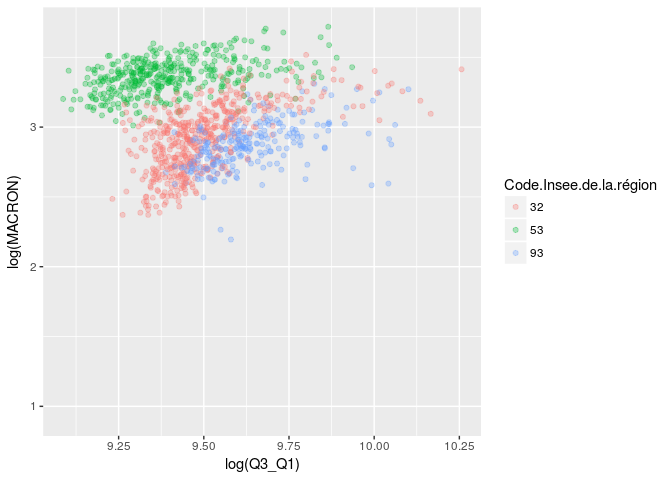
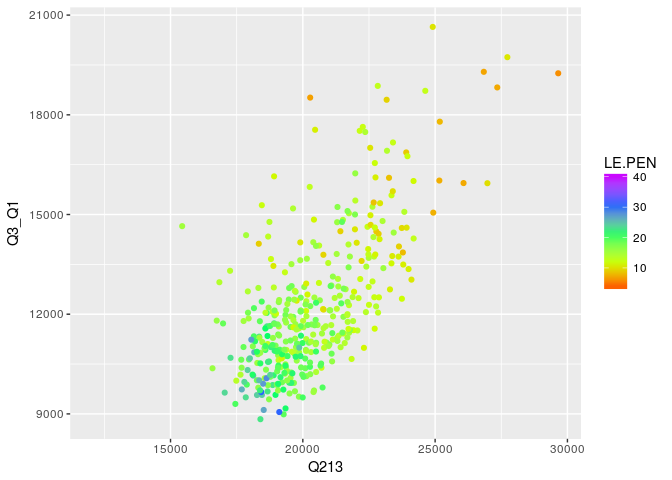

Elections France 2017 Data Merge
================

``` r
library(dplyr)
```

    ## 
    ## Attaching package: 'dplyr'

    ## The following objects are masked from 'package:stats':
    ## 
    ##     filter, lag

    ## The following objects are masked from 'package:base':
    ## 
    ##     intersect, setdiff, setequal, union

``` r
library(tidyr)
library(stringr)
library(GGally)
```

    ## 
    ## Attaching package: 'GGally'

    ## The following object is masked from 'package:dplyr':
    ## 
    ##     nasa

``` r
library(ggcorrplot)
```

    ## Loading required package: ggplot2

``` r
df_zones_communes<- read.csv('data/DOI/code_geo_communes.csv',sep=';',stringsAsFactors = 1)
df_votes.2017<-read.csv('data/DOI/pres_1erTour_2017_commune_candidat.csv',stringsAsFactors = F)
df_population.2011<-read.csv('data/DOI/base-cc-evol-struct-pop-2011.csv',stringsAsFactors = F)
df_emploi.dec.2016.sex<-read.csv('data/DOI/communes_internet_decembre_2016_gorf18oa_per_sex.csv',stringsAsFactors = F)
df_emploi.dec.2016.age<-read.csv('data/DOI/communes_internet_decembre_2016_gorf18oa_per_age.csv',stringsAsFactors = F)
df_misc.param<-read.csv('data/DOI/MDB-INSEE-V2.csv',stringsAsFactors = F)
df_revenus<-read.csv('data/DOI/revenus_median.csv')

candidats<-c("ARTHAUD","ASSELINEAU","CHEMINADE","DUPONT.AIGNAN","FILLON","HAMON","LASSALLE","LE.PEN","MACRON","MÉLENCHON","POUTOU")
```

### Remove comma on df\_emploi

``` r
df_emploi.dec.2016.age[,7:9]<-lapply(df_emploi.dec.2016.age[,7:9],function(x){as.numeric(gsub(",", "", x))})
df_emploi.dec.2016.sex[,7:9]<-lapply(df_emploi.dec.2016.sex[,7:9],function(x){as.numeric(gsub(",", "", x))})
```

### Combine zone geo with votes :

``` r
df_zones_communes$dept<-str_sub(df_zones_communes$CODGEO,1,end=2) %>% as.numeric()
```

    ## Warning in function_list[[k]](value): NAs introduced by coercion

``` r
df_zones_communes$communes<-str_sub(df_zones_communes$CODGEO,3)%>% as.numeric()


df_votes.2017<-merge(df_votes.2017,df_zones_communes, by.y = c('dept','communes'),by.x = c('Code.du.département','Code.de.la.commune'),all.x = TRUE)
df_votes.2017$CODGEO<-as.character(df_votes.2017$CODGEO)
```

### Combine votes with population structure :

``` r
df.all<- merge(df_votes.2017, df_population.2011,by='CODGEO')
df.all<-merge(df.all,df_emploi.dec.2016.sex,x.by='CODGEO',y.by='Code.Insee.de.la.commune')
df.all<-merge(df.all,df_emploi.dec.2016.age,x.by='CODGEO',y.by='Code.Insee.de.la.commune')
df.all<-merge(df.all,df_misc.param,by='CODGEO')
df.all<-merge(df.all,df_revenus %>% select(-LIBGEO),by='CODGEO')
head(df.all)
```

    ##   CODGEO Libellé.du.département Libellé.de.la.commune
    ## 1  10002                   Aube            Ailleville
    ## 2  10003                   Aube   Aix-Villemaur-Pâlis
    ## 3  10004                   Aube         Allibaudières
    ## 4  10005                   Aube                Amance
    ## 5  10006                   Aube        Arcis-sur-Aube
    ## 6  10007                   Aube            Arconville
    ##   Code.Insee.de.la.région              Libellé.de.la.région
    ## 1                      44 Alsace-Champagne-Ardenne-Lorraine
    ## 2                      44 Alsace-Champagne-Ardenne-Lorraine
    ## 3                      44 Alsace-Champagne-Ardenne-Lorraine
    ## 4                      44 Alsace-Champagne-Ardenne-Lorraine
    ## 5                      44 Alsace-Champagne-Ardenne-Lorraine
    ## 6                      44 Alsace-Champagne-Ardenne-Lorraine
    ##   Code.Insee.du.département Code.Insee.de.la.commune Code.du.département
    ## 1                        10                    10002                  10
    ## 2                        10                    10003                  10
    ## 3                        10                    10004                  10
    ## 4                        10                    10005                  10
    ## 5                        10                    10006                  10
    ## 6                        10                    10007                  10
    ##   Code.de.la.commune   X ARTHAUD ASSELINEAU CHEMINADE DUPONT.AIGNAN FILLON
    ## 1                  2 409    1.84       0.00      0.00          2.45  21.47
    ## 2                  3 410    0.87       0.58      0.19          6.35  20.98
    ## 3                  4 411    0.00       2.46      0.00          6.56  31.97
    ## 4                  5 412    1.18       1.18      0.00          6.51  24.26
    ## 5                  6 413    0.97       0.56      0.00          5.43  22.42
    ## 6                  7 414    0.00       0.00      0.00          8.11  24.32
    ##   HAMON LASSALLE LE.PEN MACRON MÉLENCHON POUTOU            LIBGEO.x DEP.x
    ## 1  1.23     0.61  33.13  18.40     19.63   1.23          Ailleville    10
    ## 2  3.15     0.92  31.83  20.30     13.81   1.02 Aix-Villemaur-Pâlis    10
    ## 3  1.64     0.00  45.08   4.10      7.38   0.82       Allibaudières    10
    ## 4  2.96     1.18  36.69  18.93      7.10   0.00              Amance    10
    ## 5  4.25     0.56  35.03  16.99     12.88   0.91      Arcis-sur-Aube    10
    ## 6  2.70     0.00  39.19  17.57      6.76   1.35          Arconville    10
    ##   REG.x      EPCI NATURE_EPCI ARR   CV ZE2010 UU2010 TUU2014 TDUU2014
    ## 1    44 241000405          CC 101 1003   2102  10000       0        4
    ## 2    44 241000447          CC 103 1001   2102  10102       1       13
    ## 3    44 200071777          CC 103 1002   2102  10000       0        4
    ## 4    44 200066892          CC 101 1017   2102  10000       0        4
    ## 5    44 200071777          CC 103 1002   2102  10106       1       13
    ## 6    44 241000405          CC 101 1003   2102  10000       0        3
    ##   AU2010 TAU2014 CATAEU2010 BV2012 REG.y DEP.y       LIBGEO.y P11_POP
    ## 1    397       1        222  10033    21    10     Ailleville     277
    ## 2    997       0        120  10003    21    10    Aix-en-Othe    2450
    ## 3    998       0        300  10006    21    10  Allibaudières     264
    ## 4    998       0        300  10034    21    10         Amance     280
    ## 5    721       1        221  10006    21    10 Arcis-sur-Aube    2988
    ## 6    000       0        400  10033    21    10     Arconville     113
    ##   P11_POP0014 P11_POP1529 P11_POP3044 P11_POP4559 P11_POP6074 P11_POP7589
    ## 1          48          58          63          54          43          12
    ## 2         437         304         397         441         495         324
    ## 3          68          52          43          45          40          16
    ## 4          61          28          65          60          37          27
    ## 5         550         521         516         548         487         316
    ## 6          19          10          24          30          17          13
    ##   P11_POP90P P11_POPH P11_H0014 P11_H1529 P11_H3044 P11_H4559 P11_H6074
    ## 1          0      139        22        33        27        26        24
    ## 2         52     1147       225       146       194       209       228
    ## 3          1      136        30        30        21        24        22
    ## 4          2      144        30        14        31        37        15
    ## 5         50     1418       288       244       273       271       222
    ## 6          0       56        13         2        13        15         8
    ##   P11_H7589 P11_H90P P11_H0019 P11_H2064 P11_H65P P11_POPF P11_F0014
    ## 1         5        0        42        78       19      138        25
    ## 2       127       17       290       591      266     1303       211
    ## 3         7        1        40        78       18      128        37
    ## 4        16        1        38        82       24      136        30
    ## 5       106       13       357       808      254     1570       262
    ## 6         5        0        15        33        8       57         6
    ##   P11_F1529 P11_F3044 P11_F4559 P11_F6074 P11_F7589 P11_F90P P11_F0019
    ## 1        24        36        27        18         7        0        40
    ## 2       158       203       231       267       197       35       268
    ## 3        22        21        20        17         9        0        42
    ## 4        15        34        23        22        12        1        39
    ## 5       277       242       277       265       210       37       361
    ## 6         8        11        15         9         8        0        11
    ##   P11_F2064 P11_F65P P11_POP01P P11_POP01P_IRAN1 P11_POP01P_IRAN2
    ## 1        81       17        274              245                6
    ## 2       649      386       2426             2075              117
    ## 3        68       17        256              197               52
    ## 4        69       28        277              237               13
    ## 5       801      407       2942             2502              143
    ## 6        34       12        110              107                0
    ##   P11_POP01P_IRAN3 P11_POP01P_IRAN4 P11_POP01P_IRAN5 P11_POP01P_IRAN6
    ## 1               17                1                5                0
    ## 2              161                3               65                0
    ## 3                0                1                6                0
    ## 4               17                0                7                0
    ## 5              156               34              106                0
    ## 6                2                1                0                0
    ##   P11_POP01P_IRAN7 P11_POP0114_IRAN2P P11_POP0114_IRAN2 P11_POP0114_IRAN3P
    ## 1                0                  3                 0                  3
    ## 2                5                 92                29                 64
    ## 3                0                 22                21                  1
    ## 4                2                 12                 6                  6
    ## 5                1                122                32                 89
    ## 6                0                  2                 0                  2
    ##   P11_POP1524_IRAN2P P11_POP1524_IRAN2 P11_POP1524_IRAN3P
    ## 1                 11                 3                  8
    ## 2                 61                23                 38
    ## 3                 14                13                  1
    ## 4                  4                 0                  4
    ## 5                 82                23                 59
    ## 6                  0                 0                  0
    ##   P11_POP2554_IRAN2P P11_POP2554_IRAN2 P11_POP2554_IRAN3P
    ## 1                 15                 3                 12
    ## 2                133                50                 83
    ## 3                 21                18                  3
    ## 4                 19                 6                 13
    ## 5                193                66                127
    ## 6                  0                 0                  0
    ##   P11_POP55P_IRAN2P P11_POP55P_IRAN2 P11_POP55P_IRAN3P C11_POP15P
    ## 1                 0                0                 0        252
    ## 2                65               16                49       2002
    ## 3                 2                0                 2        194
    ## 4                 4                1                 3        214
    ## 5                43               21                22       2461
    ## 6                 1                0                 1         96
    ##   C11_POP15P_CS1 C11_POP15P_CS2 C11_POP15P_CS3 C11_POP15P_CS4
    ## 1              8              4             24             12
    ## 2             52             52             75            111
    ## 3             12              0              4              4
    ## 4              4             13             21             13
    ## 5             16             63             56            266
    ## 6             16              0              0             12
    ##   C11_POP15P_CS5 C11_POP15P_CS6 C11_POP15P_CS7 C11_POP15P_CS8 C11_H15P
    ## 1             41             69             41             53      138
    ## 2            286            302            875            250      890
    ## 3              8             65             65             36       97
    ## 4             34             34             63             34      109
    ## 5            357            465            883            355     1106
    ## 6             12             32             16              8       44
    ##   C11_H15P_CS1 C11_H15P_CS2 C11_H15P_CS3 C11_H15P_CS4 C11_H15P_CS5
    ## 1            4            4           12            8            8
    ## 2           40           40           44           56           60
    ## 3            8            0            0            0            0
    ## 4            4           13           17            0            4
    ## 5           16           39           32          111           95
    ## 6           12            0            0            4            0
    ##   C11_H15P_CS6 C11_H15P_CS7 C11_H15P_CS8 C11_F15P C11_F15P_CS1
    ## 1           49           24           28      114            4
    ## 2          206          366           79     1113           12
    ## 3           40           32           16       97            4
    ## 4           34           29            8      105            0
    ## 5          342          373           99     1355            0
    ## 6           20            8            0       52            4
    ##   C11_F15P_CS2 C11_F15P_CS3 C11_F15P_CS4 C11_F15P_CS5 C11_F15P_CS6
    ## 1            0           12            4           32           20
    ## 2           12           32           56          226           95
    ## 3            0            4            4            8           24
    ## 4            0            4           13           29            0
    ## 5           24           24          156          262          123
    ## 6            0            0            8           12           12
    ##   C11_F15P_CS7 C11_F15P_CS8 C11_POP1524 C11_POP1524_CS1 C11_POP1524_CS2
    ## 1           16           24          65               0               0
    ## 2          509          171         171               0               0
    ## 3           32           20          32               0               0
    ## 4           34           25          21               0               0
    ## 5          510          256         300               8               8
    ## 6            8            8           4               0               0
    ##   C11_POP1524_CS3 C11_POP1524_CS4 C11_POP1524_CS5 C11_POP1524_CS6
    ## 1               0               0              12              16
    ## 2               0               4              24              56
    ## 3               0               0               4               4
    ## 4               0               0               0               4
    ## 5               0              28              48              76
    ## 6               0               0               0               0
    ##   C11_POP1524_CS7 C11_POP1524_CS8 C11_POP2554 C11_POP2554_CS1
    ## 1               0              37         110               8
    ## 2               0              87         735              32
    ## 3               0              24          85              12
    ## 4               0              17         113               0
    ## 5               0             133        1030               4
    ## 6               0               4          48               8
    ##   C11_POP2554_CS2 C11_POP2554_CS3 C11_POP2554_CS4 C11_POP2554_CS5
    ## 1               4               8              12              24
    ## 2              32              52              91             222
    ## 3               0               4               4               4
    ## 4              13              17              13              29
    ## 5              39              32             223             257
    ## 6               0               0               8              12
    ##   C11_POP2554_CS6 C11_POP2554_CS7 C11_POP2554_CS8 C11_POP55P
    ## 1              45               0               8         77
    ## 2             218               0              87       1097
    ## 3              53               0               8         77
    ## 4              29               0              13         80
    ## 5             325               0             150       1131
    ## 6              20               0               0         44
    ##   C11_POP55P_CS1 C11_POP55P_CS2 C11_POP55P_CS3 C11_POP55P_CS4
    ## 1              0              0             16              0
    ## 2             20             20             24             16
    ## 3              0              0              0              0
    ## 4              4              0              4              0
    ## 5              4             16             24             16
    ## 6              8              0              0              4
    ##   C11_POP55P_CS5 C11_POP55P_CS6 C11_POP55P_CS7 C11_POP55P_CS8 Hommes
    ## 1              4              8             41              8     20
    ## 2             40             28            875             75    160
    ## 3              0              8             65              4     20
    ## 4              4              0             63              4     10
    ## 5             52             64            883             72    130
    ## 6              0             12             16              4     10
    ##   Femmes Ensemble X.25 X25_49 X.49 Nb.Pharmacies.et.parfumerie
    ## 1     20       30   10     20   10                           0
    ## 2    170      330   50    210   80                           0
    ## 3     10       30    0     20   10                           0
    ## 4     10       20    0     10   10                           0
    ## 5    150      270   40    160   70                           0
    ## 6      0       10    0     10    0                           0
    ##   Dynamique.Entrepreneuriale
    ## 1                         12
    ## 2                        115
    ## 3                         18
    ## 4                         24
    ## 5                        140
    ## 6                         11
    ##   Dynamique.Entrepreneuriale.Service.et.Commerce Synergie.Médicale.COMMUNE
    ## 1                                              3                        52
    ## 2                                            124                        48
    ## 3                                              6                        45
    ## 4                                              8                        53
    ## 5                                            192                        84
    ## 6                                              3                        52
    ##   Orientation.Economique Indice.Fiscal.Partiel Score.Fiscal
    ## 1      Bassin Industriel              97.92283     50.06536
    ## 2     Bassin Résidentiel              97.92283     50.06536
    ## 3      Bassin diversifié              97.92283     50.06536
    ## 4      Bassin Industriel              97.92283     50.06536
    ## 5      Bassin diversifié              97.92283     50.06536
    ## 6      Bassin Industriel              97.92283     50.06536
    ##   Indice.Evasion.Client Score.Evasion.Client Indice.Synergie.Médicale
    ## 1                0.0000              0.00000                 52.25869
    ## 2              248.4555              0.10621                 48.23879
    ## 3                0.0000              0.00000                 45.22387
    ## 4                0.0000              0.00000                 53.26367
    ## 5              248.4555              0.10621                 84.41789
    ## 6                0.0000              0.00000                 52.25869
    ##   Score.Synergie.Médicale          SEG.Croissance.POP         LIBGEO REG
    ## 1                 0.05205 en croissance démographique     Ailleville  21
    ## 2                 0.04671 en croissance démographique    Aix-en-Othe  21
    ## 3                 0.04271 en croissance démographique  Allibaudières  21
    ## 4                 0.05339 en croissance démographique         Amance  21
    ## 5                 0.09476 en croissance démographique Arcis-sur-Aube  21
    ## 6                 0.05205 en croissance démographique     Arconville  21
    ##   DEP Nb.Omnipraticiens.BV Nb.Infirmiers.Libéraux.BV
    ## 1  10                   14                        10
    ## 2  10                    4                         2
    ## 3  10                   12                        10
    ## 4  10                   14                        10
    ## 5  10                   12                        10
    ## 6  10                   14                        10
    ##   Nb.dentistes.Libéraux.BV Nb.pharmaciens.Libéraux.BV Densité.Médicale.BV
    ## 1                       11                         11          0.06704660
    ## 2                        2                          2          0.05129065
    ## 3                        5                          5          0.08380825
    ## 4                       11                         11          0.06704660
    ## 5                        5                          5          0.08380825
    ## 6                       11                         11          0.06704660
    ##   Score.équipement.de.santé.BV Indice.Démographique Score.Démographique
    ## 1                            3             13.28979             0.01025
    ## 2                            0            129.97169             0.10029
    ## 3                            4             16.39887             0.01265
    ## 4                            3             14.32615             0.01105
    ## 5                            4            173.19398             0.13364
    ## 6                            3              9.08339             0.00701
    ##   Indice.Ménages Score.Ménages Population Evolution.Population
    ## 1       13.10998       0.00783        218                   -6
    ## 2      137.88083       0.08236       2132                 -204
    ## 3       11.45240       0.00684        269                   13
    ## 4       13.71274       0.00819        235                  -10
    ## 5      182.78628       0.10919       2841                  -46
    ## 6        8.13723       0.00486        149                    0
    ##   Evolution.Pop.. Nb.Ménages Nb.Résidences.Principales Nb.propriétaire
    ## 1              -2         87                        86              69
    ## 2              -9        915                       915             590
    ## 3               5         76                        76              64
    ## 4              -4         91                        91              65
    ## 5              -1       1213                      1213             642
    ## 6               0         54                        54              40
    ##   Nb.Logement Nb.Résidences.Secondaires Nb.Log.Vacants
    ## 1         106                        10             10
    ## 2        1177                       190             72
    ## 3          90                         7              7
    ## 4         110                        14              5
    ## 5        1390                        45            132
    ## 6          61                         5              2
    ##   Nb.Occupants.Résidence.Principale Nb.Femme Nb.Homme Nb.Mineurs
    ## 1                               218      210      210        259
    ## 2                              2050     2206     1984       2440
    ## 3                               216      240      284        343
    ## 4                               221      208      242        260
    ## 5                              2748     2848     2666       3299
    ## 6                               146      140      152        181
    ##   Nb.Majeurs Nb.Etudiants Nb.Entreprises.Secteur.Services
    ## 1        161           12                               2
    ## 2       1750          123                              60
    ## 3        181           18                               2
    ## 4        190            6                               4
    ## 5       2215          154                              87
    ## 6        111           11                               3
    ##   Nb.Entreprises.Secteur.Commerce Nb.Entreprises.Secteur.Construction
    ## 1                               1                                   1
    ## 2                              37                                  14
    ## 3                               3                                   1
    ## 4                               3                                   1
    ## 5                              63                                   7
    ## 6                               0                                   0
    ##   Nb.Entreprises.Secteur.Industrie Nb.Création.Enteprises
    ## 1                                0                      0
    ## 2                               21                      7
    ## 3                                3                      0
    ## 4                                7                      1
    ## 5                               29                     14
    ## 6                                0                      0
    ##   Nb.Création.Industrielles Nb.Création.Construction Nb.Création.Commerces
    ## 1                         0                        0                     0
    ## 2                         2                        1                     1
    ## 3                         0                        0                     0
    ## 4                         1                        0                     0
    ## 5                         4                        1                     1
    ## 6                         0                        0                     0
    ##   Nb.Création.Services Moyenne.Revenus.Fiscaux.Départementaux
    ## 1                    0                                   9364
    ## 2                    3                                   9364
    ## 3                    0                                   9364
    ## 4                    0                                   9364
    ## 5                    8                                   9364
    ## 6                    0                                   9364
    ##   Moyenne.Revenus.Fiscaux.Régionaux Dep.Moyenne.Salaires.Horaires
    ## 1                             10046                      10.48095
    ## 2                             10046                      10.48095
    ## 3                             10046                      10.48095
    ## 4                             10046                      10.48095
    ## 5                             10046                      10.48095
    ## 6                             10046                      10.48095
    ##   Dep.Moyenne.Salaires.Cadre.Horaires
    ## 1                            21.35238
    ## 2                            21.35238
    ## 3                            21.35238
    ## 4                            21.35238
    ## 5                            21.35238
    ## 6                            21.35238
    ##   Dep.Moyenne.Salaires.Prof.Intermédiaire.Horaires
    ## 1                                         12.56667
    ## 2                                         12.56667
    ## 3                                         12.56667
    ## 4                                         12.56667
    ## 5                                         12.56667
    ## 6                                         12.56667
    ##   Dep.Moyenne.Salaires.Employé.Horaires
    ## 1                               8.52381
    ## 2                               8.52381
    ## 3                               8.52381
    ## 4                               8.52381
    ## 5                               8.52381
    ## 6                               8.52381
    ##   Dep.Moyenne.Salaires.Ouvrié.Horaires Reg.Moyenne.Salaires.Horaires
    ## 1                             8.585714                      10.65244
    ## 2                             8.585714                      10.65244
    ## 3                             8.585714                      10.65244
    ## 4                             8.585714                      10.65244
    ## 5                             8.585714                      10.65244
    ## 6                             8.585714                      10.65244
    ##   Reg.Moyenne.Salaires.Cadre.Horaires
    ## 1                            20.93171
    ## 2                            20.93171
    ## 3                            20.93171
    ## 4                            20.93171
    ## 5                            20.93171
    ## 6                            20.93171
    ##   Reg.Moyenne.Salaires.Prof.Intermédiaire.Horaires
    ## 1                                         12.48902
    ## 2                                         12.48902
    ## 3                                         12.48902
    ## 4                                         12.48902
    ## 5                                         12.48902
    ## 6                                         12.48902
    ##   Reg.Moyenne.Salaires.Employé.Horaires
    ## 1                              8.663415
    ## 2                              8.663415
    ## 3                              8.663415
    ## 4                              8.663415
    ## 5                              8.663415
    ## 6                              8.663415
    ##   Reg.Moyenne.Salaires.Ouvrié.Horaires Valeur.ajoutée.régionale
    ## 1                             9.082927                 19749.44
    ## 2                             9.082927                 19749.44
    ## 3                             9.082927                 19749.44
    ## 4                             9.082927                 19749.44
    ## 5                             9.082927                 19749.44
    ## 6                             9.082927                 19749.44
    ##            Urbanité.Ruralité Score.Urbanité Nb.Atifs Nb.Actifs.Salariés
    ## 1 Com rurale < 2 000 m habts            0.0       90                 80
    ## 2   Com rurale > 2 000 habts            0.0      751                653
    ## 3 Com rurale < 2 000 m habts            0.0       81                 63
    ## 4 Com rurale < 2 000 m habts            0.0      105                 87
    ## 5           Com < 10 m habts           12.5     1020                893
    ## 6 Com rurale < 2 000 m habts            0.0       66                 53
    ##   Nb.Actifs.Non.Salariés Nb.Logement.Secondaire.et.Occasionnel Nb.Hotel
    ## 1                     10                                    10        0
    ## 2                     98                                   190        0
    ## 3                     18                                     7        0
    ## 4                     18                                    14        0
    ## 5                    127                                    45        1
    ## 6                     13                                     5        0
    ##   Capacité.Hotel Nb.Camping Capacité.Camping
    ## 1              0          0                0
    ## 2              0          1              125
    ## 3              0          0                0
    ## 4              0          0                0
    ## 5              9          1               56
    ## 6              0          0                0
    ##                Dynamique.Démographique.BV Taux.étudiants Taux.Propriété
    ## 1         6.Déclin par déficit migratoire              0             65
    ## 2 3.Accroissement par excédent migratoire              0             50
    ## 3         6.Déclin par déficit migratoire              0             71
    ## 4         6.Déclin par déficit migratoire              0             59
    ## 5         6.Déclin par déficit migratoire              0             46
    ## 6         6.Déclin par déficit migratoire              0             65
    ##   Dynamique.Démographique.INSEE Capacité.Fisc Capacité.Fiscale
    ## 1                             0            68               68
    ## 2                            23            88               88
    ## 3                            -1            68               68
    ## 4                             1            68               68
    ## 5                             3            97               97
    ## 6                             0            67               67
    ##   Moyenne.Revnus.fiscaux Taux.Evasion.Client
    ## 1                   9705                   0
    ## 2                   9705                   2
    ## 3                   9705                   0
    ## 4                   9705                   0
    ## 5                   9705                   2
    ## 6                   9705                   0
    ##   Nb.Education..santé..action.sociale
    ## 1                                   0
    ## 2                                  18
    ## 3                                   0
    ## 4                                   0
    ## 5                                  24
    ## 6                                   0
    ##   Nb.Services.personnels.et.domestiques Nb.Santé..action.sociale
    ## 1                                     0                        0
    ## 2                                     6                       18
    ## 3                                     0                        0
    ## 4                                     0                        1
    ## 5                                    11                       27
    ## 6                                     0                        0
    ##   Nb.Industries.des.biens.intermédiaires Nb.de.Commerce
    ## 1                                   2230           2004
    ## 2                                   2230           2004
    ## 3                                   2230           2004
    ## 4                                   2230           2004
    ## 5                                   2230           2004
    ## 6                                   2230           2004
    ##   Nb.de.Services.aux.particuliers
    ## 1                             542
    ## 2                             542
    ## 3                             542
    ## 4                             542
    ## 5                             542
    ## 6                             542
    ##   Nb.institution.de.Education..santé..action.sociale..administration
    ## 1                                                               3832
    ## 2                                                               3832
    ## 3                                                               3832
    ## 4                                                               3832
    ## 5                                                               3832
    ## 6                                                               3832
    ##   PIB.Régionnal SEG.Environnement.Démographique.Obsolète
    ## 1         35310      Zone rurale en déclin démographique
    ## 2         35310  Zone rurale en croissance démographique
    ## 3         35310      Zone rurale en déclin démographique
    ## 4         35310      Zone rurale en déclin démographique
    ## 5         35310      Zone rurale en déclin démographique
    ## 6         35310      Zone rurale en déclin démographique
    ##   Score.Croissance.Population Score.Croissance.Entrepreneuriale
    ## 1                    70.49180                           0.00000
    ## 2                    67.62295                           0.02104
    ## 3                    73.36066                           0.00000
    ## 4                    69.67213                           0.00173
    ## 5                    70.90164                           0.03314
    ## 6                    71.31148                           0.00000
    ##   Score.VA.Région Score.PIB                    Environnement.Démographique
    ## 1         6.46229   5.85503  Bassin Industriel en croissance démographique
    ## 2         6.46229   5.85503 Bassin Résidentiel en croissance démographique
    ## 3         6.46229   5.85503  Bassin diversifié en croissance démographique
    ## 4         6.46229   5.85503  Bassin Industriel en croissance démographique
    ## 5         6.46229   5.85503  Bassin diversifié en croissance démographique
    ## 6         6.46229   5.85503  Bassin Industriel en croissance démographique
    ##         Fidélité              SYN.MEDICAL   Seg.Cap.Fiscale
    ## 1 Pop Sédentaire Faible Synergie Médicale Fiscalité moyenne
    ## 2     Pop Mobile Faible Synergie Médicale Fiscalité moyenne
    ## 3 Pop Sédentaire Faible Synergie Médicale Fiscalité moyenne
    ## 4 Pop Sédentaire Faible Synergie Médicale Fiscalité moyenne
    ## 5     Pop Mobile Faible Synergie Médicale Fiscalité moyenne
    ## 6 Pop Sédentaire Faible Synergie Médicale Fiscalité moyenne
    ##          Seg.Dyn.Entre                               DYN.SetC CP NBMEN13
    ## 1     Faible dynamique           Faible Dynamique Serv et Com 10     103
    ## 2    Moyenne dynamique Bonne Dynamique Entreprise Serv et Com 10    1126
    ## 3     Faible dynamique           Faible Dynamique Serv et Com 10      80
    ## 4     Faible dynamique           Faible Dynamique Serv et Com 10     116
    ## 5 Dynamique Economique Bonne Dynamique Entreprise Serv et Com 10    1292
    ## 6     Faible dynamique           Faible Dynamique Serv et Com 10      53
    ##   NBPERS13 NBUC13 PMIMP13  Q113  Q213  Q313 Q3_Q1 D113 D213  D313  D413
    ## 1    266.5  177.1      NA    NA 18480    NA    NA   NA   NA    NA    NA
    ## 2   2430.0 1695.0    46.6 10794 17206 23322 12528 4797 9320 12370 15242
    ## 3    227.0  142.7      NA    NA 17400    NA    NA   NA   NA    NA    NA
    ## 4    272.0  185.1      NA    NA 17356    NA    NA   NA   NA    NA    NA
    ## 5   2772.5 1940.4    50.2 10524 17024 23960 13436 6282 9180 12180 14878
    ## 6    107.5   77.4      NA    NA 25442    NA    NA   NA   NA    NA    NA
    ##    D613  D713  D813  D913  RD S80S2013 GI13 PTSA13 PCHO13 PBEN13 PPEN13
    ## 1    NA    NA    NA    NA  NA       NA   NA     NA     NA     NA     NA
    ## 2 19254 22038 25000 31928 6.7        9  0.4   41.3    4.3    6.6   41.8
    ## 3    NA    NA    NA    NA  NA       NA   NA     NA     NA     NA     NA
    ## 4    NA    NA    NA    NA  NA       NA   NA     NA     NA     NA     NA
    ## 5 19532 22234 25822 32230 5.1        8  0.4   49.1    3.5    8.0   34.8
    ## 6    NA    NA    NA    NA  NA       NA   NA     NA     NA     NA     NA
    ##   PAUT13
    ## 1     NA
    ## 2    6.0
    ## 3     NA
    ## 4     NA
    ## 5    4.6
    ## 6     NA

### Add unemployment rate

``` r
# per sex
POP_Active_Male_cols<-grep('C11_H15P_C',colnames(df.all),value = T)
df.all$POP_Active_Male<- df.all %>% select(one_of(POP_Active_Male_cols)) %>% rowSums(.)
df.all<-df.all%>% mutate(POP_Active_Male_NoJob=Hommes/POP_Active_Male)

POP_Active_Female_cols<-grep('C11_F15P_C',colnames(df.all),value = T)
df.all$POP_Active_Female<- df.all %>% select(one_of(POP_Active_Female_cols)) %>% rowSums(.)
df.all<-df.all%>% mutate(POP_Active_Female_NoJob=Femmes/POP_Active_Female)


df.all<- df.all %>% mutate(POP_Active_Agricole= C11_POP15P_CS1/(POP_Active_Female+POP_Active_Male))
df.all<-df.all %>% mutate(POP_Active_Agricole_log= log(POP_Active_Agricole+1))
```

Focus on one city :

``` r
df.all %>% filter(CODGEO==41269) %>% gather()
```

    ## Warning: attributes are not identical across measure variables; they will
    ## be dropped

    ##                                                                    key
    ## 1                                                               CODGEO
    ## 2                                               Libellé.du.département
    ## 3                                                Libellé.de.la.commune
    ## 4                                              Code.Insee.de.la.région
    ## 5                                                 Libellé.de.la.région
    ## 6                                            Code.Insee.du.département
    ## 7                                             Code.Insee.de.la.commune
    ## 8                                                  Code.du.département
    ## 9                                                   Code.de.la.commune
    ## 10                                                                   X
    ## 11                                                             ARTHAUD
    ## 12                                                          ASSELINEAU
    ## 13                                                           CHEMINADE
    ## 14                                                       DUPONT.AIGNAN
    ## 15                                                              FILLON
    ## 16                                                               HAMON
    ## 17                                                            LASSALLE
    ## 18                                                              LE.PEN
    ## 19                                                              MACRON
    ## 20                                                           MÉLENCHON
    ## 21                                                              POUTOU
    ## 22                                                            LIBGEO.x
    ## 23                                                               DEP.x
    ## 24                                                               REG.x
    ## 25                                                                EPCI
    ## 26                                                         NATURE_EPCI
    ## 27                                                                 ARR
    ## 28                                                                  CV
    ## 29                                                              ZE2010
    ## 30                                                              UU2010
    ## 31                                                             TUU2014
    ## 32                                                            TDUU2014
    ## 33                                                              AU2010
    ## 34                                                             TAU2014
    ## 35                                                          CATAEU2010
    ## 36                                                              BV2012
    ## 37                                                               REG.y
    ## 38                                                               DEP.y
    ## 39                                                            LIBGEO.y
    ## 40                                                             P11_POP
    ## 41                                                         P11_POP0014
    ## 42                                                         P11_POP1529
    ## 43                                                         P11_POP3044
    ## 44                                                         P11_POP4559
    ## 45                                                         P11_POP6074
    ## 46                                                         P11_POP7589
    ## 47                                                          P11_POP90P
    ## 48                                                            P11_POPH
    ## 49                                                           P11_H0014
    ## 50                                                           P11_H1529
    ## 51                                                           P11_H3044
    ## 52                                                           P11_H4559
    ## 53                                                           P11_H6074
    ## 54                                                           P11_H7589
    ## 55                                                            P11_H90P
    ## 56                                                           P11_H0019
    ## 57                                                           P11_H2064
    ## 58                                                            P11_H65P
    ## 59                                                            P11_POPF
    ## 60                                                           P11_F0014
    ## 61                                                           P11_F1529
    ## 62                                                           P11_F3044
    ## 63                                                           P11_F4559
    ## 64                                                           P11_F6074
    ## 65                                                           P11_F7589
    ## 66                                                            P11_F90P
    ## 67                                                           P11_F0019
    ## 68                                                           P11_F2064
    ## 69                                                            P11_F65P
    ## 70                                                          P11_POP01P
    ## 71                                                    P11_POP01P_IRAN1
    ## 72                                                    P11_POP01P_IRAN2
    ## 73                                                    P11_POP01P_IRAN3
    ## 74                                                    P11_POP01P_IRAN4
    ## 75                                                    P11_POP01P_IRAN5
    ## 76                                                    P11_POP01P_IRAN6
    ## 77                                                    P11_POP01P_IRAN7
    ## 78                                                  P11_POP0114_IRAN2P
    ## 79                                                   P11_POP0114_IRAN2
    ## 80                                                  P11_POP0114_IRAN3P
    ## 81                                                  P11_POP1524_IRAN2P
    ## 82                                                   P11_POP1524_IRAN2
    ## 83                                                  P11_POP1524_IRAN3P
    ## 84                                                  P11_POP2554_IRAN2P
    ## 85                                                   P11_POP2554_IRAN2
    ## 86                                                  P11_POP2554_IRAN3P
    ## 87                                                   P11_POP55P_IRAN2P
    ## 88                                                    P11_POP55P_IRAN2
    ## 89                                                   P11_POP55P_IRAN3P
    ## 90                                                          C11_POP15P
    ## 91                                                      C11_POP15P_CS1
    ## 92                                                      C11_POP15P_CS2
    ## 93                                                      C11_POP15P_CS3
    ## 94                                                      C11_POP15P_CS4
    ## 95                                                      C11_POP15P_CS5
    ## 96                                                      C11_POP15P_CS6
    ## 97                                                      C11_POP15P_CS7
    ## 98                                                      C11_POP15P_CS8
    ## 99                                                            C11_H15P
    ## 100                                                       C11_H15P_CS1
    ## 101                                                       C11_H15P_CS2
    ## 102                                                       C11_H15P_CS3
    ## 103                                                       C11_H15P_CS4
    ## 104                                                       C11_H15P_CS5
    ## 105                                                       C11_H15P_CS6
    ## 106                                                       C11_H15P_CS7
    ## 107                                                       C11_H15P_CS8
    ## 108                                                           C11_F15P
    ## 109                                                       C11_F15P_CS1
    ## 110                                                       C11_F15P_CS2
    ## 111                                                       C11_F15P_CS3
    ## 112                                                       C11_F15P_CS4
    ## 113                                                       C11_F15P_CS5
    ## 114                                                       C11_F15P_CS6
    ## 115                                                       C11_F15P_CS7
    ## 116                                                       C11_F15P_CS8
    ## 117                                                        C11_POP1524
    ## 118                                                    C11_POP1524_CS1
    ## 119                                                    C11_POP1524_CS2
    ## 120                                                    C11_POP1524_CS3
    ## 121                                                    C11_POP1524_CS4
    ## 122                                                    C11_POP1524_CS5
    ## 123                                                    C11_POP1524_CS6
    ## 124                                                    C11_POP1524_CS7
    ## 125                                                    C11_POP1524_CS8
    ## 126                                                        C11_POP2554
    ## 127                                                    C11_POP2554_CS1
    ## 128                                                    C11_POP2554_CS2
    ## 129                                                    C11_POP2554_CS3
    ## 130                                                    C11_POP2554_CS4
    ## 131                                                    C11_POP2554_CS5
    ## 132                                                    C11_POP2554_CS6
    ## 133                                                    C11_POP2554_CS7
    ## 134                                                    C11_POP2554_CS8
    ## 135                                                         C11_POP55P
    ## 136                                                     C11_POP55P_CS1
    ## 137                                                     C11_POP55P_CS2
    ## 138                                                     C11_POP55P_CS3
    ## 139                                                     C11_POP55P_CS4
    ## 140                                                     C11_POP55P_CS5
    ## 141                                                     C11_POP55P_CS6
    ## 142                                                     C11_POP55P_CS7
    ## 143                                                     C11_POP55P_CS8
    ## 144                                                             Hommes
    ## 145                                                             Femmes
    ## 146                                                           Ensemble
    ## 147                                                               X.25
    ## 148                                                             X25_49
    ## 149                                                               X.49
    ## 150                                        Nb.Pharmacies.et.parfumerie
    ## 151                                         Dynamique.Entrepreneuriale
    ## 152                     Dynamique.Entrepreneuriale.Service.et.Commerce
    ## 153                                          Synergie.Médicale.COMMUNE
    ## 154                                             Orientation.Economique
    ## 155                                              Indice.Fiscal.Partiel
    ## 156                                                       Score.Fiscal
    ## 157                                              Indice.Evasion.Client
    ## 158                                               Score.Evasion.Client
    ## 159                                           Indice.Synergie.Médicale
    ## 160                                            Score.Synergie.Médicale
    ## 161                                                 SEG.Croissance.POP
    ## 162                                                             LIBGEO
    ## 163                                                                REG
    ## 164                                                                DEP
    ## 165                                               Nb.Omnipraticiens.BV
    ## 166                                          Nb.Infirmiers.Libéraux.BV
    ## 167                                           Nb.dentistes.Libéraux.BV
    ## 168                                         Nb.pharmaciens.Libéraux.BV
    ## 169                                                Densité.Médicale.BV
    ## 170                                       Score.équipement.de.santé.BV
    ## 171                                               Indice.Démographique
    ## 172                                                Score.Démographique
    ## 173                                                     Indice.Ménages
    ## 174                                                      Score.Ménages
    ## 175                                                         Population
    ## 176                                               Evolution.Population
    ## 177                                                    Evolution.Pop..
    ## 178                                                         Nb.Ménages
    ## 179                                          Nb.Résidences.Principales
    ## 180                                                    Nb.propriétaire
    ## 181                                                        Nb.Logement
    ## 182                                          Nb.Résidences.Secondaires
    ## 183                                                     Nb.Log.Vacants
    ## 184                                  Nb.Occupants.Résidence.Principale
    ## 185                                                           Nb.Femme
    ## 186                                                           Nb.Homme
    ## 187                                                         Nb.Mineurs
    ## 188                                                         Nb.Majeurs
    ## 189                                                       Nb.Etudiants
    ## 190                                    Nb.Entreprises.Secteur.Services
    ## 191                                    Nb.Entreprises.Secteur.Commerce
    ## 192                                Nb.Entreprises.Secteur.Construction
    ## 193                                   Nb.Entreprises.Secteur.Industrie
    ## 194                                             Nb.Création.Enteprises
    ## 195                                          Nb.Création.Industrielles
    ## 196                                           Nb.Création.Construction
    ## 197                                              Nb.Création.Commerces
    ## 198                                               Nb.Création.Services
    ## 199                             Moyenne.Revenus.Fiscaux.Départementaux
    ## 200                                  Moyenne.Revenus.Fiscaux.Régionaux
    ## 201                                      Dep.Moyenne.Salaires.Horaires
    ## 202                                Dep.Moyenne.Salaires.Cadre.Horaires
    ## 203                   Dep.Moyenne.Salaires.Prof.Intermédiaire.Horaires
    ## 204                              Dep.Moyenne.Salaires.Employé.Horaires
    ## 205                               Dep.Moyenne.Salaires.Ouvrié.Horaires
    ## 206                                      Reg.Moyenne.Salaires.Horaires
    ## 207                                Reg.Moyenne.Salaires.Cadre.Horaires
    ## 208                   Reg.Moyenne.Salaires.Prof.Intermédiaire.Horaires
    ## 209                              Reg.Moyenne.Salaires.Employé.Horaires
    ## 210                               Reg.Moyenne.Salaires.Ouvrié.Horaires
    ## 211                                           Valeur.ajoutée.régionale
    ## 212                                                  Urbanité.Ruralité
    ## 213                                                     Score.Urbanité
    ## 214                                                           Nb.Atifs
    ## 215                                                 Nb.Actifs.Salariés
    ## 216                                             Nb.Actifs.Non.Salariés
    ## 217                              Nb.Logement.Secondaire.et.Occasionnel
    ## 218                                                           Nb.Hotel
    ## 219                                                     Capacité.Hotel
    ## 220                                                         Nb.Camping
    ## 221                                                   Capacité.Camping
    ## 222                                         Dynamique.Démographique.BV
    ## 223                                                     Taux.étudiants
    ## 224                                                     Taux.Propriété
    ## 225                                      Dynamique.Démographique.INSEE
    ## 226                                                      Capacité.Fisc
    ## 227                                                   Capacité.Fiscale
    ## 228                                             Moyenne.Revnus.fiscaux
    ## 229                                                Taux.Evasion.Client
    ## 230                                Nb.Education..santé..action.sociale
    ## 231                              Nb.Services.personnels.et.domestiques
    ## 232                                           Nb.Santé..action.sociale
    ## 233                             Nb.Industries.des.biens.intermédiaires
    ## 234                                                     Nb.de.Commerce
    ## 235                                    Nb.de.Services.aux.particuliers
    ## 236 Nb.institution.de.Education..santé..action.sociale..administration
    ## 237                                                      PIB.Régionnal
    ## 238                           SEG.Environnement.Démographique.Obsolète
    ## 239                                        Score.Croissance.Population
    ## 240                                  Score.Croissance.Entrepreneuriale
    ## 241                                                    Score.VA.Région
    ## 242                                                          Score.PIB
    ## 243                                        Environnement.Démographique
    ## 244                                                           Fidélité
    ## 245                                                        SYN.MEDICAL
    ## 246                                                    Seg.Cap.Fiscale
    ## 247                                                      Seg.Dyn.Entre
    ## 248                                                           DYN.SetC
    ## 249                                                                 CP
    ## 250                                                            NBMEN13
    ## 251                                                           NBPERS13
    ## 252                                                             NBUC13
    ## 253                                                            PMIMP13
    ## 254                                                               Q113
    ## 255                                                               Q213
    ## 256                                                               Q313
    ## 257                                                              Q3_Q1
    ## 258                                                               D113
    ## 259                                                               D213
    ## 260                                                               D313
    ## 261                                                               D413
    ## 262                                                               D613
    ## 263                                                               D713
    ## 264                                                               D813
    ## 265                                                               D913
    ## 266                                                                 RD
    ## 267                                                           S80S2013
    ## 268                                                               GI13
    ## 269                                                             PTSA13
    ## 270                                                             PCHO13
    ## 271                                                             PBEN13
    ## 272                                                             PPEN13
    ## 273                                                             PAUT13
    ## 274                                                    POP_Active_Male
    ## 275                                              POP_Active_Male_NoJob
    ## 276                                                  POP_Active_Female
    ## 277                                            POP_Active_Female_NoJob
    ## 278                                                POP_Active_Agricole
    ## 279                                            POP_Active_Agricole_log
    ##                                             value
    ## 1                                           41269
    ## 2                                    Loir-et-Cher
    ## 3                                         Vendôme
    ## 4                                              24
    ## 5                             Centre-Val de Loire
    ## 6                                              41
    ## 7                                           41269
    ## 8                                              41
    ## 9                                             269
    ## 10                                          14362
    ## 11                                           0.78
    ## 12                                           1.26
    ## 13                                            0.2
    ## 14                                           4.94
    ## 15                                          24.84
    ## 16                                           6.46
    ## 17                                           1.14
    ## 18                                          17.56
    ## 19                                          23.92
    ## 20                                          17.81
    ## 21                                           1.08
    ## 22                                        Vendôme
    ## 23                                             41
    ## 24                                             24
    ## 25                                      200072072
    ## 26                                             CA
    ## 27                                            412
    ## 28                                           4114
    ## 29                                           2415
    ## 30                                          41401
    ## 31                                              4
    ## 32                                             41
    ## 33                                            169
    ## 34                                              5
    ## 35                                            111
    ## 36                                          41269
    ## 37                                             24
    ## 38                                             41
    ## 39                                        Vendôme
    ## 40                                          16849
    ## 41                                           2574
    ## 42                                           2620
    ## 43                                           2703
    ## 44                                           3121
    ## 45                                           2970
    ## 46                                           2582
    ## 47                                            279
    ## 48                                           7791
    ## 49                                           1286
    ## 50                                           1299
    ## 51                                           1360
    ## 52                                           1518
    ## 53                                           1281
    ## 54                                            991
    ## 55                                             55
    ## 56                                           1796
    ## 57                                           4166
    ## 58                                           1829
    ## 59                                           9058
    ## 60                                           1288
    ## 61                                           1321
    ## 62                                           1343
    ## 63                                           1603
    ## 64                                           1689
    ## 65                                           1591
    ## 66                                            224
    ## 67                                           1742
    ## 68                                           4448
    ## 69                                           2868
    ## 70                                          16666
    ## 71                                          14598
    ## 72                                            693
    ## 73                                            567
    ## 74                                            242
    ## 75                                            485
    ## 76                                              7
    ## 77                                             75
    ## 78                                            369
    ## 79                                            145
    ## 80                                            224
    ## 81                                            555
    ## 82                                            148
    ## 83                                            407
    ## 84                                            879
    ## 85                                            318
    ## 86                                            562
    ## 87                                            266
    ## 88                                             82
    ## 89                                            184
    ## 90                                          14276
    ## 91                                             33
    ## 92                                            364
    ## 93                                            827
    ## 94                                           1343
    ## 95                                           1973
    ## 96                                           2123
    ## 97                                           5554
    ## 98                                           2058
    ## 99                                           6511
    ## 100                                            23
    ## 101                                           239
    ## 102                                           521
    ## 103                                           691
    ## 104                                           369
    ## 105                                          1652
    ## 106                                          2270
    ## 107                                           744
    ## 108                                          7765
    ## 109                                            10
    ## 110                                           125
    ## 111                                           306
    ## 112                                           652
    ## 113                                          1604
    ## 114                                           471
    ## 115                                          3283
    ## 116                                          1314
    ## 117                                          1897
    ## 118                                             0
    ## 119                                             8
    ## 120                                            19
    ## 121                                           153
    ## 122                                           346
    ## 123                                           416
    ## 124                                             0
    ## 125                                           957
    ## 126                                          5462
    ## 127                                            33
    ## 128                                           269
    ## 129                                           594
    ## 130                                          1030
    ## 131                                          1380
    ## 132                                          1481
    ## 133                                            23
    ## 134                                           653
    ## 135                                          6916
    ## 136                                             0
    ## 137                                            88
    ## 138                                           215
    ## 139                                           161
    ## 140                                           248
    ## 141                                           226
    ## 142                                          5531
    ## 143                                           448
    ## 144                                           850
    ## 145                                           830
    ## 146                                          1680
    ## 147                                           260
    ## 148                                          1010
    ## 149                                           410
    ## 150                                             1
    ## 151                                           777
    ## 152                                          1158
    ## 153                                           471
    ## 154                             Bassin Industriel
    ## 155                                     109.47356
    ## 156                                      75.88235
    ## 157                                     869.59423
    ## 158                                       0.37175
    ## 159                                     473.34316
    ## 160                                       0.61129
    ## 161                   en croissance démographique
    ## 162                                       Vendôme
    ## 163                                            24
    ## 164                                            41
    ## 165                                            44
    ## 166                                            28
    ## 167                                            21
    ## 168                                            21
    ## 169                                  0.0861548776
    ## 170                                             4
    ## 171                                    1079.58188
    ## 172                                       0.83303
    ## 173                                     1187.7341
    ## 174                                       0.70951
    ## 175                                         17709
    ## 176                                           339
    ## 177                                             1
    ## 178                                          7882
    ## 179                                          7892
    ## 180                                          3535
    ## 181                                          8700
    ## 182                                           313
    ## 183                                           495
    ## 184                                         17082
    ## 185                                         18152
    ## 186                                         16360
    ## 187                                         20403
    ## 188                                         14109
    ## 189                                          1109
    ## 190                                           476
    ## 191                                           423
    ## 192                                            52
    ## 193                                           142
    ## 194                                            89
    ## 195                                             5
    ## 196                                            11
    ## 197                                            30
    ## 198                                            43
    ## 199                                         11139
    ## 200                                         11231
    ## 201                                 10.8074074074
    ## 202                                 21.0814814815
    ## 203                                 12.5037037037
    ## 204                                  8.7074074074
    ## 205                                  8.9703703704
    ## 206                                 11.2143564356
    ## 207                                 21.2722772277
    ## 208                                 12.5995049505
    ## 209                                  8.7965346535
    ## 210                                  9.1727722772
    ## 211                                  34878.305122
    ## 212                              Com < 50 m habts
    ## 213                                            50
    ## 214                                          6770
    ## 215                                          6154
    ## 216                                           616
    ## 217                                           313
    ## 218                                             6
    ## 219                                           161
    ## 220                                             1
    ## 221                                           180
    ## 222       3.Accroissement par excédent migratoire
    ## 223                                             0
    ## 224                                            40
    ## 225                                           -21
    ## 226                                           290
    ## 227                                           290
    ## 228                                         11185
    ## 229                                             7
    ## 230                                           143
    ## 231                                            52
    ## 232                                           158
    ## 233                                          2916
    ## 234                                          3652
    ## 235                                          1226
    ## 236                                          6903
    ## 237                                         63457
    ## 238       Zone rurale en croissance démographique
    ## 239                                      71.72131
    ## 240                                       0.42189
    ## 241                                      12.30681
    ## 242                                      11.54726
    ## 243 Bassin Industriel en croissance démographique
    ## 244                                    Pop Mobile
    ## 245                       Forte Synergie Médicale
    ## 246                             Fiscalité moyenne
    ## 247                          Dynamique Economique
    ## 248        Bonne Dynamique Entreprise Serv et Com
    ## 249                                            41
    ## 250                                          7861
    ## 251                                       16135.5
    ## 252                                       11514.6
    ## 253                                          52.5
    ## 254                                         10970
    ## 255                                         18286
    ## 256                                         26002
    ## 257                                         15032
    ## 258                                          4700
    ## 259                                          9266
    ## 260                                         12698
    ## 261                                         15756
    ## 262                                         20760
    ## 263                                         23978
    ## 264                                         28514
    ## 265                                         36624
    ## 266                                           7.8
    ## 267                                          10.2
    ## 268                                           0.4
    ## 269                                          49.5
    ## 270                                           3.8
    ## 271                                             5
    ## 272                                          36.4
    ## 273                                           5.3
    ## 274                                          6509
    ## 275                              0.13058841603933
    ## 276                                          7765
    ## 277                             0.106889890534449
    ## 278                           0.00231189575451871
    ## 279                           0.00230922743532139

``` r
corr <- round(cor(df.all %>% select(one_of(c(candidats,"Taux.étudiants","POP_Active_Male_NoJob","POP_Active_Female_NoJob")))%>% na.omit()),1)

# Plot
ggcorrplot(corr, hc.order = TRUE, 
           type = "lower", 
           lab = FALSE, 
           lab_size = 3, 
           method="square", 
           colors = c("cyan4", "white", "red3"), 
           title="Correlogram of Selected Features", 
           ggtheme=theme_bw)
```


``` r
ggplot(df.all,aes(x=Score.PIB)) + geom_histogram(bins = 100)
```


``` r
ggplot(df.all,aes(x=P11_POP,y=P11_POP)) + geom_boxplot()
```

    ## Warning: Continuous x aesthetic -- did you forget aes(group=...)?


``` r
df.all[which.min(df.all$P11_POP),]
```

    ##      CODGEO Libellé.du.département Libellé.de.la.commune
    ## 4734  25242                  Doubs         Flagey-Rigney
    ##      Code.Insee.de.la.région    Libellé.de.la.région
    ## 4734                      27 Bourgogne-Franche-Comté
    ##      Code.Insee.du.département Code.Insee.de.la.commune
    ## 4734                        25                    25242
    ##      Code.du.département Code.de.la.commune    X ARTHAUD ASSELINEAU
    ## 4734                  25                242 6749       0          0
    ##      CHEMINADE DUPONT.AIGNAN FILLON HAMON LASSALLE LE.PEN MACRON MÉLENCHON
    ## 4734         0          5.33  21.33     4        0     28  22.67     18.67
    ##      POUTOU      LIBGEO.x DEP.x REG.x      EPCI NATURE_EPCI ARR   CV
    ## 4734      0 Flagey-Rigney    25    27 242504447          CC 251 2502
    ##      ZE2010 UU2010 TUU2014 TDUU2014 AU2010 TAU2014 CATAEU2010 BV2012 REG.y
    ## 4734   4301  25000       0        3    041       8        112  25047    43
    ##      DEP.y      LIBGEO.y P11_POP P11_POP0014 P11_POP1529 P11_POP3044
    ## 4734    25 Flagey-Rigney      82          14           8          20
    ##      P11_POP4559 P11_POP6074 P11_POP7589 P11_POP90P P11_POPH P11_H0014
    ## 4734          15          20           5          0       42         8
    ##      P11_H1529 P11_H3044 P11_H4559 P11_H6074 P11_H7589 P11_H90P P11_H0019
    ## 4734         2        11         7        12         2        0         9
    ##      P11_H2064 P11_H65P P11_POPF P11_F0014 P11_F1529 P11_F3044 P11_F4559
    ## 4734        26        7       40         7         5         9         9
    ##      P11_F6074 P11_F7589 P11_F90P P11_F0019 P11_F2064 P11_F65P P11_POP01P
    ## 4734         8         3        0         8        24        9         81
    ##      P11_POP01P_IRAN1 P11_POP01P_IRAN2 P11_POP01P_IRAN3 P11_POP01P_IRAN4
    ## 4734               75                0                5                0
    ##      P11_POP01P_IRAN5 P11_POP01P_IRAN6 P11_POP01P_IRAN7 P11_POP0114_IRAN2P
    ## 4734                0                0                0                  0
    ##      P11_POP0114_IRAN2 P11_POP0114_IRAN3P P11_POP1524_IRAN2P
    ## 4734                 0                  0                  1
    ##      P11_POP1524_IRAN2 P11_POP1524_IRAN3P P11_POP2554_IRAN2P
    ## 4734                 0                  1                  4
    ##      P11_POP2554_IRAN2 P11_POP2554_IRAN3P P11_POP55P_IRAN2P
    ## 4734                 0                  4                 0
    ##      P11_POP55P_IRAN2 P11_POP55P_IRAN3P C11_POP15P C11_POP15P_CS1
    ## 4734                0                 0         74              0
    ##      C11_POP15P_CS2 C11_POP15P_CS3 C11_POP15P_CS4 C11_POP15P_CS5
    ## 4734              0              0              9             13
    ##      C11_POP15P_CS6 C11_POP15P_CS7 C11_POP15P_CS8 C11_H15P C11_H15P_CS1
    ## 4734              9             26             17       31            0
    ##      C11_H15P_CS2 C11_H15P_CS3 C11_H15P_CS4 C11_H15P_CS5 C11_H15P_CS6
    ## 4734            0            0            4            0            9
    ##      C11_H15P_CS7 C11_H15P_CS8 C11_F15P C11_F15P_CS1 C11_F15P_CS2
    ## 4734           13            4       44            0            0
    ##      C11_F15P_CS3 C11_F15P_CS4 C11_F15P_CS5 C11_F15P_CS6 C11_F15P_CS7
    ## 4734            0            4           13            0           13
    ##      C11_F15P_CS8 C11_POP1524 C11_POP1524_CS1 C11_POP1524_CS2
    ## 4734           13          13               0               0
    ##      C11_POP1524_CS3 C11_POP1524_CS4 C11_POP1524_CS5 C11_POP1524_CS6
    ## 4734               0               0               0               0
    ##      C11_POP1524_CS7 C11_POP1524_CS8 C11_POP2554 C11_POP2554_CS1
    ## 4734               0              13          26               0
    ##      C11_POP2554_CS2 C11_POP2554_CS3 C11_POP2554_CS4 C11_POP2554_CS5
    ## 4734               0               0               9               9
    ##      C11_POP2554_CS6 C11_POP2554_CS7 C11_POP2554_CS8 C11_POP55P
    ## 4734               9               0               0         35
    ##      C11_POP55P_CS1 C11_POP55P_CS2 C11_POP55P_CS3 C11_POP55P_CS4
    ## 4734              0              0              0              0
    ##      C11_POP55P_CS5 C11_POP55P_CS6 C11_POP55P_CS7 C11_POP55P_CS8 Hommes
    ## 4734              4              0             26              4      0
    ##      Femmes Ensemble X.25 X25_49 X.49 Nb.Pharmacies.et.parfumerie
    ## 4734      0       10    0     10    0                           0
    ##      Dynamique.Entrepreneuriale
    ## 4734                          7
    ##      Dynamique.Entrepreneuriale.Service.et.Commerce
    ## 4734                                              1
    ##      Synergie.Médicale.COMMUNE Orientation.Economique
    ## 4734                        53          Bassin Urbain
    ##      Indice.Fiscal.Partiel Score.Fiscal Indice.Evasion.Client
    ## 4734              105.3991      66.7756                     0
    ##      Score.Evasion.Client Indice.Synergie.Médicale Score.Synergie.Médicale
    ## 4734                    0                 53.26367                 0.05339
    ##               SEG.Croissance.POP        LIBGEO REG DEP
    ## 4734 en croissance démographique Flagey-Rigney  43  25
    ##      Nb.Omnipraticiens.BV Nb.Infirmiers.Libéraux.BV
    ## 4734                   12                        12
    ##      Nb.dentistes.Libéraux.BV Nb.pharmaciens.Libéraux.BV
    ## 4734                        6                          6
    ##      Densité.Médicale.BV Score.équipement.de.santé.BV Indice.Démographique
    ## 4734                   1                            1              4.32833
    ##      Score.Démographique Indice.Ménages Score.Ménages Population
    ## 4734             0.00334        4.82206       0.00288         71
    ##      Evolution.Population Evolution.Pop.. Nb.Ménages
    ## 4734                    1               2         32
    ##      Nb.Résidences.Principales Nb.propriétaire Nb.Logement
    ## 4734                        32              27          40
    ##      Nb.Résidences.Secondaires Nb.Log.Vacants
    ## 4734                         7              1
    ##      Nb.Occupants.Résidence.Principale Nb.Femme Nb.Homme Nb.Mineurs
    ## 4734                                71       62       78         80
    ##      Nb.Majeurs Nb.Etudiants Nb.Entreprises.Secteur.Services
    ## 4734         60            2                               1
    ##      Nb.Entreprises.Secteur.Commerce Nb.Entreprises.Secteur.Construction
    ## 4734                               0                                   0
    ##      Nb.Entreprises.Secteur.Industrie Nb.Création.Enteprises
    ## 4734                                0                      0
    ##      Nb.Création.Industrielles Nb.Création.Construction
    ## 4734                         0                        0
    ##      Nb.Création.Commerces Nb.Création.Services
    ## 4734                     0                    0
    ##      Moyenne.Revenus.Fiscaux.Départementaux
    ## 4734                                  11072
    ##      Moyenne.Revenus.Fiscaux.Régionaux Dep.Moyenne.Salaires.Horaires
    ## 4734                             10813                         10.96
    ##      Dep.Moyenne.Salaires.Cadre.Horaires
    ## 4734                            21.05429
    ##      Dep.Moyenne.Salaires.Prof.Intermédiaire.Horaires
    ## 4734                                         12.39714
    ##      Dep.Moyenne.Salaires.Employé.Horaires
    ## 4734                              8.605714
    ##      Dep.Moyenne.Salaires.Ouvrié.Horaires Reg.Moyenne.Salaires.Horaires
    ## 4734                             9.271429                      10.83333
    ##      Reg.Moyenne.Salaires.Cadre.Horaires
    ## 4734                            21.10128
    ##      Reg.Moyenne.Salaires.Prof.Intermédiaire.Horaires
    ## 4734                                         12.28077
    ##      Reg.Moyenne.Salaires.Employé.Horaires
    ## 4734                              8.565385
    ##      Reg.Moyenne.Salaires.Ouvrié.Horaires Valeur.ajoutée.régionale
    ## 4734                             9.139744                 15211.41
    ##               Urbanité.Ruralité Score.Urbanité Nb.Atifs Nb.Actifs.Salariés
    ## 4734 Com rurale < 2 000 m habts              0       27                 24
    ##      Nb.Actifs.Non.Salariés Nb.Logement.Secondaire.et.Occasionnel Nb.Hotel
    ## 4734                      3                                     7        0
    ##      Capacité.Hotel Nb.Camping Capacité.Camping Dynamique.Démographique.BV
    ## 4734              0          0                0               Grande Ville
    ##      Taux.étudiants Taux.Propriété Dynamique.Démographique.INSEE
    ## 4734              0             67                             0
    ##      Capacité.Fisc Capacité.Fiscale Moyenne.Revnus.fiscaux
    ## 4734            70               70                10942.5
    ##      Taux.Evasion.Client Nb.Education..santé..action.sociale
    ## 4734                   0                                   0
    ##      Nb.Services.personnels.et.domestiques Nb.Santé..action.sociale
    ## 4734                                     0                        0
    ##      Nb.Industries.des.biens.intermédiaires Nb.de.Commerce
    ## 4734                                   1534           1383
    ##      Nb.de.Services.aux.particuliers
    ## 4734                             437
    ##      Nb.institution.de.Education..santé..action.sociale..administration
    ## 4734                                                               2988
    ##      PIB.Régionnal               SEG.Environnement.Démographique.Obsolète
    ## 4734         28090 Com rurale < 2 000 m habts en croissance démographique
    ##      Score.Croissance.Population Score.Croissance.Entrepreneuriale
    ## 4734                    72.13115                                 0
    ##      Score.VA.Région Score.PIB               Environnement.Démographique
    ## 4734         4.70918   4.39491 Bassin Urbain en croissance démographique
    ##            Fidélité              SYN.MEDICAL   Seg.Cap.Fiscale
    ## 4734 Pop Sédentaire Faible Synergie Médicale Fiscalité moyenne
    ##         Seg.Dyn.Entre                     DYN.SetC CP NBMEN13 NBPERS13
    ## 4734 Faible dynamique Faible Dynamique Serv et Com 25      43    106.5
    ##      NBUC13 PMIMP13 Q113  Q213 Q313 Q3_Q1 D113 D213 D313 D413 D613 D713
    ## 4734   69.7      NA   NA 21694   NA    NA   NA   NA   NA   NA   NA   NA
    ##      D813 D913 RD S80S2013 GI13 PTSA13 PCHO13 PBEN13 PPEN13 PAUT13
    ## 4734   NA   NA NA       NA   NA     NA     NA     NA     NA     NA
    ##      POP_Active_Male POP_Active_Male_NoJob POP_Active_Female
    ## 4734              30                     0                43
    ##      POP_Active_Female_NoJob POP_Active_Agricole POP_Active_Agricole_log
    ## 4734                       0                   0                       0

``` r
summary(df.all$P11_POP)
```

    ##    Min. 1st Qu.  Median    Mean 3rd Qu.    Max. 
    ##      82     254     526    2022    1242 2250000

### Clean features

``` r
# Remove demographic classes data
df.all.clean<-df.all %>% select(-contains('C11')) %>% select(-contains('P11'))

# add Ratio

Nb.Columns<- grep('Nb.',colnames(df.all.clean),value = T)
Ratio.Nb <- gsub("Nb.", "Ratio.", Nb.Columns)

df.all.clean<-df.all.clean %>% mutate_each(funs(ratio=log(./Population+1)),contains('Nb.'))
```

``` r
bretagne<-df.all.clean %>% filter(Code.Insee.de.la.région==24) %>% filter(!is.na(Q3_Q1))
bretagne$extremes<-bretagne$LE.PEN+bretagne$MÉLENCHON
dim(bretagne)
```

    ## [1] 216 215

``` r
model1<-lm(LE.PEN~. ,data=bretagne %>%select(matches('LE.PEN|NoJob|Q213|Q3_Q1|GI13|RD|Score.PIB|_ratio|Population')))
summary(model1)
```

    ## 
    ## Call:
    ## lm(formula = LE.PEN ~ ., data = bretagne %>% select(matches("LE.PEN|NoJob|Q213|Q3_Q1|GI13|RD|Score.PIB|_ratio|Population")))
    ## 
    ## Residuals:
    ##     Min      1Q  Median      3Q     Max 
    ## -7.8868 -1.8421 -0.0629  1.7977  7.5514 
    ## 
    ## Coefficients: (3 not defined because of singularities)
    ##                                                                            Estimate
    ## (Intercept)                                                               5.839e+01
    ## Population                                                                1.658e-04
    ## Evolution.Population                                                     -2.636e-03
    ## Score.Croissance.Population                                               4.050e-01
    ## Score.PIB                                                                        NA
    ## Q213                                                                     -1.504e-03
    ## Q3_Q1                                                                    -6.430e-05
    ## RD                                                                       -2.242e-02
    ## GI13                                                                     -8.408e+00
    ## POP_Active_Male_NoJob                                                    -3.174e+01
    ## POP_Active_Female_NoJob                                                   3.281e+01
    ## Nb.Pharmacies.et.parfumerie_ratio                                         1.824e+03
    ## Nb.Omnipraticiens.BV_ratio                                                4.031e+02
    ## Nb.Infirmiers.Libéraux.BV_ratio                                          -1.624e+02
    ## Nb.dentistes.Libéraux.BV_ratio                                           -7.493e+02
    ## Nb.pharmaciens.Libéraux.BV_ratio                                                 NA
    ## Nb.Ménages_ratio                                                         -8.554e+01
    ## Nb.Résidences.Principales_ratio                                          -7.861e+02
    ## Nb.propriétaire_ratio                                                     1.575e+01
    ## Nb.Logement_ratio                                                         8.998e+02
    ## Nb.Résidences.Secondaires_ratio                                          -5.385e+02
    ## Nb.Log.Vacants_ratio                                                     -6.146e+02
    ## Nb.Occupants.Résidence.Principale_ratio                                  -5.430e+01
    ## Nb.Femme_ratio                                                           -9.303e+01
    ## Nb.Homme_ratio                                                           -9.679e+01
    ## Nb.Mineurs_ratio                                                          9.135e+01
    ## Nb.Majeurs_ratio                                                          4.412e+01
    ## Nb.Etudiants_ratio                                                       -5.397e+01
    ## Nb.Entreprises.Secteur.Services_ratio                                    -2.668e+00
    ## Nb.Entreprises.Secteur.Commerce_ratio                                     2.141e+01
    ## Nb.Entreprises.Secteur.Construction_ratio                                 6.823e+01
    ## Nb.Entreprises.Secteur.Industrie_ratio                                    7.823e+01
    ## Nb.Création.Enteprises_ratio                                              2.020e+05
    ## Nb.Création.Industrielles_ratio                                          -2.023e+05
    ## Nb.Création.Construction_ratio                                           -2.009e+05
    ## Nb.Création.Commerces_ratio                                              -2.009e+05
    ## Nb.Création.Services_ratio                                               -2.018e+05
    ## Nb.Atifs_ratio                                                            4.452e+02
    ## Nb.Actifs.Salariés_ratio                                                 -3.861e+02
    ## Nb.Actifs.Non.Salariés_ratio                                             -3.672e+02
    ## Nb.Logement.Secondaire.et.Occasionnel_ratio                                      NA
    ## Nb.Hotel_ratio                                                           -1.929e+03
    ## Nb.Camping_ratio                                                         -7.347e+01
    ## Nb.Education..santé..action.sociale_ratio                                 1.491e+02
    ## Nb.Services.personnels.et.domestiques_ratio                               3.560e+02
    ## Nb.Santé..action.sociale_ratio                                           -6.243e+02
    ## Nb.Industries.des.biens.intermédiaires_ratio                              7.943e+03
    ## Nb.de.Commerce_ratio                                                     -7.061e+03
    ## Nb.de.Services.aux.particuliers_ratio                                    -1.946e+03
    ## Nb.institution.de.Education..santé..action.sociale..administration_ratio  7.599e+02
    ##                                                                          Std. Error
    ## (Intercept)                                                               1.122e+02
    ## Population                                                                6.647e-05
    ## Evolution.Population                                                      8.248e-04
    ## Score.Croissance.Population                                               4.001e-01
    ## Score.PIB                                                                        NA
    ## Q213                                                                      3.380e-04
    ## Q3_Q1                                                                     3.092e-04
    ## RD                                                                        2.119e-01
    ## GI13                                                                      8.268e+00
    ## POP_Active_Male_NoJob                                                     1.778e+01
    ## POP_Active_Female_NoJob                                                   1.884e+01
    ## Nb.Pharmacies.et.parfumerie_ratio                                         1.797e+03
    ## Nb.Omnipraticiens.BV_ratio                                                2.663e+02
    ## Nb.Infirmiers.Libéraux.BV_ratio                                           2.273e+02
    ## Nb.dentistes.Libéraux.BV_ratio                                            4.349e+02
    ## Nb.pharmaciens.Libéraux.BV_ratio                                                 NA
    ## Nb.Ménages_ratio                                                          3.565e+02
    ## Nb.Résidences.Principales_ratio                                           5.996e+02
    ## Nb.propriétaire_ratio                                                     1.604e+01
    ## Nb.Logement_ratio                                                         5.031e+02
    ## Nb.Résidences.Secondaires_ratio                                           3.531e+02
    ## Nb.Log.Vacants_ratio                                                      3.534e+02
    ## Nb.Occupants.Résidence.Principale_ratio                                   3.888e+01
    ## Nb.Femme_ratio                                                            7.819e+02
    ## Nb.Homme_ratio                                                            7.664e+02
    ## Nb.Mineurs_ratio                                                          8.611e+02
    ## Nb.Majeurs_ratio                                                          6.846e+02
    ## Nb.Etudiants_ratio                                                        2.964e+01
    ## Nb.Entreprises.Secteur.Services_ratio                                     1.054e+02
    ## Nb.Entreprises.Secteur.Commerce_ratio                                     6.220e+01
    ## Nb.Entreprises.Secteur.Construction_ratio                                 1.361e+02
    ## Nb.Entreprises.Secteur.Industrie_ratio                                    1.076e+02
    ## Nb.Création.Enteprises_ratio                                              2.220e+05
    ## Nb.Création.Industrielles_ratio                                           2.212e+05
    ## Nb.Création.Construction_ratio                                            2.213e+05
    ## Nb.Création.Commerces_ratio                                               2.213e+05
    ## Nb.Création.Services_ratio                                                2.216e+05
    ## Nb.Atifs_ratio                                                            7.935e+02
    ## Nb.Actifs.Salariés_ratio                                                  7.706e+02
    ## Nb.Actifs.Non.Salariés_ratio                                              5.962e+02
    ## Nb.Logement.Secondaire.et.Occasionnel_ratio                                      NA
    ## Nb.Hotel_ratio                                                            7.374e+02
    ## Nb.Camping_ratio                                                          1.560e+03
    ## Nb.Education..santé..action.sociale_ratio                                 3.742e+02
    ## Nb.Services.personnels.et.domestiques_ratio                               4.080e+02
    ## Nb.Santé..action.sociale_ratio                                            3.680e+02
    ## Nb.Industries.des.biens.intermédiaires_ratio                              6.851e+03
    ## Nb.de.Commerce_ratio                                                      6.192e+03
    ## Nb.de.Services.aux.particuliers_ratio                                     1.583e+03
    ## Nb.institution.de.Education..santé..action.sociale..administration_ratio  6.926e+02
    ##                                                                          t value
    ## (Intercept)                                                                0.521
    ## Population                                                                 2.494
    ## Evolution.Population                                                      -3.196
    ## Score.Croissance.Population                                                1.012
    ## Score.PIB                                                                     NA
    ## Q213                                                                      -4.450
    ## Q3_Q1                                                                     -0.208
    ## RD                                                                        -0.106
    ## GI13                                                                      -1.017
    ## POP_Active_Male_NoJob                                                     -1.786
    ## POP_Active_Female_NoJob                                                    1.742
    ## Nb.Pharmacies.et.parfumerie_ratio                                          1.015
    ## Nb.Omnipraticiens.BV_ratio                                                 1.514
    ## Nb.Infirmiers.Libéraux.BV_ratio                                           -0.714
    ## Nb.dentistes.Libéraux.BV_ratio                                            -1.723
    ## Nb.pharmaciens.Libéraux.BV_ratio                                              NA
    ## Nb.Ménages_ratio                                                          -0.240
    ## Nb.Résidences.Principales_ratio                                           -1.311
    ## Nb.propriétaire_ratio                                                      0.982
    ## Nb.Logement_ratio                                                          1.789
    ## Nb.Résidences.Secondaires_ratio                                           -1.525
    ## Nb.Log.Vacants_ratio                                                      -1.739
    ## Nb.Occupants.Résidence.Principale_ratio                                   -1.396
    ## Nb.Femme_ratio                                                            -0.119
    ## Nb.Homme_ratio                                                            -0.126
    ## Nb.Mineurs_ratio                                                           0.106
    ## Nb.Majeurs_ratio                                                           0.064
    ## Nb.Etudiants_ratio                                                        -1.821
    ## Nb.Entreprises.Secteur.Services_ratio                                     -0.025
    ## Nb.Entreprises.Secteur.Commerce_ratio                                      0.344
    ## Nb.Entreprises.Secteur.Construction_ratio                                  0.501
    ## Nb.Entreprises.Secteur.Industrie_ratio                                     0.727
    ## Nb.Création.Enteprises_ratio                                               0.910
    ## Nb.Création.Industrielles_ratio                                           -0.915
    ## Nb.Création.Construction_ratio                                            -0.908
    ## Nb.Création.Commerces_ratio                                               -0.908
    ## Nb.Création.Services_ratio                                                -0.911
    ## Nb.Atifs_ratio                                                             0.561
    ## Nb.Actifs.Salariés_ratio                                                  -0.501
    ## Nb.Actifs.Non.Salariés_ratio                                              -0.616
    ## Nb.Logement.Secondaire.et.Occasionnel_ratio                                   NA
    ## Nb.Hotel_ratio                                                            -2.616
    ## Nb.Camping_ratio                                                          -0.047
    ## Nb.Education..santé..action.sociale_ratio                                  0.399
    ## Nb.Services.personnels.et.domestiques_ratio                                0.873
    ## Nb.Santé..action.sociale_ratio                                            -1.697
    ## Nb.Industries.des.biens.intermédiaires_ratio                               1.159
    ## Nb.de.Commerce_ratio                                                      -1.140
    ## Nb.de.Services.aux.particuliers_ratio                                     -1.229
    ## Nb.institution.de.Education..santé..action.sociale..administration_ratio   1.097
    ##                                                                          Pr(>|t|)
    ## (Intercept)                                                               0.60333
    ## Population                                                                0.01358
    ## Evolution.Population                                                      0.00166
    ## Score.Croissance.Population                                               0.31293
    ## Score.PIB                                                                      NA
    ## Q213                                                                     1.55e-05
    ## Q3_Q1                                                                     0.83549
    ## RD                                                                        0.91584
    ## GI13                                                                      0.31066
    ## POP_Active_Male_NoJob                                                     0.07592
    ## POP_Active_Female_NoJob                                                   0.08331
    ## Nb.Pharmacies.et.parfumerie_ratio                                         0.31143
    ## Nb.Omnipraticiens.BV_ratio                                                0.13199
    ## Nb.Infirmiers.Libéraux.BV_ratio                                           0.47606
    ## Nb.dentistes.Libéraux.BV_ratio                                            0.08678
    ## Nb.pharmaciens.Libéraux.BV_ratio                                               NA
    ## Nb.Ménages_ratio                                                          0.81065
    ## Nb.Résidences.Principales_ratio                                           0.19158
    ## Nb.propriétaire_ratio                                                     0.32760
    ## Nb.Logement_ratio                                                         0.07548
    ## Nb.Résidences.Secondaires_ratio                                           0.12911
    ## Nb.Log.Vacants_ratio                                                      0.08383
    ## Nb.Occupants.Résidence.Principale_ratio                                   0.16440
    ## Nb.Femme_ratio                                                            0.90543
    ## Nb.Homme_ratio                                                            0.89965
    ## Nb.Mineurs_ratio                                                          0.91564
    ## Nb.Majeurs_ratio                                                          0.94868
    ## Nb.Etudiants_ratio                                                        0.07041
    ## Nb.Entreprises.Secteur.Services_ratio                                     0.97983
    ## Nb.Entreprises.Secteur.Commerce_ratio                                     0.73117
    ## Nb.Entreprises.Secteur.Construction_ratio                                 0.61682
    ## Nb.Entreprises.Secteur.Industrie_ratio                                    0.46811
    ## Nb.Création.Enteprises_ratio                                              0.36413
    ## Nb.Création.Industrielles_ratio                                           0.36165
    ## Nb.Création.Construction_ratio                                            0.36529
    ## Nb.Création.Commerces_ratio                                               0.36521
    ## Nb.Création.Services_ratio                                                0.36379
    ## Nb.Atifs_ratio                                                            0.57554
    ## Nb.Actifs.Salariés_ratio                                                  0.61703
    ## Nb.Actifs.Non.Salariés_ratio                                              0.53882
    ## Nb.Logement.Secondaire.et.Occasionnel_ratio                                    NA
    ## Nb.Hotel_ratio                                                            0.00971
    ## Nb.Camping_ratio                                                          0.96248
    ## Nb.Education..santé..action.sociale_ratio                                 0.69074
    ## Nb.Services.personnels.et.domestiques_ratio                               0.38408
    ## Nb.Santé..action.sociale_ratio                                            0.09162
    ## Nb.Industries.des.biens.intermédiaires_ratio                              0.24794
    ## Nb.de.Commerce_ratio                                                      0.25574
    ## Nb.de.Services.aux.particuliers_ratio                                     0.22070
    ## Nb.institution.de.Education..santé..action.sociale..administration_ratio  0.27408
    ##                                                                             
    ## (Intercept)                                                                 
    ## Population                                                               *  
    ## Evolution.Population                                                     ** 
    ## Score.Croissance.Population                                                 
    ## Score.PIB                                                                   
    ## Q213                                                                     ***
    ## Q3_Q1                                                                       
    ## RD                                                                          
    ## GI13                                                                        
    ## POP_Active_Male_NoJob                                                    .  
    ## POP_Active_Female_NoJob                                                  .  
    ## Nb.Pharmacies.et.parfumerie_ratio                                           
    ## Nb.Omnipraticiens.BV_ratio                                                  
    ## Nb.Infirmiers.Libéraux.BV_ratio                                             
    ## Nb.dentistes.Libéraux.BV_ratio                                           .  
    ## Nb.pharmaciens.Libéraux.BV_ratio                                            
    ## Nb.Ménages_ratio                                                            
    ## Nb.Résidences.Principales_ratio                                             
    ## Nb.propriétaire_ratio                                                       
    ## Nb.Logement_ratio                                                        .  
    ## Nb.Résidences.Secondaires_ratio                                             
    ## Nb.Log.Vacants_ratio                                                     .  
    ## Nb.Occupants.Résidence.Principale_ratio                                     
    ## Nb.Femme_ratio                                                              
    ## Nb.Homme_ratio                                                              
    ## Nb.Mineurs_ratio                                                            
    ## Nb.Majeurs_ratio                                                            
    ## Nb.Etudiants_ratio                                                       .  
    ## Nb.Entreprises.Secteur.Services_ratio                                       
    ## Nb.Entreprises.Secteur.Commerce_ratio                                       
    ## Nb.Entreprises.Secteur.Construction_ratio                                   
    ## Nb.Entreprises.Secteur.Industrie_ratio                                      
    ## Nb.Création.Enteprises_ratio                                                
    ## Nb.Création.Industrielles_ratio                                             
    ## Nb.Création.Construction_ratio                                              
    ## Nb.Création.Commerces_ratio                                                 
    ## Nb.Création.Services_ratio                                                  
    ## Nb.Atifs_ratio                                                              
    ## Nb.Actifs.Salariés_ratio                                                    
    ## Nb.Actifs.Non.Salariés_ratio                                                
    ## Nb.Logement.Secondaire.et.Occasionnel_ratio                                 
    ## Nb.Hotel_ratio                                                           ** 
    ## Nb.Camping_ratio                                                            
    ## Nb.Education..santé..action.sociale_ratio                                   
    ## Nb.Services.personnels.et.domestiques_ratio                                 
    ## Nb.Santé..action.sociale_ratio                                           .  
    ## Nb.Industries.des.biens.intermédiaires_ratio                                
    ## Nb.de.Commerce_ratio                                                        
    ## Nb.de.Services.aux.particuliers_ratio                                       
    ## Nb.institution.de.Education..santé..action.sociale..administration_ratio    
    ## ---
    ## Signif. codes:  0 '***' 0.001 '**' 0.01 '*' 0.05 '.' 0.1 ' ' 1
    ## 
    ## Residual standard error: 2.981 on 169 degrees of freedom
    ## Multiple R-squared:  0.7754, Adjusted R-squared:  0.7143 
    ## F-statistic: 12.68 on 46 and 169 DF,  p-value: < 2.2e-16

``` r
ggplot(df.all.clean  %>% filter(Code.Insee.de.la.région %in% c(32,53,93)) %>% filter(Population>10),aes(x=log(Q3_Q1),y=log(LE.PEN),col=Code.Insee.de.la.région))+geom_jitter(alpha=.3) #+geom_smooth(method = 'lm')
```

    ## Warning: Removed 3247 rows containing missing values (geom_point).



``` r
ggplot(df.all.clean %>% filter(Q213<30000) %>% filter(Code.Insee.de.la.région==53),aes(x=Q213,y=Q3_Q1,col=LE.PEN))+ geom_jitter(alpha=.3)+scale_color_gradientn(colours = rainbow(5))
```

    ## Warning: Removed 800 rows containing missing values (geom_point).


