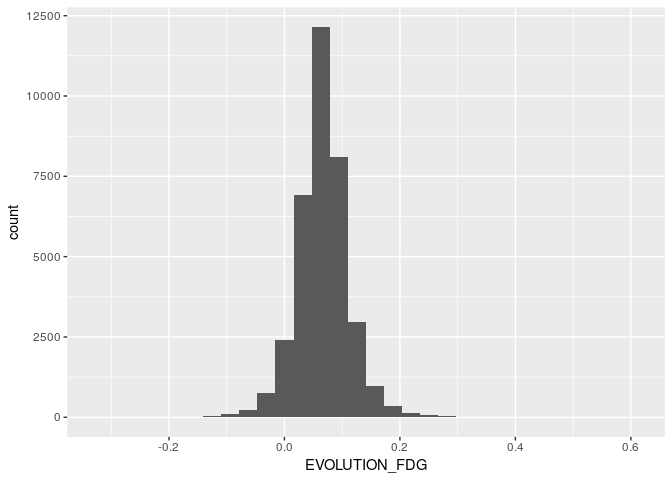
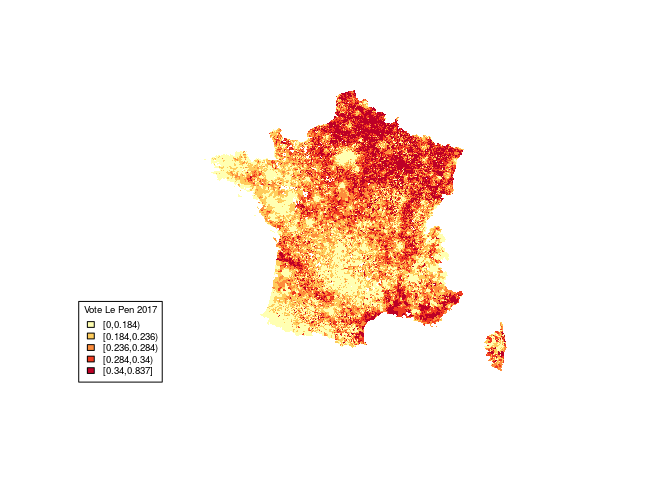
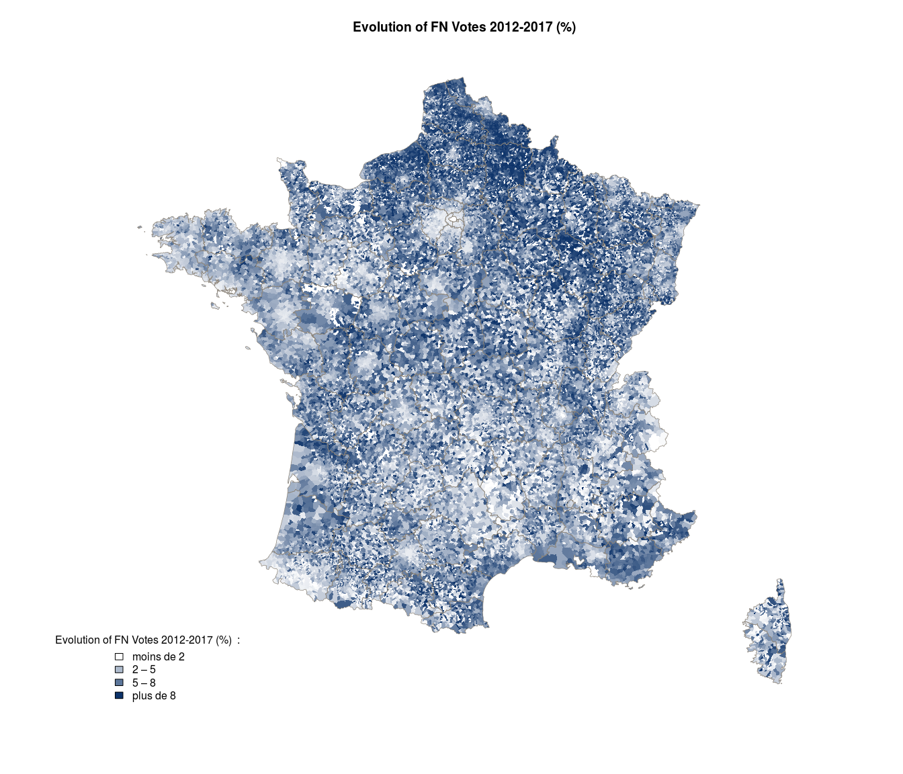
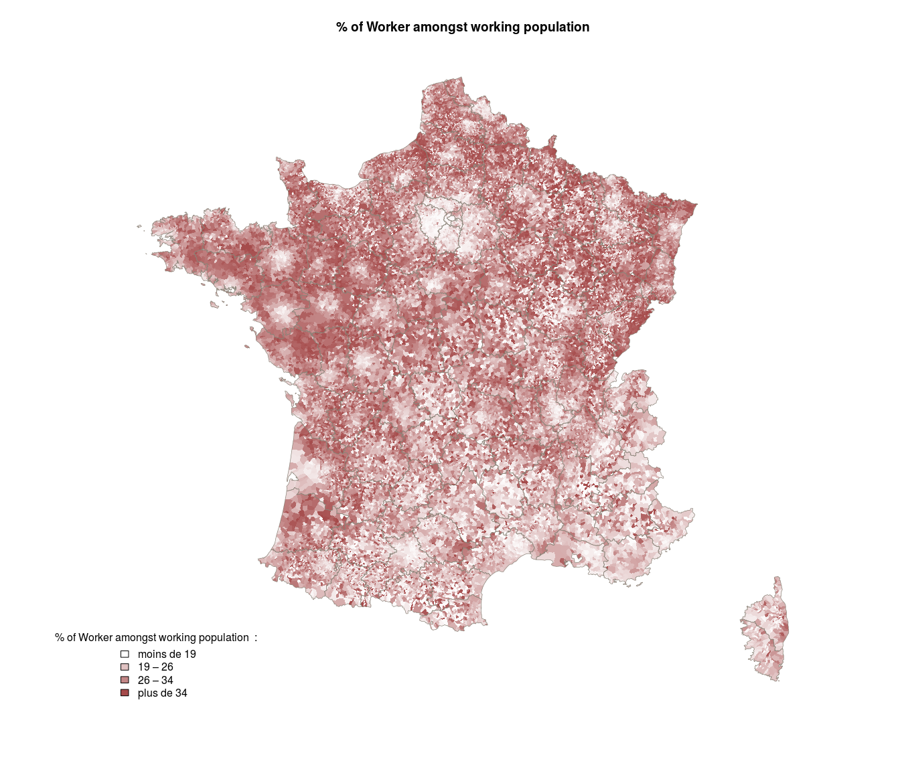
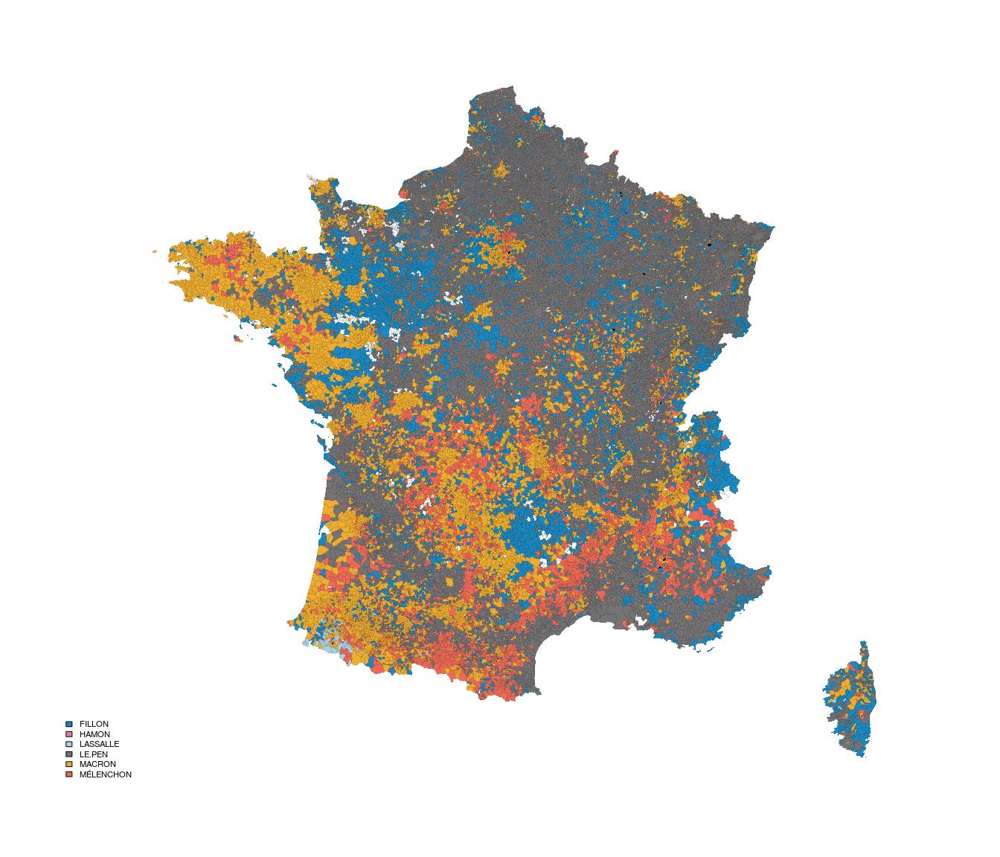

Elections France 2017 Maps
================

``` r
library("sp")
library("rgdal")
```

    ## rgdal: version: 1.2-6, (SVN revision 651)
    ##  Geospatial Data Abstraction Library extensions to R successfully loaded
    ##  Loaded GDAL runtime: GDAL 1.11.3, released 2015/09/16
    ##  Path to GDAL shared files: /usr/share/gdal/1.11
    ##  Loaded PROJ.4 runtime: Rel. 4.9.2, 08 September 2015, [PJ_VERSION: 492]
    ##  Path to PROJ.4 shared files: (autodetected)
    ##  Linking to sp version: 1.2-4

``` r
library(dplyr)
```

    ## 
    ## Attaching package: 'dplyr'

    ## The following objects are masked from 'package:stats':
    ## 
    ##     filter, lag

    ## The following objects are masked from 'package:base':
    ## 
    ##     intersect, setdiff, setequal, union

``` r
library(tidyr)
library(gridExtra)
```

    ## 
    ## Attaching package: 'gridExtra'

    ## The following object is masked from 'package:dplyr':
    ## 
    ##     combine

``` r
library("RColorBrewer")
library("classInt")
library('plotrix')    # Créer des échelles de couleurs

library("ggmap")
```

    ## Loading required package: ggplot2

``` r
library("maptools")
```

    ## Checking rgeos availability: FALSE
    ##      Note: when rgeos is not available, polygon geometry     computations in maptools depend on gpclib,
    ##      which has a restricted licence. It is disabled by default;
    ##      to enable gpclib, type gpclibPermit()

``` r
# Emplacement de l'archive décompressée, à remplacer par le votre
pathToShp <- "data/GEOFLA/1_DONNEES_LIVRAISON_2016-06-00236/GEOFLA_2-2_SHP_LAMB93_FR-ED161/COMMUNE/"

pathToShp_dept <- "data/GEOFLA_DEPT/1_DONNEES_LIVRAISON_2016-06-00235/GEOFLA_2-2_SHP_LAMB93_FR-ED161/DEPARTEMENT"
# Description des données via orgInfo
# Attention à ne pas mettre l'extension à la fin du nom
ogrInfo(dsn = pathToShp,layer="COMMUNE")
```

    ## Source: "data/GEOFLA/1_DONNEES_LIVRAISON_2016-06-00236/GEOFLA_2-2_SHP_LAMB93_FR-ED161/COMMUNE/", layer: "COMMUNE"
    ## Driver: ESRI Shapefile; number of rows: 35798 
    ## Feature type: wkbPolygon with 2 dimensions
    ## Extent: (99217.1 6049646) - (1242417 7110480)
    ## CRS: +proj=lcc +lat_1=44 +lat_2=49 +lat_0=46.5 +lon_0=3 +x_0=700000 +y_0=6600000 +ellps=GRS80 +units=m +no_defs  
    ## LDID: 87 
    ## Number of fields: 17 
    ##          name type length typeName
    ## 1   ID_GEOFLA    4     24   String
    ## 2    CODE_COM    4      3   String
    ## 3   INSEE_COM    4      5   String
    ## 4     NOM_COM    4     50   String
    ## 5      STATUT    4     25   String
    ## 6  X_CHF_LIEU    0      7  Integer
    ## 7  Y_CHF_LIEU    0      7  Integer
    ## 8  X_CENTROID    0      7  Integer
    ## 9  Y_CENTROID    0      7  Integer
    ## 10    Z_MOYEN    0      4  Integer
    ## 11 SUPERFICIE    2     12     Real
    ## 12 POPULATION    0     10  Integer
    ## 13   CODE_ARR    4      1   String
    ## 14  CODE_DEPT    4      2   String
    ## 15   NOM_DEPT    4     30   String
    ## 16   CODE_REG    4      2   String
    ## 17    NOM_REG    4     35   String

``` r
# Import via la fonction readOGR de rgdal
comm <- readOGR(dsn = pathToShp, layer="COMMUNE", stringsAsFactors=FALSE)
```

    ## OGR data source with driver: ESRI Shapefile 
    ## Source: "data/GEOFLA/1_DONNEES_LIVRAISON_2016-06-00236/GEOFLA_2-2_SHP_LAMB93_FR-ED161/COMMUNE/", layer: "COMMUNE"
    ## with 35798 features
    ## It has 17 fields

``` r
df.elections_2017<-read.csv('data/DOI/elections_2017_First_round.csv')
ggplot(df.elections_2017,aes(x=EVOLUTION_FDG))+ geom_histogram()
```

    ## `stat_bin()` using `bins = 30`. Pick better value with `binwidth`.

    ## Warning: Removed 522 rows containing non-finite values (stat_bin).



``` r
dim(comm@data)
```

    ## [1] 35798    17

``` r
comm2<-comm
comm2@data <- left_join(comm2@data, df.elections_2017, by="INSEE_COM")
```

    ## Warning in left_join_impl(x, y, by$x, by$y, suffix$x, suffix$y): joining
    ## factor and character vector, coercing into character vector

``` r
# Filtrage des données pour ne garder que la région Bretagne

#comm2 <- comm2[comm2@data$CODE_REG.x=="53",]
dim(comm2)
```

    ## [1] 35798   223

``` r
summarise_each(comm2@data, funs(sum(is.na(.)/n()))) %>% gather() %>% arrange(desc(value))
```

    ##                                                                          key
    ## 1                                                                         RD
    ## 2                                                                       GI13
    ## 3                                                               EVOLUTION_FN
    ## 4                                                               EVOLUTION_PS
    ## 5                                                               EVOLUTION_LR
    ## 6                                                              EVOLUTION_FDG
    ## 7                                                                          X
    ## 8                                                                    Votants
    ## 9                                                                   Inscrits
    ## 10                                                               Abstentions
    ## 11                                                                  Exprimés
    ## 12                                                                X..Abs.Ins
    ## 13                                                                X..Exp.Vot
    ## 14                                                                   ARTHAUD
    ## 15                                                                ASSELINEAU
    ## 16                                                                 CHEMINADE
    ## 17                                                             DUPONT.AIGNAN
    ## 18                                                                    FILLON
    ## 19                                                                     HAMON
    ## 20                                                                  LASSALLE
    ## 21                                                                    LE.PEN
    ## 22                                                                    MACRON
    ## 23                                                                 MÉLENCHON
    ## 24                                                                    POUTOU
    ## 25                                                            best_candidate
    ## 26                                                                  Nb.Atifs
    ## 27                                                        Nb.Actifs.Salariés
    ## 28                                                    Nb.Actifs.Non.Salariés
    ## 29                                               Nb.Pharmacies.et.parfumerie
    ## 30                                                Dynamique.Entrepreneuriale
    ## 31                            Dynamique.Entrepreneuriale.Service.et.Commerce
    ## 32                                           Nb.Entreprises.Secteur.Services
    ## 33                                           Nb.Entreprises.Secteur.Commerce
    ## 34                                       Nb.Entreprises.Secteur.Construction
    ## 35                                          Nb.Entreprises.Secteur.Industrie
    ## 36                                                    Nb.Création.Enteprises
    ## 37                                                 Nb.Création.Industrielles
    ## 38                                                  Nb.Création.Construction
    ## 39                                                     Nb.Création.Commerces
    ## 40                                                      Nb.Création.Services
    ## 41                                       Nb.Education..santé..action.sociale
    ## 42                                     Nb.Services.personnels.et.domestiques
    ## 43                                                  Nb.Santé..action.sociale
    ## 44                                         Score.Croissance.Entrepreneuriale
    ## 45                                                 Synergie.Médicale.COMMUNE
    ## 46                                                    Orientation.Economique
    ## 47                                                     Indice.Fiscal.Partiel
    ## 48                                                              Score.Fiscal
    ## 49                                                     Indice.Evasion.Client
    ## 50                                                      Score.Evasion.Client
    ## 51                                                  Indice.Synergie.Médicale
    ## 52                                                   Score.Synergie.Médicale
    ## 53                                                        SEG.Croissance.POP
    ## 54                                                                    LIBGEO
    ## 55                                                                       REG
    ## 56                                                                       DEP
    ## 57                                                      Nb.Omnipraticiens.BV
    ## 58                                                 Nb.Infirmiers.Libéraux.BV
    ## 59                                                  Nb.dentistes.Libéraux.BV
    ## 60                                                Nb.pharmaciens.Libéraux.BV
    ## 61                                                       Densité.Médicale.BV
    ## 62                                              Score.équipement.de.santé.BV
    ## 63                                                      Indice.Démographique
    ## 64                                                       Score.Démographique
    ## 65                                                            Indice.Ménages
    ## 66                                                             Score.Ménages
    ## 67                                                                Population
    ## 68                                                      Evolution.Population
    ## 69                                                           Evolution.Pop..
    ## 70                                                                Nb.Ménages
    ## 71                                                 Nb.Résidences.Principales
    ## 72                                                           Nb.propriétaire
    ## 73                                                               Nb.Logement
    ## 74                                                 Nb.Résidences.Secondaires
    ## 75                                                            Nb.Log.Vacants
    ## 76                                         Nb.Occupants.Résidence.Principale
    ## 77                                                                  Nb.Femme
    ## 78                                                                  Nb.Homme
    ## 79                                                                Nb.Mineurs
    ## 80                                                                Nb.Majeurs
    ## 81                                                              Nb.Etudiants
    ## 82                                    Moyenne.Revenus.Fiscaux.Départementaux
    ## 83                                         Moyenne.Revenus.Fiscaux.Régionaux
    ## 84                                             Dep.Moyenne.Salaires.Horaires
    ## 85                                       Dep.Moyenne.Salaires.Cadre.Horaires
    ## 86                          Dep.Moyenne.Salaires.Prof.Intermédiaire.Horaires
    ## 87                                     Dep.Moyenne.Salaires.Employé.Horaires
    ## 88                                      Dep.Moyenne.Salaires.Ouvrié.Horaires
    ## 89                                             Reg.Moyenne.Salaires.Horaires
    ## 90                                       Reg.Moyenne.Salaires.Cadre.Horaires
    ## 91                          Reg.Moyenne.Salaires.Prof.Intermédiaire.Horaires
    ## 92                                     Reg.Moyenne.Salaires.Employé.Horaires
    ## 93                                      Reg.Moyenne.Salaires.Ouvrié.Horaires
    ## 94                                                  Valeur.ajoutée.régionale
    ## 95                                                         Urbanité.Ruralité
    ## 96                                                            Score.Urbanité
    ## 97                                     Nb.Logement.Secondaire.et.Occasionnel
    ## 98                                                                  Nb.Hotel
    ## 99                                                            Capacité.Hotel
    ## 100                                                               Nb.Camping
    ## 101                                                         Capacité.Camping
    ## 102                                               Dynamique.Démographique.BV
    ## 103                                                           Taux.étudiants
    ## 104                                                           Taux.Propriété
    ## 105                                            Dynamique.Démographique.INSEE
    ## 106                                                            Capacité.Fisc
    ## 107                                                         Capacité.Fiscale
    ## 108                                                   Moyenne.Revnus.fiscaux
    ## 109                                                      Taux.Evasion.Client
    ## 110                                   Nb.Industries.des.biens.intermédiaires
    ## 111                                                           Nb.de.Commerce
    ## 112                                          Nb.de.Services.aux.particuliers
    ## 113                                                            PIB.Régionnal
    ## 114                                 SEG.Environnement.Démographique.Obsolète
    ## 115                                              Score.Croissance.Population
    ## 116                                                          Score.VA.Région
    ## 117                                                                Score.PIB
    ## 118                                              Environnement.Démographique
    ## 119                                                                 Fidélité
    ## 120                                                              SYN.MEDICAL
    ## 121                                                          Seg.Cap.Fiscale
    ## 122                                                            Seg.Dyn.Entre
    ## 123                                                                 DYN.SetC
    ## 124                                                                       CP
    ## 125                                                              LE.PEN_2012
    ## 126                                                            HOLLANDE_2012
    ## 127                                                             SARKOZY_2012
    ## 128                                                           MELENCHON_2012
    ## 129                                                                      X.1
    ## 130                                                            CODGEO_ARR_NO
    ## 131                                                               CODE_COM.y
    ## 132                                                                NOM_COM.y
    ## 133                                                               CODGEO_ARR
    ## 134                                                               NOM_DEPT.y
    ## 135                                                               CODE_REG.y
    ## 136                                                                NOM_REG.y
    ## 137                                                             POPULATION.y
    ## 138                                                          NoJob_all_ratio
    ## 139                                                         NoJob_1524_ratio
    ## 140                                                         NoJob_2554_ratio
    ## 141                                                         NoJob_5564_ratio
    ## 142                                                           Job_AGRO_ratio
    ## 143                                                        Job_ARTISAN_ratio
    ## 144                                                          Job_CADRE_ratio
    ## 145                                                       Job_INTERMED_ratio
    ## 146                                                        Job_EMPLOYE_ratio
    ## 147                                                        Job_OUVRIER_ratio
    ## 148                                                          Etudiants_ratio
    ## 149                                                          Retraites_ratio
    ## 150                                                                     Q213
    ## 151                                                                    Q3_Q1
    ## 152                                                                 Q213_ARR
    ## 153                                                                Q3_Q1_ARR
    ## 154                                                                   RD_ARR
    ## 155                                                                 GI13_ARR
    ## 156                                                      Q213.Data.Available
    ## 157                                                     Q3_Q1.Data.Available
    ## 158                                                         ratio_foreigners
    ## 159                                                         ratio_immigrants
    ## 160                                                    ratio_immigrants_AGRO
    ## 161                                                ratio_immigrants_ARTISANS
    ## 162                                                   ratio_immigrants_CADRE
    ## 163                                                   ratio_immigrants_INTER
    ## 164                                                 ratio_immigrants_EMPLOYE
    ## 165                                                 ratio_immigrants_OUVRIER
    ## 166                                                ratio_immigrants_RETRAITE
    ## 167       Nb.institution.de.Education..santé..action.sociale..administration
    ## 168                                        Nb.Pharmacies.et.parfumerie_ratio
    ## 169                                               Nb.Omnipraticiens.BV_ratio
    ## 170                                          Nb.Infirmiers.Libéraux.BV_ratio
    ## 171                                           Nb.dentistes.Libéraux.BV_ratio
    ## 172                                         Nb.pharmaciens.Libéraux.BV_ratio
    ## 173                                                         Nb.Ménages_ratio
    ## 174                                          Nb.Résidences.Principales_ratio
    ## 175                                                    Nb.propriétaire_ratio
    ## 176                                                        Nb.Logement_ratio
    ## 177                                          Nb.Résidences.Secondaires_ratio
    ## 178                                                     Nb.Log.Vacants_ratio
    ## 179                                  Nb.Occupants.Résidence.Principale_ratio
    ## 180                                                           Nb.Femme_ratio
    ## 181                                                           Nb.Homme_ratio
    ## 182                                                         Nb.Mineurs_ratio
    ## 183                                                         Nb.Majeurs_ratio
    ## 184                                                       Nb.Etudiants_ratio
    ## 185                                    Nb.Entreprises.Secteur.Services_ratio
    ## 186                                    Nb.Entreprises.Secteur.Commerce_ratio
    ## 187                                Nb.Entreprises.Secteur.Construction_ratio
    ## 188                                   Nb.Entreprises.Secteur.Industrie_ratio
    ## 189                                             Nb.Création.Enteprises_ratio
    ## 190                                          Nb.Création.Industrielles_ratio
    ## 191                                           Nb.Création.Construction_ratio
    ## 192                                              Nb.Création.Commerces_ratio
    ## 193                                               Nb.Création.Services_ratio
    ## 194                                                           Nb.Atifs_ratio
    ## 195                                                 Nb.Actifs.Salariés_ratio
    ## 196                                             Nb.Actifs.Non.Salariés_ratio
    ## 197                              Nb.Logement.Secondaire.et.Occasionnel_ratio
    ## 198                                                           Nb.Hotel_ratio
    ## 199                                                         Nb.Camping_ratio
    ## 200                                Nb.Education..santé..action.sociale_ratio
    ## 201                              Nb.Services.personnels.et.domestiques_ratio
    ## 202                                           Nb.Santé..action.sociale_ratio
    ## 203                             Nb.Industries.des.biens.intermédiaires_ratio
    ## 204                                                     Nb.de.Commerce_ratio
    ## 205                                    Nb.de.Services.aux.particuliers_ratio
    ## 206 Nb.institution.de.Education..santé..action.sociale..administration_ratio
    ## 207                                                                ID_GEOFLA
    ## 208                                                               CODE_COM.x
    ## 209                                                                INSEE_COM
    ## 210                                                                NOM_COM.x
    ## 211                                                                   STATUT
    ## 212                                                               X_CHF_LIEU
    ## 213                                                               Y_CHF_LIEU
    ## 214                                                               X_CENTROID
    ## 215                                                               Y_CENTROID
    ## 216                                                                  Z_MOYEN
    ## 217                                                               SUPERFICIE
    ## 218                                                             POPULATION.x
    ## 219                                                                 CODE_ARR
    ## 220                                                                CODE_DEPT
    ## 221                                                               NOM_DEPT.x
    ## 222                                                               CODE_REG.x
    ## 223                                                                NOM_REG.x
    ##            value
    ## 1   8.576736e-01
    ## 2   8.574781e-01
    ## 3   1.460975e-02
    ## 4   1.460975e-02
    ## 5   1.460975e-02
    ## 6   1.460975e-02
    ## 7   1.329683e-02
    ## 8   1.329683e-02
    ## 9   1.329683e-02
    ## 10  1.329683e-02
    ## 11  1.329683e-02
    ## 12  1.329683e-02
    ## 13  1.329683e-02
    ## 14  1.329683e-02
    ## 15  1.329683e-02
    ## 16  1.329683e-02
    ## 17  1.329683e-02
    ## 18  1.329683e-02
    ## 19  1.329683e-02
    ## 20  1.329683e-02
    ## 21  1.329683e-02
    ## 22  1.329683e-02
    ## 23  1.329683e-02
    ## 24  1.329683e-02
    ## 25  1.329683e-02
    ## 26  2.039220e-03
    ## 27  2.039220e-03
    ## 28  2.039220e-03
    ## 29  1.648137e-03
    ## 30  1.648137e-03
    ## 31  1.648137e-03
    ## 32  1.648137e-03
    ## 33  1.648137e-03
    ## 34  1.648137e-03
    ## 35  1.648137e-03
    ## 36  1.648137e-03
    ## 37  1.648137e-03
    ## 38  1.648137e-03
    ## 39  1.648137e-03
    ## 40  1.648137e-03
    ## 41  1.648137e-03
    ## 42  1.648137e-03
    ## 43  1.648137e-03
    ## 44  1.648137e-03
    ## 45  1.620202e-03
    ## 46  1.620202e-03
    ## 47  1.620202e-03
    ## 48  1.620202e-03
    ## 49  1.620202e-03
    ## 50  1.620202e-03
    ## 51  1.620202e-03
    ## 52  1.620202e-03
    ## 53  1.620202e-03
    ## 54  1.620202e-03
    ## 55  1.620202e-03
    ## 56  1.620202e-03
    ## 57  1.620202e-03
    ## 58  1.620202e-03
    ## 59  1.620202e-03
    ## 60  1.620202e-03
    ## 61  1.620202e-03
    ## 62  1.620202e-03
    ## 63  1.620202e-03
    ## 64  1.620202e-03
    ## 65  1.620202e-03
    ## 66  1.620202e-03
    ## 67  1.620202e-03
    ## 68  1.620202e-03
    ## 69  1.620202e-03
    ## 70  1.620202e-03
    ## 71  1.620202e-03
    ## 72  1.620202e-03
    ## 73  1.620202e-03
    ## 74  1.620202e-03
    ## 75  1.620202e-03
    ## 76  1.620202e-03
    ## 77  1.620202e-03
    ## 78  1.620202e-03
    ## 79  1.620202e-03
    ## 80  1.620202e-03
    ## 81  1.620202e-03
    ## 82  1.620202e-03
    ## 83  1.620202e-03
    ## 84  1.620202e-03
    ## 85  1.620202e-03
    ## 86  1.620202e-03
    ## 87  1.620202e-03
    ## 88  1.620202e-03
    ## 89  1.620202e-03
    ## 90  1.620202e-03
    ## 91  1.620202e-03
    ## 92  1.620202e-03
    ## 93  1.620202e-03
    ## 94  1.620202e-03
    ## 95  1.620202e-03
    ## 96  1.620202e-03
    ## 97  1.620202e-03
    ## 98  1.620202e-03
    ## 99  1.620202e-03
    ## 100 1.620202e-03
    ## 101 1.620202e-03
    ## 102 1.620202e-03
    ## 103 1.620202e-03
    ## 104 1.620202e-03
    ## 105 1.620202e-03
    ## 106 1.620202e-03
    ## 107 1.620202e-03
    ## 108 1.620202e-03
    ## 109 1.620202e-03
    ## 110 1.620202e-03
    ## 111 1.620202e-03
    ## 112 1.620202e-03
    ## 113 1.620202e-03
    ## 114 1.620202e-03
    ## 115 1.620202e-03
    ## 116 1.620202e-03
    ## 117 1.620202e-03
    ## 118 1.620202e-03
    ## 119 1.620202e-03
    ## 120 1.620202e-03
    ## 121 1.620202e-03
    ## 122 1.620202e-03
    ## 123 1.620202e-03
    ## 124 1.620202e-03
    ## 125 1.508464e-03
    ## 126 1.508464e-03
    ## 127 1.508464e-03
    ## 128 1.508464e-03
    ## 129 2.793452e-05
    ## 130 2.793452e-05
    ## 131 2.793452e-05
    ## 132 2.793452e-05
    ## 133 2.793452e-05
    ## 134 2.793452e-05
    ## 135 2.793452e-05
    ## 136 2.793452e-05
    ## 137 2.793452e-05
    ## 138 2.793452e-05
    ## 139 2.793452e-05
    ## 140 2.793452e-05
    ## 141 2.793452e-05
    ## 142 2.793452e-05
    ## 143 2.793452e-05
    ## 144 2.793452e-05
    ## 145 2.793452e-05
    ## 146 2.793452e-05
    ## 147 2.793452e-05
    ## 148 2.793452e-05
    ## 149 2.793452e-05
    ## 150 2.793452e-05
    ## 151 2.793452e-05
    ## 152 2.793452e-05
    ## 153 2.793452e-05
    ## 154 2.793452e-05
    ## 155 2.793452e-05
    ## 156 2.793452e-05
    ## 157 2.793452e-05
    ## 158 2.793452e-05
    ## 159 2.793452e-05
    ## 160 2.793452e-05
    ## 161 2.793452e-05
    ## 162 2.793452e-05
    ## 163 2.793452e-05
    ## 164 2.793452e-05
    ## 165 2.793452e-05
    ## 166 2.793452e-05
    ## 167 2.793452e-05
    ## 168 2.793452e-05
    ## 169 2.793452e-05
    ## 170 2.793452e-05
    ## 171 2.793452e-05
    ## 172 2.793452e-05
    ## 173 2.793452e-05
    ## 174 2.793452e-05
    ## 175 2.793452e-05
    ## 176 2.793452e-05
    ## 177 2.793452e-05
    ## 178 2.793452e-05
    ## 179 2.793452e-05
    ## 180 2.793452e-05
    ## 181 2.793452e-05
    ## 182 2.793452e-05
    ## 183 2.793452e-05
    ## 184 2.793452e-05
    ## 185 2.793452e-05
    ## 186 2.793452e-05
    ## 187 2.793452e-05
    ## 188 2.793452e-05
    ## 189 2.793452e-05
    ## 190 2.793452e-05
    ## 191 2.793452e-05
    ## 192 2.793452e-05
    ## 193 2.793452e-05
    ## 194 2.793452e-05
    ## 195 2.793452e-05
    ## 196 2.793452e-05
    ## 197 2.793452e-05
    ## 198 2.793452e-05
    ## 199 2.793452e-05
    ## 200 2.793452e-05
    ## 201 2.793452e-05
    ## 202 2.793452e-05
    ## 203 2.793452e-05
    ## 204 2.793452e-05
    ## 205 2.793452e-05
    ## 206 2.793452e-05
    ## 207 0.000000e+00
    ## 208 0.000000e+00
    ## 209 0.000000e+00
    ## 210 0.000000e+00
    ## 211 0.000000e+00
    ## 212 0.000000e+00
    ## 213 0.000000e+00
    ## 214 0.000000e+00
    ## 215 0.000000e+00
    ## 216 0.000000e+00
    ## 217 0.000000e+00
    ## 218 0.000000e+00
    ## 219 0.000000e+00
    ## 220 0.000000e+00
    ## 221 0.000000e+00
    ## 222 0.000000e+00
    ## 223 0.000000e+00

``` r
# Découpage du taux de vote   en 5 classes via la méthodes des quantiles : idenfication des bornes (breaks, ou brks)
classSuffrages <- classIntervals(comm2@data$LE.PEN, 5, style = "quantile")
```

    ## Warning in classIntervals(comm2@data$LE.PEN, 5, style = "quantile"): var
    ## has missing values, omitted in finding classes

``` r
# Choix d'une palette de couleur pour les 5 catégories
palette <- brewer.pal(n = 5, name = "YlOrRd")


# Application de ce découpage à la variable suffrages, sauvegarde dans suffrage_cat
# On stocke, pour chaque observation, la valeur de la couleur correspondante
comm2@data$suffrage_cat <- as.character(cut(comm2@data$LE.PEN, breaks = classSuffrages$brks, labels = palette, include.lowest = TRUE))

# On stocke l'information des classes pour créer une légende 
legende_LePen <- as.character(levels(cut(comm2@data$LE.PEN, breaks = classSuffrages$brks, include.lowest = TRUE, right = FALSE)))
```

``` r
plot(comm2, col = comm2@data$suffrage_cat, border='black',lwd=0.001)

legend("bottomleft", legend = legende_LePen, fill = palette, cex=0.6, title = "Vote Le Pen 2017")
```



``` r
# Lecture des départements
departements <- readOGR(dsn=pathToShp_dept,  layer="DEPARTEMENT")
```

    ## OGR data source with driver: ESRI Shapefile 
    ## Source: "data/GEOFLA_DEPT/1_DONNEES_LIVRAISON_2016-06-00235/GEOFLA_2-2_SHP_LAMB93_FR-ED161/DEPARTEMENT", layer: "DEPARTEMENT"
    ## with 96 features
    ## It has 11 fields

``` r
# Lecture des limites départementales pour sélectionner les frontières
frontieres <- readOGR(dsn=pathToShp_dept,  layer="LIMITE_DEPARTEMENT")
```

    ## OGR data source with driver: ESRI Shapefile 
    ## Source: "data/GEOFLA_DEPT/1_DONNEES_LIVRAISON_2016-06-00235/GEOFLA_2-2_SHP_LAMB93_FR-ED161/DEPARTEMENT", layer: "LIMITE_DEPARTEMENT"
    ## with 9062 features
    ## It has 2 fields

``` r
frontieres <- frontieres[frontieres$NATURE %in% c('Fronti\xe8re internationale','Limite c\xf4ti\xe8re'),]
```

``` r
plot_map<- function(comm,feature,color_hex,title){
  
  col <- findColours(classIntervals(
            comm@data[,feature], 98, style="quantile"),
            smoothColors("white",3,color_hex))

leg <- findColours(classIntervals(
            round(comm@data[,feature]*100,0), 4, style="quantile"),
            smoothColors("white",3,color_hex),
            under="moins de", over="plus de", between="–",
            cutlabels=FALSE)

plot(comm,   col=col, border=col, lwd=.1,main=title)
plot(departements, border="#8b8378",lwd=.7,add=TRUE)

legend("bottomleft",fill=attr(leg, "palette"),
    legend=gsub("\\.", ",", names(attr(leg,"table"))),
    title = paste(title," :"),bty = "n",cex=1)
  
}

plot_map(comm = comm2,feature = 'EVOLUTION_FN',"#0C3269",'Evolution of FN Votes 2012-2017 (%)')
```

    ## Warning in classIntervals(comm@data[, feature], 98, style = "quantile"):
    ## var has missing values, omitted in finding classes

    ## Warning in classIntervals(round(comm@data[, feature] * 100, 0), 4, style =
    ## "quantile"): var has missing values, omitted in finding classes



``` r
plot_map(comm = comm2,feature = 'Job_OUVRIER_ratio',"#a54a4a",'% of Worker amongst working population')
```

    ## Warning in classIntervals(comm@data[, feature], 98, style = "quantile"):
    ## var has missing values, omitted in finding classes

    ## Warning in classIntervals(comm@data[, feature], 98, style = "quantile"):
    ## var has missing values, omitted in finding classes



``` r
#myplots <- lapply(c('NoJob_all_ratio','Job_OUVRIER_ratio','Q213','MACRON','FILLON','EVOLUTION_FN'), plot_map, comm = comm2)
```

``` r
#add color for each candidate :
df<-data.frame()
candidate_colors <-  data.frame(best_candidate = levels(comm2@data$best_candidate),color='grey')
candidate_colors<- candidate_colors %>% mutate(color=ifelse(best_candidate=='MACRON','#ecad31',color))
candidate_colors<- candidate_colors %>% mutate(color=ifelse(best_candidate=='LE.PEN','#767374',color))
candidate_colors<- candidate_colors %>% mutate(color=ifelse(best_candidate=='FILLON','#1d88be',color))
candidate_colors<- candidate_colors %>% mutate(color=ifelse(best_candidate=='MÉLENCHON','#ec6a56',color))
candidate_colors<- candidate_colors %>% mutate(color=ifelse(best_candidate=='HAMON','#e97ba9',color))
candidate_colors<- candidate_colors %>% mutate(color=ifelse(best_candidate=='LASSALLE','#a9cfe2',color))

legend_colors<-candidate_colors %>% filter(color!=1)


candidates_palette<-comm2@data %>% select(best_candidate) %>% left_join(.,candidate_colors,by='best_candidate') 
candidates_palette$color<-as.character(candidates_palette$color)

plot(comm2,col = candidates_palette$color,  lwd=.1)
par(xpd=TRUE)
legend("bottomleft", inset=c(-0.000,0),legend = unique(legend_colors$best_candidate), fill=unique(legend_colors$color),bty = "n",cex=0.7)
```


