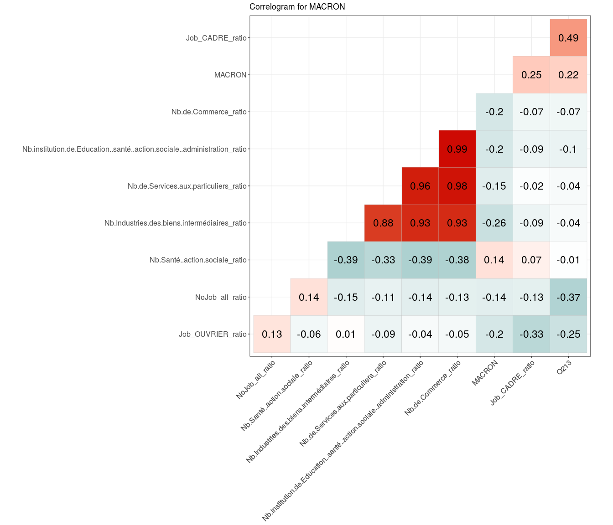

Elections France 2017 Models analysis
================

``` r
library(dplyr)
```

    ## 
    ## Attaching package: 'dplyr'

    ## The following objects are masked from 'package:stats':
    ## 
    ##     filter, lag

    ## The following objects are masked from 'package:base':
    ## 
    ##     intersect, setdiff, setequal, union

``` r
library(tidyr)
library(stringr)
library(ggplot2)
```

### Load file

``` r
df<- read.csv('data/DOI/elections_2017_First_round.csv')
```

### Set features

``` r
candidats<-c("ARTHAUD","ASSELINEAU","CHEMINADE","DUPONT.AIGNAN","FILLON","HAMON","LASSALLE","LE.PEN","MACRON","MÉLENCHON","POUTOU")
job_indicators<- grep('Job|ratio',colnames(df),value = TRUE)
fiscal<-c('Q213','Q3_Q1','Population')

all_features<-c(candidats,job_indicators,fiscal)
```

### Filter on numerical values

``` r
df_numeric<- df %>% select(one_of(all_features)) #%>% mutate_if(is.factor, funs(as.numeric(levels(.))[.])) 
```

### Correlations

``` r
cor.matrix<-cor(df_numeric %>% filter(!is.na(LE.PEN)))
View(as.data.frame(cor.matrix) %>% select(LE.PEN) %>% top_n(10))
```

    ## Selecting by LE.PEN

``` r
ggplot(df%>% filter(!is.na(LE.PEN))%>% filter(Q3_Q1.Data.Available) %>% filter(REG %in% c(53,93,22,31)) ,aes(Q3_Q1,LE.PEN, col=as.factor(NOM_REG)))+ geom_jitter(alpha=.6)+ scale_colour_brewer(palette = "Set1")+theme(legend.title=element_blank())+ylab('1st Round - LE PEN (%)')+ xlab('Yearly Income - Inter Quartile Range')
```



``` r
ggplot(df%>% filter(!is.na(LE.PEN))%>% filter(Q3_Q1.Data.Available) %>% filter(REG %in% c(53,93,22,31)) ,aes(Q3_Q1,MACRON, col=as.factor(NOM_REG)))+ geom_jitter(alpha=.6)+ scale_colour_brewer(palette = "Set1")+theme(legend.title=element_blank())+ylab('1st Round - MACRON (%)')+ xlab('Yearly Income - Inter Quartile Range')
```


